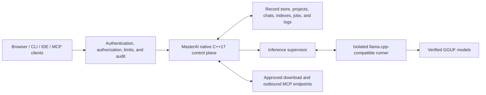
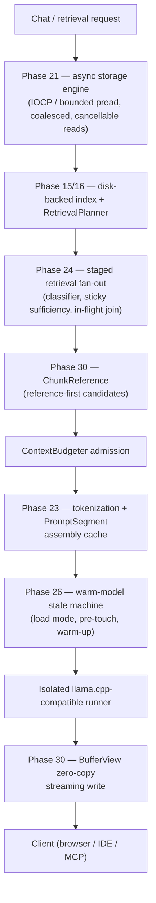

# MasterAI

**A secure, native, local programming AI control plane built from the ground up
in ISO C++17.**

[](docs/architecture/ADR-0001-cpp17-native-architecture.md)
[](docs/architecture/platform-matrix.md)
[](LICENSE)
[](docs/PLAN.md)

MasterAI coordinates local language models, authenticated users, programming
projects, chats, source context, verified downloads, benchmarks, IDE clients,
and Model Context Protocol (MCP) integrations from one security-focused native
service.

The project is designed for developers who want local ownership of models and
project data without making an inference engine, a container platform, or a
third-party application framework the foundation of the system.

> [!IMPORTANT]
> MasterAI is under active development and is **not yet production-ready**.
> Several major capabilities are implemented and test-covered, but
> distribution-packaging certification and the full multi-machine/multi-
> storage-media performance certification matrix remain outstanding (both
> genuinely require physical hardware this checkout does not have). See
> [Project status](#project-status) and the authoritative
> [implementation plan](docs/PLAN.md).

## Why MasterAI?

MasterAI is intended to provide a dependable local AI programming environment
with explicit security and resource boundaries:

- **Local ownership** — models, projects, chats, indexes, benchmarks, and
  operational state remain on systems you control.
- **Native C++17 control plane** — no Docker runtime and no inherited web or
  application framework.
- **Programming-first workflows** — chat, code completion, review, debugging,
  documentation, project search, IDE integration, and reproducible model
  comparison.
- **Process-isolated inference** — model runners execute outside the main
  control-plane process, so model memory and runner failures remain isolated.
- **Deny-by-default security** — listeners, routes, files, model sources, MCP
  tools, and administrative operations require explicit authority.
- **Verified model lifecycle** — manifests bind model identity, provenance,
  license, size, digest, backend, and hardware suitability.
- **Bounded resource use** — queues, memory reservations, contexts, background
  work, downloads, and indexes are designed around enforced ceilings.
- **Replaceable adapters** — inference, hardware, storage, embedding, speech,
  secret, and MCP integrations do not dictate the internal architecture.
- **Evidence-driven optimization** — performance work must be measured without
  bypassing correctness, security, cancellation, or auditing.

## Project aims

MasterAI aims to become a native, modular programming AI host that can:

1. Run securely on developer workstations and approved local servers.
2. Discover and validate categorized local programming models.
3. Assess whether a model can run safely on the current hardware.
4. Supervise local inference backends without loading model weights into the
   control process.
5. Provide authenticated browser, API, CLI, IDE, and MCP workflows.
6. Preserve durable projects, chats, attachments, indexes, jobs, and audit
   records with recovery support.
7. Download model artifacts only from approved immutable sources, resume
   interrupted transfers, and verify them before promotion.
8. Compare models with reproducible performance and programming-quality
   evidence.
9. Operate safely on lower-memory systems through deterministic admission,
   pressure handling, and degradation.
10. Add retrieval, caching, prompt reuse, and advanced throughput only after
    their security, memory, and quality boundaries are proven.

## Architecture

MasterAI separates the security-sensitive control plane from replaceable model
runner processes:



The control plane owns configuration, authentication, authorization, users,
projects, chats, model metadata, downloads, benchmarks, MCP policy, process
supervision, health, metrics, and graceful lifecycle operations. It does not
map large model weights into its own address space.

Initial inference uses an optional, version-pinned `llama.cpp` server behind a
validated process adapter. `llama.cpp` is not the architectural foundation and
can be replaced without changing MasterAI's external contract.

### Core design principles

- Strict ISO C++17 for application source; optional Assembly only when profiling
  proves a benefit and a C++17 boundary is retained.
- Native Windows, Linux, and macOS (Apple Silicon) operation without a
  container runtime.
- Loopback-only network binding by default.
- Authentication and authorization even in local-only mode.
- Canonical, authorized filesystem paths with symlink traversal denied by
  default.
- OS-backed cryptography and secret protection; no custom cryptographic
  primitives.
- Strict configuration schemas, bounded inputs, atomic persistence, and
  recoverable state.
- Process isolation, cancellation, timeouts, backpressure, and graceful
  shutdown.
- Explicit model provenance, licensing, size, and SHA-256 verification.
- Current authorization checks remain authoritative; caches never become an
  access-control source.

Further design detail is available in
[ADR-0001](docs/architecture/ADR-0001-cpp17-native-architecture.md), the
[release 1 baseline](docs/architecture/ADR-0003-release-1-product-baseline.md),
and the [security threat model](docs/security/threat-model.md).

## Implemented capability areas

The current source includes native implementations for:

- Schema-versioned configuration with precedence, atomic replacement, reset,
  migration metadata, and objective-hash verification.
- OS-principal authentication, first-administrator setup, persistent roles,
  hashed sessions, scoped tokens, CSRF/origin/host controls, rate limits, and
  hash-chained audit records.
- Categorized model discovery, strict manifest parsing, exact size and SHA-256
  checks, license/provenance preservation, suitability decisions, quarantine,
  and load-time integrity revalidation.
- Process-isolated `llama.cpp` supervision with readiness checks, loopback IPC,
  tokenization, streamed generation, cancellation, unload, logs, and metrics.
- Authenticated native web pages, projects, chats, model selection,
  attachments, prompt context assembly, streaming, and cancellation. Chat
  bubbles show per-message token counts (prompt tokens on the query,
  generated tokens on the response), and reply budgets are fitted to the
  model's context window up front so oversized attachments produce a clear
  error instead of a runner failure or context-shift repetition loop. Replies
  render Markdown links and bare URLs as real clickable anchors. The model
  picker carries a per-model Effort/Thinking settings panel (opens
  automatically on selection, persisted in the browser and restored whenever
  that model is chosen again): for a reasoning-capable architecture (Qwen,
  gpt-oss) the choice is sent to the model as an explicit reasoning
  directive, and for every other architecture it is instead applied as a
  sampling-preset adjustment (temperature/top_p/reply length), so the
  setting is never a silent no-op. System-error notifications are a
  contained, auto-fading floating bubble with a copy button rather than a
  full-width banner. Each
  user also has durable, owner-scoped chat memory: `save to memory: <detail>`
  stores a detail without invoking the model, common self-disclosures (names,
  preferences, contact details, work, and suggestions) are captured by
  deterministic bounded rules, and relevant saved details are read once when
  a conversation starts, then retained as bounded user reference data on that
  chat for later turns and restarts regardless of the selected model. New
  durable details apply automatically to newly created conversations; an
  active conversation retains its own history and startup snapshot. The
  collapsed Memory sidebar makes every capture visible and removable.
- Agentic tool use (Phase 84): a short confirm/implement/proceed/go-ahead/
  make-the-changes/phase/plan/strategy composer message puts a turn into
  auto-drive mode, where the model can call real read/list/search/write/
  delete-file and admin-allow-listed run-command tools — each shown live in
  the transcript as it happens — and keep working the task across as many
  turns as it takes with no further input, until it reports the task
  complete or Escape/Stop is pressed. Every chat has its own Tool execution
  mode, set from the composer's Model settings panel: Auto (safe actions run
  immediately, risky ones ask first — the default), Confirm every action
  (every call, safe or not, pauses on an Approve/Deny card), or Off (no
  tools at all for that chat). Any destructive action (delete, or a command
  matching a fixed destructive-pattern table) always pauses on an explicit
  Approve/Deny card first, regardless of mode — no execution mode can
  weaken that. Administrators manage the run-command allow-list from
  Settings -> Run-command allow-list (or GET/POST /api/v1/chat-tools/
  allowed-commands, plus POST .../update to edit a record in place). The
  page is pre-loaded with a built-in catalog of common Windows, Linux, and
  cross-platform developer commands, each tagged with the OS(es) it applies
  to and enabled by default -- disable anything not warranted for your
  install, or add/edit/revoke your own entries via the icon-only Edit and
  Revoke buttons on each row. The same six tools are also reachable by a
  connected MCP client (`masterai.project.read_file`/`list_directory`/
  `search`/`write_file`/`delete_file`/`run_command`), gated by the
  `projects.read`/`projects.write` token scopes; a call MCP classifies
  high-risk is refused rather than executed unattended (MCP has no
  Approve/Deny UI of its own yet), so completing that specific action still
  means using the web chat — see docs/PLAN.md Phase 84.
- How a tool actually runs — and why the model can't just do it: every one
  of the six tools is ordinary MasterAI server code (`execute_chat_tool()`
  in `src/tool_exec.cpp`), not something the loaded model has any direct
  access to. A local model is just text in, text out — it cannot open a
  file, touch the filesystem, or spawn a process by itself. `read_file`/
  `list_directory`/`search`/`write_file`/`delete_file` all resolve their
  path against the project root first and reject anything absolute or
  outside it, and `run_command` will only launch an executable that is
  already on the admin allow-list, run with no shell (so no argument can be
  interpreted as shell syntax) inside the same sandbox outbound MCP servers
  use — a Windows Job Object or Linux rlimit/`PR_SET_NO_NEW_PRIVS` cap, a
  wall-clock timeout, and a combined stdout+stderr byte cap. Because the
  model can't reach any of that directly, there are exactly three ways a
  tool call actually happens, and every one of them goes through the
  server, never the model in isolation:
  1. **The model requests one (Phase 84).** Mid-reply, the model ends its
     text with one `[[TOOL_CALL]]{"tool":"<name>","arguments":{...}}
     [[/TOOL_CALL]]` block — a plain text convention it was told about in
     its own prompt, nothing more. `send_chat_message()` parses that block
     out of the generated text, classifies the call's risk, and only then
     either runs it for real and feeds the model back the real result on
     the next turn, or — for anything destructive, or any chat set to
     Confirm every action — pauses on an Approve/Deny card until a human
     decides. A model that emits a malformed block, or names a tool that
     isn't one of the six, gets nothing executed at all.
  2. **MasterAI recognizes the request itself and skips the model
     entirely (Phase 98).** A bounded table of plain-English phrasings —
     "list the files in ...", "read the file ...", "search the project
     for ...", "run the command ..." — is checked against every message
     the instant it arrives, before the model is ever asked to generate
     anything. A match executes immediately through the exact same
     `execute_chat_tool()` path and the exact same risk/approval gate as
     path 1 above; the model is only brought in afterward, to comment on
     the real result in its own words. `write_file` and `delete_file` are
     deliberately excluded from this table — a write needs real content
     only the model can produce, and a delete is destructive enough that
     reaching for it should stay a considered model decision.
  3. **MasterAI answers a question about its own tooling without
     executing anything (Phase 99).** A separate, broader phrase table —
     "what tools are you authorised to use", "which commands can you
     run", "what's on your allow-list", and many more (see
     `is_capability_disclosure_query()` in `src/server.cpp`) — is checked
     the same way, immediately and before the model runs. A match answers
     straight from the real, live server configuration (the six real
     tools, plus the actual currently-enabled `run_command` allow-list for
     that project) instead of asking the model to describe its own setup
     from memory, which is exactly the failure this closed: a small local
     model asked directly would otherwise guess at a plausible-looking
     list, or simply truncate mid-answer once it ran out of reply budget.
     Nothing is ever executed for this path — it only ever discloses
     configuration, the same way `save to memory: ...` (above) answers
     without invoking the model.

  In short: the model can only ever *ask*, through one narrow, parsed text
  convention (path 1) or by matching a fixed phrase MasterAI already
  recognizes on its own (paths 2 and 3) — every actual filesystem read,
  filesystem write, or process launch happens in MasterAI's own server
  code, gated by the project-root/allow-list checks above and, for
  anything destructive, a human's explicit approval. See docs/PLAN.md
  Phases 84, 98, and 99 for the full implementation detail.
- Resumable, journaled, hash-verified model downloads with quarantine on
  integrity failure.
- Quick, standard, and extended benchmark profiles with compatible comparison
  and recommendation records.
- Inbound MCP over newline-delimited `stdio` and Streamable HTTP using protocol
  revision `2025-11-25`.
- Policy-separated outbound MCP over restricted `stdio` and loopback
  Streamable HTTP, with executable pinning, allow-lists, approval, cancellation,
  timeouts, response bounds, secret references, and audit.
- Native VS Code/Agent-Coder and Visual Studio connection profiles, protected
  IDE tokens, diagnostics, and read-only diff preview contracts.
- Backup, restore, secret/log rotation, recovery, hash-bound upgrade and
  rollback, standalone lifecycle scripts, and hardened systemd operations.
- Query-stage measurement, resource attribution, hardware/storage probes,
  authenticated metrics, and repeatable control-plane performance baselines.
- System-wide memory admission, OS reserve protection, bounded work queues,
  pressure actions, profiles, status, and inference leases.
- A cancellable, checksummed, disk-generation project index foundation with
  recovery, partial publication, unchanged-file elimination, affected-path
  updates, literal and exact-boundary symbol search, typed/coalesced triggers,
  bounded background work, and authenticated status/rebuild/cancel/notify
  routes, plus a native `ProjectWatcher` file-watcher/branch-switch adapter
  (`indexing.watchProjectFiles`, on by default) that drives the same service
  automatically without any external editor or version-control hook.
- Deadline-bound hybrid retrieval (`RetrievalPlanner`/`ContextBudgeter`) that
  chooses the least expensive sufficient index-backed strategy, runs bounded
  parallel strategy steps, fuses results on canonical chunk identity, and
  discloses every included and omitted candidate on the query trace.
- A security-partitioned, byte-bounded cache (`CacheManager`) in front of
  retrieval results, with segmented LRU eviction, versioned keys that make
  file, index, and policy changes an automatic miss, atomic
  checksum-verified disk entries, and authenticated status/trim/clear
  administration.
- Compatible runner prompt-prefix/KV-session reuse (`PromptSessionManager`)
  that resumes a chat's previous llama.cpp KV-cache slot only on an exact
  fingerprint match and a literal byte-prefix-extending prompt, refusing
  reuse on any model switch, reindex, or edited earlier turn.
- Adaptive hardware/model calibration (`CalibrationService`): a real
  cold-load-plus-generation measurement persisted as a host/model/backend/
  build-keyed `TuningProfile`, with automatic invalidation and a safe-default
  fallback on any identity change, plus GPU-layer/mmap/mlock/thread/batch
  launch tuning and CPU%/disk-byte calibration evidence.
- Real GPU memory (VRAM) detection (`probe_hardware`, DXGI-backed on
  Windows) feeding an evidence-based GPU-layer offload decision
  (`select_gpu_layers`): a model whose weights comfortably fit the detected
  VRAM (minus a reserved headroom for the backend's own context/runtime
  overhead) is recommended for full `--n-gpu-layers` offload; otherwise the
  always-safe CPU-only default is kept rather than guessing a partial layer
  count. Applied automatically to every chat auto-load and manual model
  load, not only after an administrator runs an explicit calibration.
- Phase 30A: CPU-only/GPU-disabled low-memory operation. A strict
  `hardware.acceleratorPolicy` config (`auto` / `cpu_only` / `gpu_allowed`,
  default `auto`). Under `cpu_only`, every runner launch is forced to zero
  GPU layers -- `CalibrationService` never recommends GPU offload, a stale
  persisted profile that does is rejected rather than silently zeroed, and
  `LlamaCppAdapter::build_launch_spec()` refuses to launch at all if a
  nonzero GPU-layer request reaches it. The runner process is also launched
  with GPU-visibility environment overrides (`CUDA_VISIBLE_DEVICES=-1` and
  equivalents) so a backend library cannot enumerate or initialize a GPU
  even if it ignores the launch flags. Before that runner process is ever
  started, `admit_runner_weights()` reserves a `MemoryCategory::
  runner_weights` budget lease sized from the model's real weight bytes plus
  compute-buffer/KV heuristics, rejecting an oversized model with a concrete
  reason instead of letting it map/load first and fail later; a released
  lease on every unload path keeps the next model's admission check
  accurate. `MemoryPolicy::maximum_active_inference` (one request under the
  minimal/cpu_only profile) is enforced on every chat request instead of
  being a validated-but-unread field. A background `MemorySweeper` thread
  unloads an idle runner once past its calibrated idle-unload seconds
  (unconditionally under a profile that does not keep a warm idle model by
  default, otherwise once real memory pressure appears) and trims bounded
  caches under sustained pressure. `GET /api/v1/system/resources` reports
  the effective `acceleratorPolicy`; `GET /api/v1/runner/status` adds
  requested-vs-actual GPU layers and an unload countdown; `GET /api/v1/
  system/memory` adds pagefile/swap headroom (`totalVirtualMemoryMiB`/
  `availableVirtualMemoryMiB`, already pagefile-inclusive via Windows
  `GlobalMemoryStatusEx`), process commit bytes, and hard-fault count.
  Reconfiguring the OS pagefile itself is out of scope -- MasterAI reports
  virtual-memory/pagefile state, it never changes it. An administrator-only
  `GET`/`POST /api/v1/admin/config` reads and writes the live `settings.json`
  (surfaced in the web UI's Settings -> System configuration panel), applying
  every field a live request path already re-reads immediately and reporting
  which changed fields need a restart. The matched `auto`-vs-`cpu_only`
  real-model benchmark matrix is recorded against a pinned local GGUF
  (`docs/performance/phase-19-qwen3b-matrix.md`), closing this phase.
- A durable, administrator-controlled Phase 20 registry for optional
  advanced-throughput candidates (continuous batching, speculative decoding,
  NUMA affinity, storage prefetch, multiple warm runners, GPU/CPU KV
  placement). Evidence records are strictly validated and restart-safe;
  recording evidence never enables a feature; admission additionally requires
  a wired implementation, no recorded regression, and a verified fallback;
  every admitted feature remains independently disableable. The safe Phase 19
  profile is always retained. No optional candidate is currently admitted.
- Phase 31: storage tiering and scratch-volume management. Five measured
  storage tiers (fast local NVMe, local SATA SSD, local HDD, removable/
  network, RAM-backed) classified from Phase 21's real device-type/latency
  evidence, never assumed. `ScratchVolumeManager` bounds ephemeral per-job
  scratch storage with per-job and global byte quotas, refuses admission
  once free disk space would fall below a configured reserve, publishes
  finished output atomically (stage-then-rename, so a durable destination is
  never partially observable), cleans up on shutdown, and recovers orphaned
  scratch left by a previous crashed run via a durable journal at the next
  startup (also re-runnable on demand via `POST /api/v1/system/scratch/
  cleanup`). A hard, code-enforced prohibition (`durable_data_class_allows_
  ram_tier()`) refuses -- never silently downgrades -- any attempt to place a
  GGUF model, durable chat, audit/security record, user database, resumable
  download, backup, or sole-copy index generation on RAM-backed storage.
  `GET /api/v1/system/storage` (administrator-only) reports measured
  filesystem-integrity flags (compression/encryption/dedup/virtual-disk/
  network-redirection, best-effort on Windows) and a resulting model-
  placement recommendation, plus separate physical/committed/commit-limit/
  pagefile/page-fault-rate/model-resident memory accounting so none of those
  figures are conflated into one number. `GET /api/v1/system/scratch`
  reports live quota/usage/active-job status. A dedicated multi-tier
  migration workflow (relocating already-placed durable data between tiers)
  is also implemented: `migrate_durable_file()` verifies a SHA-256 digest
  match between source and staged copy before an atomic rename, enforces
  the same RAM-tier prohibition, and is exposed administrator-only via
  `POST /api/v1/system/storage/migrate`. Every migration is recorded in a
  durable, journaled `DurableFileManifest`, and `resolve_durable_path()`
  transparently follows it -- wired into the model-launch path so a Model
  Registry entry's model file is still found after being migrated, and
  visible administrator-only at `GET /api/v1/system/storage/manifest`.
- Phase 33: distributed runners, both halves. Local multi-runner
  orchestration: `LocalRunnerPool` generalizes the existing single-runner
  `RunnerSupervisor` supervision pattern to N concurrent local runner
  processes (per-GPU runner, CPU+GPU split, or dedicated embedding/router/
  benchmark runners), configured via the `localRunnerPool` settings array,
  which stays empty (unchanged single-runner mode) unless an administrator
  opts in. Requests are routed by resident-model match, runner health/
  state, capability, and priority, with Phase 2 project-bound authorization
  enforced as a hard filter; a failing runner is isolated (marked
  unhealthy, excluded from routing) rather than taking down the control
  plane, and a retry is only ever attempted when nothing from the failed
  attempt has already reached the caller or been persisted. The runner
  that actually served each query is recorded on the Phase 13 query trace
  and visible administrator-only at `GET /api/v1/runner/pool`. Intranet
  worker protocol: `IntranetWorkerPool`/`WorkerListener`
  (`src/intranet_worker.cpp`) add mutual-TLS routing to administrator-
  approved remote worker machines, using OpenSSL as this codebase's first
  vendored TLS/crypto dependency (optional at build time via
  `find_package(OpenSSL)`; fails closed at runtime with a clear error when
  unavailable, never falls back to plaintext). A worker's certificate is
  verified against a pinned private CA plus a pinned leaf digest; the
  worker equally verifies this control plane's own client certificate.
  Worker certificates are issued from an in-process private CA
  (`POST /api/v1/system/pki/initialize`, `POST /api/v1/system/pki/workers`)
  and copied to the physical worker machine out of band -- there is no
  self-service worker registration. Each worker's self-reported loaded-
  model digest is verified against this control plane's own model registry
  before that worker is ever selectable (`GET`/`POST /api/v1/worker/pool[/refresh]`).
  `WorkerListener` (`AppConfig::workerMode`, disabled by default) is this
  codebase's one deliberate exception to the administrator HTTP server's
  loopback-only constraint, speaking only the narrow authenticated worker
  protocol, never the administrator surface. Wired into the live
  chat-generation dispatch path: a chat request automatically fails over
  onto a healthy, verified remote worker (before falling back further to
  the default local runner) whenever the local runner it tried fails and
  nothing from that attempt has already reached the caller.
- Phase 34: adaptive performance controller. `AdaptiveController`
  (`src/adaptive_controller.cpp`) extends Phase 19 calibration into a live,
  bounded controller with real minimum-dwell-time, cooldown, bounded-step-
  size, rolling-measurement, confidence-requirement, and safe-rollback
  stability controls, and all eight named modes (Minimal Memory, Balanced,
  Lowest Latency, Maximum Throughput, Battery Saver, Quiet/Thermal
  Conservative, Administrator Custom, Automatic). Every named knob now has a
  real, genuinely-consumed target: inference concurrency, queued-inference
  ceiling, index worker count (also "background-job rate" -- background
  indexing is what that name means here), default context tokens, and idle-
  unload time apply instantly via `MemoryBudgetManager::set_policy()`; the
  cache byte quota applies instantly via `CacheManager::set_policy()`;
  thread count, GPU offload layers, prompt-processing batch size, and NUMA
  local placement are launch-time arguments to a separate llama.cpp process
  with no live-reload primitive, so they apply at the next natural model
  load rather than forcing a disruptive unload/reload of an in-flight
  model. Read queue depth and KV placement beyond the existing KV-precision
  admission remain disclosed-only (no live setter exists for either);
  prefetch distance and warm-up policy are a permanent, documented scope
  limit -- no subsystem exists in this codebase to apply a computed value
  to. The Settings page's Performance section exposes a ceilings editor for
  every `PerformanceCeilings` field alongside the mode selector and the
  applied/recommended report. Administrator-only routes:
  `GET /api/v1/performance/adaptive`, `POST .../mode`, `POST .../ceilings`,
  `POST .../rollback`.
- Phase 35: a "Performance" administration page (`/app/performance`)
  consolidating live visibility into the local runner pool, the intranet
  worker pool, the adaptive controller (mode selection, applied/
  recommended adjustments with reasons and confidence, rollback), memory,
  caches, storage tiers and the tier-migration manifest, the request
  scheduler, advanced optimizations, and calibration profiles, backed
  entirely by the real routes above -- condensed from the plan's full
  named-page enumeration into one working page rather than many
  placeholders. Extended with a "Memory Status" widget on the Model
  Inventory page (`/app/models-inventory`, administrator-only):
  auto-refreshes every 5 seconds (system RAM, system virtual memory, and
  MasterAI's own cache/scratch usage) and offers a "Clean Memory" action
  (`GET`/`POST /api/v1/system/memory/clean`) with selectable real reclaim
  steps -- trim bounded caches, remove orphaned scratch/temp files, release
  MasterAI's own process memory back to the OS, and optionally unload the
  loaded model -- shown as genuine step-by-step progress, not a fabricated
  animation. Refreshes the models table immediately afterward so a
  previously RAM-blocked model shows as ready without a page reload. Also
  offers true system-wide Windows memory options -- trim other
  applications' working sets (size threshold, foreground-protect), flush
  the modified page list, purge the (optionally low-priority-only) standby
  list, empty system/service working sets, and clear the system file
  cache. These require MasterAI itself to be running elevated
  (Administrator); each fails closed and names itself in the result when it
  can't acquire the privilege, rather than silently doing nothing.
- Phase 36: full performance benchmark matrix and regression gate.
  `PerformanceCertificationRunner`/`PerformanceCertificationStore`
  (`src/regression_gate.cpp`) run the existing quality benchmark suite plus
  five real regression check groups against this codebase's own live
  decision logic -- runner attribution, low-memory admission, prompt-cache
  reuse/refusal, calibration identity-exact restore, and smallest-capable-
  tier/Minimal-profile model routing -- plus real per-run metrics (TTFT,
  peak resident memory, generation throughput, a real queue-wait
  measurement from an actual `RequestScheduler` admission, real storage
  bytes read from the process's own disk-read counter, and a CPU sample).
  A run is only ever compared against the previous *accepted* run sharing
  its exact fingerprint (model/backend/hardware/settings/prompt-suite/
  cache-state/profile), so mismatched environments are never presented as
  a direct comparison; administrator-configurable thresholds gate
  acceptance, and a rejected run is still persisted. Administrator/
  developer routes: `GET`/`POST /api/v1/performance/certification`,
  `GET`/`POST /api/v1/performance/certification/thresholds`, rendered on
  the new "Benchmarks & Regression" page (`/app/performance/benchmarks`).
  Real evidence now spans two model/profile combinations on this host
  (`llama32-1b-instruct-q4km` `quick`, 2026-08-18; `granite31-2b-instruct-
  q4km` `standard`, 2026-08-26), each accepted with a clean matching-
  fingerprint comparison -- see
  [docs/validation/phase-36-certification-runbook.md](docs/validation/phase-36-certification-runbook.md).
  What remains outside this control plane's reach: the plan's full
  physical matrix (multiple storage media, multiple machines, GPU-
  offloaded hardware) requires an administrator to actually run this page
  on each real target host -- no software on one machine can manufacture a
  second physical drive or GPU.
- Phase 32: speculative decoding. `check_draft_target_
  compatibility()`, `SpeculativeDecodingStats`, and
  `decide_speculative_decoding_for_request()`
  (`src/speculative_decoding.cpp`) implement exact draft/target
  compatibility checking, rolling acceptance-rate tracking, and the bounded
  per-request enable/disable rule the plan describes, wired to a real
  dual-model (draft+target concurrently resident) launch path
  (`LlamaCppAdapter::build_launch_spec`'s `--model-draft` flags) and gated
  behind the same evidence/admission registry `continuous_batching` uses.
  The sampling-compatibility gate correctly reflects that llama.cpp's
  rejection-sampling verification supports this codebase's real (non-greedy)
  chat sampling presets, so the feature activates for live chat traffic once
  admitted and evidenced. Real hardware evidence is now recorded via the
  `masterai speculative-benchmark` CLI command
  (`docs/performance/phase-32-speculative-matrix.md`): on this low-VRAM
  test host the dual-model path measured 22.5% *slower* than the
  single-model baseline (`qwen25-coder` pair), corroborated 2026-08-26 by a
  second, unrelated pair (`llama32-3b`/`llama32-1b`) measuring 40.5%
  *slower* -- an honest negative result, twice over -- the launch path
  itself works, but this host lacks the compute/VRAM headroom for it to
  pay off.
- A native asynchronous storage and prefetch engine (`IAsyncFileReader`):
  IOCP-backed overlapped reads on Windows and a bounded worker-pool `pread`
  fallback on POSIX, adjacent-request read coalescing, an adaptive
  queue-depth policy keyed to a measured `StorageLatencyProfile`, and
  cancellable requests, wired into model-manifest and index-segment reads
  with automatic fallback to the prior blocking path.
- Tokenization, chat-template, and segmented prompt-fragment caching: a
  content/tokenizer-fingerprinted tokenization cache, compiled
  process-lifetime chat-template execution plans, `PromptSegment`-based
  assembly over shared immutable buffers, a restricted identifier intern
  table, and an extended `PromptSessionManager` reuse decision reporting
  exact reusable-prefix length, divergence offset, invalidation reason, and
  a configurable prefix byte ceiling.
- Low-risk control-plane hot-path reductions: Windows CNG SHA-256/HMAC
  algorithm-provider handles are reused for the process lifetime instead of
  reopened for each authenticated request, frequency-sketch slots use a
  power-of-two mask instead of integer modulo, and both JSON encoders use a
  complete 256-entry escape table plus bulk clean-run copies. These are
  implementation optimizations, not new throughput claims; correctness and
  measured performance gates remain authoritative.
- Staged, classified retrieval fan-out on top of `RetrievalPlanner`:
  filename/path and recent-change strategies, a deterministic request
  classifier, sticky-sufficiency staged execution, an authorization-scoped
  in-flight request join table, and reference-first (`ChunkReference`)
  candidate materialization gated on `ContextBudgeter` admission. Every
  strategy now has a real adapter: heuristic call-graph/type-reference/
  dependency-neighbour scans (C++/Python/JavaScript/TypeScript), a
  sandboxed `git diff` adapter, real cosine-similarity semantic-embedding
  search over the already-live `/v1/embeddings` backend call, conversation
  memory recall, and outbound-MCP resource reads -- the four expensive/
  IO-bound ones are gated both by a config toggle and by whether the
  requesting `RetrievalPlanner` instance was actually constructed with the
  optional dependency each needs, with a runtime "not configured" reason
  disclosed on the query trace when it wasn't.
- Explicit model load-mode/pre-touch selection and a warm-model state
  machine: `ModelLoadMode`/`PreTouchLevel` chosen from measured storage and
  RAM evidence, and a `WarmModelState` machine layered onto the existing
  runner-state tracking via a regression-tested translation table, with
  cancellable background warm-up that yields under memory pressure.
- An immutable shared-buffer and request-scoped memory architecture:
  `SharedBuffer`/`BufferView`/`MappedBufferView`/`ChunkReference`/
  `TokenSpan`/`PromptSegment`, a debug-poison-checked `RequestArena`, and a
  `FixedSizePool<T>` bridged into `MemoryBudgetManager` accounting, plus a
  zero-copy write path for streamed chat tokens.
- A "PageFile" storage setting (`storage.pageFileRoot`, restart required):
  redirects MasterAI's own disk-backed, per-category, key-indexed cache
  (`CacheManager` -- tokenization, prompt/retrieval, model manifests, and
  more) to an administrator-chosen directory instead of the default
  `runtime_root/cache`, so that disk activity can be pointed at a faster
  drive or away from the drive backing the real Windows pagefile, with no
  admin privilege required and no data outside MasterAI's own use. Left
  empty, behavior is unchanged. Configurable in the web UI's Settings ->
  System configuration panel; resolved via `resolve_page_file_root()`.
- A "System Report" (web UI: Report -> System Report, administrator-only,
  `GET /api/v1/system/report`): one consolidated read of hardware (RAM, GPU
  memory, CPU/NUMA), the real Windows pagefile's commit headroom,
  `MemoryBudgetManager` pressure, this process's resident/commit memory, the
  configured PageFile location's drive capacity/free space and MasterAI's
  own used/capacity bytes there, and which optional features (retrieval,
  cache, session reuse, automatic calibration, project-file watching,
  local-password/OS sign-in) are currently enabled.
- A stall watchdog on live generation requests (`inference.stallTimeoutSeconds`,
  default 120s, hot-reloadable): `RunnerSupervisor::generate()`'s wait on the
  runner's `/completion` stream now has a deadline measured from the last
  byte actually received, so a runner that stalls mid-request (most likely
  on a cold model's first prompt) surfaces as a timeout error instead of
  hanging the request indefinitely; a still-streaming generation is never
  cut off since the deadline resets on every byte received.
- Weighted-fair request scheduling and bounded backpressure across eight
  priority classes, deterministic KV-cache reservation and eviction,
  hardware-topology discovery, and evidence-driven model-routing/cascade
  decision logic. Continuous backend batching, live worker affinity, and
  transparent multi-model cascade execution remain gated follow-up work.
- An administrator-only Machine Learning control-plane foundation with a
  dashboard and durable lifecycle records for ML projects, model registry
  entries, datasets, subject packages, labeling and preparation work,
  training and fine-tuning jobs, evaluations, experiments, model-builder
  configurations, instruction and synthetic-data records, vector stores,
  RAG configurations, subject exams, hyperparameter searches,
  model-optimization runs, training checkpoints, and deployments — plus a
  real execution engine (Phases 56-61) that ingests validated CSV dataset
  content, trains tabular models by gradient descent with genuine loss
  curves and held-out metrics, captures measured-loss checkpoints, scores
  trained models with real evaluation metrics, compares two trained models
  on a shared benchmark with a measured winner, serves live predictions
  from persisted weight artifacts, ingests and hashes approved text files,
  persists either authored hashing vectors or validated learned vectors from
  a verified local embedding GGUF, and executes ranked, cited retrieval/
  context assembly. Generative RAG answers (Phase 76), exam administration
  with real LLM-as-judge grading (Phase 51), hyperparameter search execution
  (Phase 52), and deployment promotion (Phase 82) all run for real too --
  see the Project status table below for each one's own honest boundary.
  Every ML executor not explicitly named across Phases 56-82 remains
  `Planned`. (Phase 73, real LLM LoRA fine-tuning, was implemented and later
  removed -- see its row in the table below.)

Implementation does not automatically mean operational certification. The next
section records the distinction.

## Project status

Status below reflects the evidence recorded in
[docs/PLAN.md](docs/PLAN.md) on **18 August 2026**.

| Phase | Area | Status |
|---:|---|---|
| 0 | Requirements and release decisions | Complete |
| 1 | Native foundation and lifecycle | Complete |
| 2 | Identity and security baseline | Complete |
| 3 | Model registry and hardware assessment | Complete |
| 4 | First isolated inference adapter | Complete; real pinned backend/GGUF path validated |
| 5 | Chat and project web application | Complete; actual-browser real-model chat validated |
| 6 | Secure resumable downloads | Complete; interrupted immutable HTTPS resume and digest promotion validated |
| 7 | Reproducible benchmarking | Complete; same-host real-model comparison validated |
| 8 | Inbound MCP | Complete; live project-bound independent-inspector connection validated |
| 9 | Outbound MCP | Complete |
| 10 | IDE integrations | Complete; VS Code and Visual Studio 2022 hosts live-validated |
| 11 | Operations hardening | Complete |
| 12 | Measured control-plane optimization | Complete for measured native scope |
| 13 | Query measurement and resource baseline | Complete |
| 14 | Bounded-memory foundation | Complete |
| 15 | Incremental disk-backed indexing | Complete; deeper symbol extraction remains a forward enhancement |
| 16 | Deadline-bound hybrid retrieval | Complete; authored hybrid-vs-full-text evaluation passes |
| 17 | Security-partitioned cache hierarchy | Complete; representative cache latency benchmark passes |
| 18 | Prompt-prefix and KV/session reuse | Complete; real repeated-turn prefix reuse validated |
| 19 | Hardware/model calibration | Comparative Qwen 3B offload/throughput matrix validated; broadened 2026-08-26 to a smaller (~2B) and a larger (~6.7B) model on the same host; broader semantic-quality scoring and a second physical host remain forward work |
| 20 | Optional advanced throughput | Complete admission layer; every candidate (including `multiple_warm_runners`, closed 2026-08-23) now has a real implementation and a real caller gated on this registry; all candidates remain disabled by default until an administrator records real evidence and admits one |
| 21 | Native asynchronous storage and prefetch engine | Implementation complete; bounded IOCP/`pread` fallback, mapped regions, coalescing, cancellation |
| 22 | Hierarchical content and model-data caching | Implementation complete; immutable resident L1 and streaming-aware segmented eviction |
| 23 | Tokenization, template, and prompt-fragment caching | Implementation complete; exact recorded token-prefix reuse |
| 24 | Advanced retrieval fan-out and adaptive query planning | Implementation complete; authored Release evaluation clears Phase 16 baseline |
| 25 | Continuous inference batching and request scheduling | Implementation complete; backend activation remains calibrated and default-off |
| 26 | Model loading, mapping, pre-touch, and warm-state management | Implementation complete; all selective pre-touch levels actionable |
| 27 | KV-cache compression, placement, and lifecycle management | Accounting/placement/lifecycle, reduced-precision launch flags + quality-parity check, and cross-request prefix sharing all real; every admission stays explicit-administrator-gated (never self-enabling); chats can now be marked as shareable templates and `send_chat_message()` uses the shared-template reuse path in production once prefix sharing is admitted |
| 28 | NUMA, processor-group, and topology-aware execution | Discovery and recommendation implemented; real thread-pinning wired into every connection worker thread, gated on an off-by-default configuration flag (now a working Settings checkbox) plus the Phase 20 admission; live per-host benefit evidence (Phase 36) still pending |
| 29 | Model tiering, routing, and cascade inference | Complete; live chat routing via the "Auto (Tiered)" model-picker entry, with a real buffered cascade (confidence-checked, escalated once) for any tier below the largest |
| 30 | Memory deduplication and immutable shared-data architecture | Implemented at a scoped-down level |
| 30A | CPU-only and GPU-disabled low-memory operation | Implemented; matched real-model benchmark matrix recorded |
| 31 | Storage tiering, virtual drives, and scratch-volume management | Implemented, including Priority B tier-migration tooling |
| 32 | Speculative decoding and draft-model acceleration | Implemented; real dual-model launch path measured on real hardware (negative result on this low-VRAM host) |
| 33 | Distributed local runners and multi-device orchestration | Implemented; local runner pool and intranet mTLS worker protocol |
| 34 | Adaptive performance controller | Complete; every named knob has a real, genuinely-consumed target (instant, next-natural-load, or a documented permanent scope limit) |
| 35 | Performance administration interfaces | Implemented at a scoped-down level; one consolidated Performance page |
| 36 | Full performance certification and regression gates | Implemented at a scoped-down level; real quality-plus-five-regression-check-group certification with threshold-gated build comparison, real evidence recorded on this host via `scripts/run-certification.ps1`; physical cross-device matrix remains an administrator-run exercise on further hosts. 2026-08-24: added real commit-bytes/page-fault/storage-operation-count metrics and widened the CPU sample window (100ms to 500ms) to stop a too-short sample from spuriously tripping the regression gate; model-load-time, cancellation/shutdown latency, per-stage retrieval/prompt/tokenization latency, mapped-bytes, and cache-hit-rate remain out of scope (no reusable measurement exists for them in this codebase -- see docs/PLAN.md's Phase 36 status note) |
| 37 | Machine Learning module foundation | Implemented at a scoped-down level |
| 38 | Machine Learning projects | Implemented; Phase 93 (2026-08-24) added the section 5 governance/target fields (administrators, validated against real accounts; approved data sources; security classification; target architecture/deployment; success/evaluation/safety criteria; a declared storage allocation) |
| 39 | ML model registry and dataset manager | Model Registry implemented at a scoped-down level; Dataset Manager's remaining fields (record/file count, schema, content hash, duplicate rate, data quality score) are now real, computed at upload time, and Dataset Versioning (section 11) is implemented -- Phase 94 (2026-08-24) |
| 40 | Subject Knowledge Manager | Implemented at a scoped-down level |
| 41 | Data labeling and preparation | Implemented at a scoped-down level |
| 42 | Training Jobs | Implemented; real tabular training executor (Phase 56); Phase 95 (2026-08-24) added the section 16 execution-policy fields, with max runtime, retry-once failure recovery, and checkpoint cadence genuinely enforced by the executor |
| 43 | Evaluation Lab | Implemented; real tabular scoring harness (Phase 56); Phase 96 (2026-08-24) added latency, throughput, memory use, a stability score, a robustness score, and an optional bias/fairness breakdown -- every metric category honestly computable for a tabular model; LLM-only categories (perplexity, hallucination rate, ...) remain out of scope |
| 44 | Experiment Tracking | Implemented at a scoped-down level initially; Phase 80 adds a real training/evaluation executor and side-by-side comparison |
| 45 | Fine-Tuning Interface | Implemented; Phase 70 adds a warm-start executor that continues gradient descent from an existing tabular model's learned weights. (Phase 73 added a real LLM LoRA fine-tuning executor via the `llama.cpp` `finetune`/`export-lora` CLI, triggered by a `llm:`-prefixed method; removed -- see Phase 73's row below.) |
| 46 | Model Builder | Fully implemented (full section 9 design sheet, basic/advanced modes); `POST .../run` hands a submitted configuration off to a real `TrainingJob`, which now trains against a real from-scratch, configurable multi-layer-perceptron (MLP) trainer when the settings specify a hidden-layer architecture, genuinely consuming layer/activation/dropout/optimiser/batch-size/gradient-clip/accumulation/LR-schedule/early-stopping/init/epoch/seed/checkpoint settings (2026-08-23); attention/tokenizer/sequence-length/mixed-precision fields stay honestly unconsumed as transformer-only concepts this tabular-row engine does not implement |
| 47 | Prompt and Instruction Training | Implemented at a scoped-down metadata level initially; Phase 81 adds the real content record, generation, multi-model testing, duplicate/contradiction detection, and structured-output validation |
| 48 | Synthetic Data Generation | Implemented at a scoped-down metadata level initially; Phase 82 adds a real generation executor |
| 49 | Embeddings and Vector Stores | Registry implemented; real local hashing-vector index added in Phase 59 |
| 50 | Retrieval-Augmented Generation | Configuration implemented; real retrieval/context executor added in Phase 60 |
| 51 | Subject Examination System | Implemented at a scoped-down record level; `POST .../run` genuinely asks the target model each configured question and grades it with a real LLM-as-judge (fixed JSON-prompt pattern, 2026-08-23), falling back to the original plain text-overlap heuristic whenever the judge call fails or its reply is unparseable — every result records which grading path produced it |
| 52 | Hyperparameter Optimization | Implemented at a scoped-down record level; `POST .../run` runs a real, bounded grid search over learning rate and epochs (plus batch size, dropout, and optimiser choice for an MLP-architecture job, 2026-08-23) against the referenced training job's dataset |
| 53 | Model Optimization | Implemented at a scoped-down record level; no optimizer executor |
| 54 | Checkpoint Management | Implemented at a scoped-down retention-record level initially; Phase 79 adds real mid-training weight-snapshot capture and a resume-training executor |
| 55 | Deployment Manager | Implemented at a scoped-down approval-record level initially; Phase 82 adds a real deploy/health/rollback executor |
| 56 | Real ML execution engine (tabular training, evaluation, prediction) | Implemented; dataset content upload accepts CSV, JSON (array of flat objects), JSONL, and Parquet (via the same DuckDB helper Knowledge ingestion uses), all converted to CSV before validation |
| 57 | Model Comparison (real baseline-vs-candidate benchmark executor) | Implemented |
| 58 | Knowledge-file ingestion | Implemented; bounded text upload, SHA-256 provenance, durable chunk records |
| 59 | Local embedding and vector indexing | Implemented; authored 128-dimensional hashing vectors and index profiles |
| 60 | RAG retrieval and grounded context assembly | Implemented; approved-config query execution with ranked chunks and citations |
| 61 | Learned embeddings and once-per-chat memory recall | Implemented; isolated llama.cpp embedding adapter, durable vector provenance, and retained chat memory snapshots |
| 62 | Inference Endpoints | Implemented at a scoped-down record level initially; Phase 77 adds a real network listener; Phase 82 completes the auth-token/policy UI and the roster entry |
| 63 | Hardware and Compute | Implemented at a scoped-down record level initially; Phase 67/75 add real local and remote telemetry |
| 64 | Automation Pipelines | Implemented at a scoped-down record level initially; Phase 69/71/72 add real stage execution |
| 65 | Safety and Governance | Implemented at a scoped-down policy/model-card approval level initially; Phase 74 adds real heuristic content scanning |
| 66 | Audit Logs and Machine Learning Settings | Implemented; real read over the existing audit trail, and a real ML-scoped subset of System Configuration |
| 67 | Hardware and Compute live telemetry | Implemented; a compute node flagged as the local host reports a genuinely fresh `probe_hardware()` snapshot on demand |
| 68 | Monitoring and Diagnostics | Implemented; real aggregation of live local-host hardware, training-job counts, evaluation metrics, and benchmark throughput |
| 69 | Automation Pipelines real executor | Implemented; "Train model"/"Evaluate model" stages genuinely run, every other named stage honestly reported as skipped |
| 70 | Fine-Tuning real executor | Implemented; genuine warm-start gradient descent from a base model's trained weights, registered as a new model |
| 71 | Automation Pipelines: more real stages and live progress | Implemented; "Validate data"/"Validate model"/"Safety tests"/"Request approval"/"Deploy staging"/"Deploy production"/"Rollback"/"Monitor" all genuinely execute (Import/clean/label/split data, optimize, and staging tests remain honestly skipped); a run now executes on a background thread and reports live per-stage progress the web UI renders as a progress bar |
| 72 | Automation Pipelines: final six real stages | Implemented; all six stages genuinely execute, including "Label data", which now runs a real heuristic auto-labeler (quantile-binning or existing-label validation) when no completed labeling task is on record |
| 73 | Real LLM LoRA fine-tuning | Removed (2026-08-25). Depended on `llama.cpp`'s `finetune`/`export-lora` CLI tools, which upstream removed from all releases on 2024-07-25 (PR #8669) -- no compatible binary has existed since, and any build old enough to still have them predates model architectures added afterward (e.g. Qwen3), so the feature could never load this codebase's own models. The executor, its `AppConfig` fields, HTTP routes, and web UI were deleted rather than kept as permanently-broken dead code; Phase 70's tabular warm-start fine-tuning is unaffected |
| 74 | Safety and Governance real content scanning | Implemented; local heuristic secret/prompt-injection/restricted-term scanning (`scan_content_for_risks`) plus a real LLM-as-judge ML classifier pass (`scan_content_with_model_classifier`) for bias/hallucination/subtler harmful content |
| 75 | Hardware and Compute remote telemetry agent | Implemented; `masterai telemetry-agent` run on a remote node, polled for real by a `ComputeNode` with a matching `agentUrl` |
| 76 | RAG real answer generation | Implemented; the RAG query route's optional `"generate":true` mode produces a real generated answer grounded in the same retrieved context |
| 77 | Inference Endpoints real listener | Implemented; an `active` endpoint opens a real listener enforcing authentication, rate limiting, and a real per-endpoint safety policy (scan on/off, block-on-finding, attached `SafetyPolicy`, opt-in Phase 74 model classifier), re-read live on every request |
| 78 | Monitoring real per-request telemetry | Implemented; real latency percentiles, queue depth, requests/minute, live per-step tabular-training progress, and KV-session cache-hit rate |
| 79 | Checkpoint Management real capture and resume | Implemented; training/fine-tuning runs capture a genuine weight snapshot at each checkpoint epoch, and "Resume training" continues gradient descent from one, registering the result as a new model |
| 80 | Experiment Tracking real executor | Implemented; "Run now" genuinely trains and evaluates the experiment's dataset (real training/validation/evaluation metrics, checkpoints, hardware, runtime), and "Compare" builds a genuine side-by-side diff of two or more already-run experiments |
| 81 | Prompt and Instruction Training real content and operations | Implemented; a real content record (system/user instruction, context, expected/rejected response, tool calls/results, output format, difficulty, safety classification), real draft generation and multi-model testing via `execute_rag_generation`, heuristic duplicate/contradiction detection, real JSON structured-output validation, and enforced approval-requires-content |
| 82 | Deployment Manager, Inference Endpoints, and Synthetic Data completion | Implemented; Synthetic Data gets a real generation executor (technique-specific prompts via `execute_rag_generation`); Deployment Manager gets its own real deploy/health/rollback action (approved-Model-Card gate, trained-weights health signal, supersede/rollback tracking); Inference Endpoints' already-real Phase 77 listener gets its missing auth-token/policy UI. All three roster entries move from `planned` to `available` |
| 83 | Safety and Governance roster completion | Implemented; no new executor needed — Phase 74's real content scanning and Phase 82's approval-gated deployment/inference enforcement already met the bar, so the roster entry moves from `planned` to `available`; added the missing `SafetyGovernanceStore`/`scan_content_for_risks` store-level test |
| — | ML forms clarity pass | Implemented; hover/focus "?" hint bubbles on ambiguous fields (toggleable off per-browser from Machine Learning Settings), every remaining raw-ID text field converted to a named dropdown, and every remaining comma-separated multi-id field converted to a checkbox multi-select |
| 84 | Agentic tool use in chat | Implemented, not yet build/host validated; real `read_file`/`list_directory`/`search`/`write_file`/`delete_file`/`run_command` tools, an auto-drive mode ("confirm"/"implement"/"proceed"-style composer messages) that keeps a turn working a stated plan across turns with no further input until the model reports it done, a per-chat Tool execution mode (Auto/Confirm every action/Off, set from the composer's Model settings panel), mandatory Approve/Deny for destructive actions regardless of mode, every tool call/result shown live in the transcript, admin allow-list management routes/UI, and the same six tools reachable through MCP `tools/call` (`masterai.project.*`) sharing the identical `execute_chat_tool()` dispatch — MCP refuses rather than executes a high-risk call, since it has no Approve/Deny UI of its own yet |
| 85 | Inference and retrieval throughput tuning | Implemented, not yet build/host validated; evidence-based `--threads`/`--ubatch-size` launch tuning derived from the host's real core count (Phase 19's `thread_count`/`ubatch_tokens` fields existed since their introduction but were never populated until now); `CacheCategory::retrieval_result` actually wired into the live retrieval request path (the category and its serializer existed since Phase 17 but nothing had ever called them); parallel worker-pool dispatch for the semantic-embedding adapter's per-chunk embed calls and for model pre-touch; a cached (not rebuilt-per-call) dependency-graph map for the `dependency_neighbour` retrieval strategy |
| 88 | Downloaded models as a fine-tuning/model-builder base, and a live-streaming cleanup fix | Implemented; Fine-Tuning Job's and Model Builder Config's "Base model" dropdowns now also list every downloaded (not just previously-registered) model, tagged "(downloaded)"; picking one registers it into the Model Registry transparently on submit (`resolve_or_register_base_model()`, `src/server.cpp`) with no separate manual step. Also fixes the chat UI occasionally rendering a raw, unstripped fragment of a hallucinated tool-call attempt: the `"complete"` streaming event now carries the server's fully-cleaned reply text, which the client swaps in before its final render instead of trusting its own pre-cleanup streamed buffer |
| 89 | ML web UI clarity pass, part 1: core training pipeline | Implemented (core pipeline only — see `docs/PLAN.md` Phase 89 for the remaining-panels list); every dataset picker and the Dataset Manager table now show real content status ("N row(s) ready" / "⚠ no content uploaded yet", `datasets_json_with_content_status()`); Training Jobs' "Train now" is disabled with an explanatory tooltip when its dataset has no uploaded content, instead of only failing after the click with `ml_dataset_has_no_content`; a numbered "Step 1 → 5" banner (`ml_step_flow()`) now orients a user landing on any of Projects/Model Registry/Dataset Manager/Training Jobs/Evaluation Lab/Experiment Tracking; sidebar nav fixed to put Model Registry beside Dataset Manager instead of mislabeled under "Logs and Settings", and Hyperparameter Optimization after Training Jobs instead of before it |
| 90 | ML web UI clarity pass, part 2: responsive step banner, and automatic categorical feature encoding | Implemented; `.mlStepFlow` is now a CSS grid that wraps at any browser width/height (was a fixed-width scrolling flex row that clipped on resize), and Dataset Manager renders one banner spanning steps 2–3 instead of a squeezed duplicate copy; `parse_tabular_csv()` gained an opt-in `encode_categorical_features` flag (default off, every prior caller unchanged) that one-hot encodes a text/category feature column instead of rejecting it with "every feature column must be numeric" — fit mode for a fresh training/experiment run, apply mode (reusing the trained model's own persisted `categorical_encoding`) for evaluation/comparison/fine-tuning/checkpoint-resume, so a dataset like one with a `record_type` text column now uploads, trains, and predicts (via its natural value, e.g. `{"record_type":"document"}`) with zero manual CSV pre-processing |
| 91 | Dataset Manager instruction-purpose datasets, and quote-aware CSV row parsing | Implemented; a `Dataset` now carries a `purpose` ("Tabular data" or "Instruction / fine-tuning text", chosen at registration and shown as a Dataset Manager list column) that the content-upload endpoint validates against — a Tabular dataset is unchanged (classification/regression target column, up to 64 distinct labels); an Instruction dataset skips that entirely and instead just checks for an instruction/prompt column and a response/output/completion column, since LLM fine-tuning data has no target-column concept and was previously forced through — and could fail — classification validation that never applied to it. Also fixes a real parsing bug the same investigation surfaced: CSV row splitting in `parse_tabular_csv`, `auto_label_tabular_dataset`, and the LLM fine-tuning text writer was a raw split on `\n`, silently corrupting any RFC 4180 quoted field with an embedded newline (any multi-paragraph text cell) into multiple broken rows; all three now use a quote-aware row splitter |
| 92 | Model Registry quantization tracking | Implemented; `ModelRegistryEntry` gained a `quantization` field, auto-carried over from a downloaded model's manifest when it becomes a Fine-Tuning base (previously silently dropped), settable manually otherwise, and shown as a Model Registry list column. The real LLM LoRA fine-tuning executor now checks it against the precisions llama.cpp's finetune tooling trains against reliably (F32/F16/BF16/Q8_0) and adds a non-blocking `quantizationWarning` to the job's result when the base is more heavily quantized. Also closes a pre-existing gap found while wiring that warning to the UI: the Fine-Tuning Jobs page's "Fine-tune now" button previously only handled the tabular path's synchronous response and left a real (`llm:`-method) job's 202 "queued" response completely unrendered — it now polls the job's result until it completes or fails |
| 98 | Instant natural-language execution for mechanical chat tools | Implemented; a plain request like "show me the directory of ..."/"list files in ..."/"search the project for ..."/"run the command ..." is now matched against a bounded natural-language phrase table and, when matched, its `list_directory`/`read_file`/`search`/`run_command` tool call executes immediately — before the message ever reaches the model — instead of waiting on a full generation just to decide to call a tool a fixed phrase already answers unambiguously. Destructive/high-risk calls (and any chat set to "Confirm every action") still pause for an explicit Approve/Deny click exactly as the model-mediated tool path does; a safe call still triggers one real model turn afterward so it can comment on the result. `write_file`/`delete_file` and unmatched/ambiguous phrasing are untouched, falling straight through to the normal model-mediated `[[TOOL_CALL]]` path |

Current validation includes Windows x64 Debug and Release builds and tests under
strict C++17, plus a Linux x86-64 Release build and test run under Ubuntu 26.04
WSL. Release packaging certification on the pinned Ubuntu 24.04 and Debian 13
hosts is still outstanding.

Phase 1 was revalidated on the current tree on 5 August 2026 without an
additional rebuild: the Windows Debug native suite passed, both loopback health
endpoints returned HTTP 200 on port 7070, and the documented graceful-stop path
completed successfully.

Phase 15 has a bounded native indexing service, affected-path updates,
typed/coalesced trigger admission, disk-generation recovery tests, a native
`ProjectWatcher` file-watcher/branch-switch adapter that calls the indexing
service automatically (no external editor or VCS hook required), a
representative large-project ceiling measurement (`masterai index-probe`),
and a recorded platform-I/O backend decision. Both of its exit criteria now
have current evidence on Windows Debug and Release; deeper language-aware
symbol extraction remains a forward enhancement, not an exit-criterion
blocker.

Phase 16 adds a `RetrievalPlanner` that reads a project's Phase 15 index
directly (exact symbol, exact text, and per-token lexical strategies),
runs bounded parallel strategy steps under a hard request deadline, fuses
and deduplicates results on canonical chunk identity, and discloses exactly
which evidence was used through `/api/v1/queries/{id}`. Phase 17 adds a
byte-bounded, security-partitioned `CacheManager` in front of Phase 16
retrieval results, keyed so that a file change, an index republish, or a
membership/policy change makes a stale entry unreachable automatically,
with authenticated `GET/POST /api/v1/system/cache*` administrative routes.
Both are Windows Debug- and Release-validated; Phase 24's authored evaluation
also closes Phase 16's previously outstanding evaluation-set criterion.

Phases 21–30 add a native performance/architecture layer on top of Phases 15–19:
an asynchronous storage/prefetch engine, hierarchical and prompt caches,
staged retrieval fan-out, weighted-fair scheduling, model warm-state
management, KV-cache governance, hardware-topology decisions, model-routing
logic, and an immutable shared-buffer/arena architecture with a zero-copy
chat-streaming write path. Phases 21–26 are implementation-complete; Phases
27–30 retain the explicit scope limits recorded in [docs/PLAN.md](docs/PLAN.md).
Linux uses the documented bounded `pread` fallback instead of `io_uring`, and
continuous batching remains default-off until host/model/backend calibration
admits it. Phase 31 adds storage tiering (`StorageTier`, measured from the
same Phase 21 device-type/latency evidence), a `ScratchVolumeManager` (bounded
per-job/global quotas, atomic publish, crash-recovery journal, orphan cleanup,
free-space reserve), a hard code-enforced prohibition on placing durable data
(models, chats, audit/security records, user databases, downloads, backups,
sole-copy indexes) on RAM-backed storage, separate physical/commit/pagefile/
page-fault/model-resident memory accounting, and best-effort Windows
filesystem-integrity detection (compression/encryption/dedup/virtual-disk/
network-redirection) feeding a measured, not assumed, model-placement
recommendation. Its tier-migration workflow remains future work; Phases
32–36 remain planned.

Phases 37–55 establish the Machine Learning administration layer:
administrators manage durable, permission-gated records through native web
pages and `/api/v1/ml/*` routes, with lifecycle, review, approval, reload,
and deletion behavior covered by native tests. Phase 56 adds the module's
first real execution engine on top of those records: administrators upload
CSV dataset content (validated server-side), run Training Jobs that
actually train tabular models by gradient descent (linear regression, and
logistic/softmax classification) with genuine loss curves, deterministic
held-out splits, measured-loss checkpoints, and persisted weight artifacts;
run Evaluation Lab scoring that produces real accuracy/precision/recall/F1/
confusion-matrix or MSE/MAE/R² metrics; and serve live predictions from any
trained model through the Model Registry, all surviving server restarts.
Phase 57 extends that engine with Model Comparison: a baseline and a
candidate model are both evaluated against one shared benchmark dataset,
and the stored verdict reports both metric sets, the primary-metric delta,
and the measured winner.
Phases 58–61 add a second evidence-producing path: administrators select a
local text, Markdown, CSV, JSON, JSONL, or Parquet file in the Subject
Knowledge Manager (Parquet is converted to text via a configured,
process-isolated DuckDB CLI helper); MasterAI bounds and hashes the accepted
content, creates overlapping
chunks, persists authored 128-dimensional hashing vectors, and exposes a
measured vector-store profile. An approved RAG configuration can then run
hybrid, vector, or keyword retrieval and return ranked source chunks plus a
citation-ready context package.
Phase 61 lets a Vector Store instead select a verified, ready GGUF from the
`embeddings-code-search` category. MasterAI loads it through the existing
isolated llama.cpp runner, validates and normalizes its learned vectors, and
persists the exact model and dimensions so retrieval cannot silently mix
embedding spaces. Durable user-memory records are also recalled only when a
conversation starts; the bounded snapshot is retained with that chat and
reused on later turns and after restart.
The honest remaining boundary: the authored fallback is still lexical
feature hashing, and no learned embedding GGUF is installed in this
checkout for model-specific semantic-quality or latency evidence. RAG
generation (Phase 76) runs for real now -- see the Project status table
above for its own boundary. For the concepts, current workflows, exact
capability boundary,
and a sequential teaching guide, read
[How to Use Machine Learning and Models with MasterAI](docs/HowToUse-MachineLearning.md).

No release may be called production-ready until the functional, security,
migration, recovery, MCP conformance, performance, resource-ceiling, retrieval,
cache-isolation, licensing, provenance, and documentation gates all pass.

## Supported targets and baseline hardware

The release 1 target matrix is:

- Windows 11 x86-64
- Windows Server 2022 x86-64
- Ubuntu Server 24.04 LTS x86-64
- Ubuntu Server 24.04 LTS arm64 (ADR-0004; code-complete, not yet build/run
  validated on real ARM64 Linux hardware)
- Debian 13 x86-64
- macOS 15+ (Sequoia or later) on Apple Silicon (arm64) only, no Intel Mac
  (ADR-0004; code-complete, not yet build/run validated on real Apple
  Silicon hardware). Any M-series chip is in scope, with the newer
  M4/M5/M6-class chips as the primary chipsets this support targets

Other distributions, Intel/x86-64 macOS, WSL, and containers are
experimental build or validation environments rather than supported release
targets. See [the platform matrix](docs/architecture/platform-matrix.md) for
per-target validation status.

Release 1 baseline hardware:

- x86-64 CPU with SSE4.2 and at least four logical processors on Windows and
  x86-64 Linux; Apple Silicon and ARM64 Linux targets have no equivalent
  SSE4.2 floor (NEON is detected instead)
- 16 GiB physical RAM, retaining at least 2 GiB for the operating system
- 20 GiB free storage plus model and backup requirements
- Optional GPU; CPU inference remains the compatibility baseline
- For GPU acceleration: a supported CUDA, Vulkan, or HIP backend, a compatible
  driver, and at least 8 GiB dedicated VRAM. Dedicated VRAM size is
  auto-detected on Windows (DXGI); the largest real (non-software) adapter
  found decides whether a given model's weights are recommended for full
  GPU offload. Discrete-GPU vendor telemetry (NVML/ADLX) is Windows-only;
  Apple Silicon has no discrete GPU or comparable vendor SDK to probe.

Individual model manifests may require more capable hardware. MasterAI reports
`Unsupported`, `Memory Risk`, `Slow`, `Usable`, or `Recommended` and blocks
unsafe loads according to policy.

## Building from source

### Prerequisites

Common requirements:

- Git
- CMake
- A C++17 compiler
- Sufficient disk space for generated builds and any local models

Windows development currently uses:

- Visual Studio 2022 with the MSVC x64 C++ toolchain
- Ninja, as supplied by the configured Visual Studio installation
- PowerShell 7 or Windows PowerShell

Linux development uses:

- GCC or Clang with C++17 support
- CMake
- A supported build tool generated by CMake
- POSIX `sh`

macOS development (Apple Silicon only -- see below) uses:

- Xcode Command Line Tools (Clang with C++17 support)
- CMake
- A supported build tool generated by CMake (Ninja or Unix Makefiles)
- POSIX `sh`

The project owns its CMake entry point under `scripts/CMakeLists.txt`.

### Windows x64

Run from the repository root:

```powershell
.\scripts\build.ps1 -Platform Windows-x64 -BuildType Release
.\scripts\test.ps1 -Platform Windows-x64 -BuildType Release
```

For a development build:

```powershell
.\scripts\build.ps1 -Platform Windows-x64 -BuildType Debug
.\scripts\test.ps1 -Platform Windows-x64 -BuildType Debug
```

The build helper searches supported Visual Studio installation roots and
currently expects the Visual Studio-integrated Ninja path configured in
`scripts/build.ps1`. See the
[Visual Studio guidance](docs/ide/visual-studio.md) if local tool discovery
needs adjustment.

### Linux x86-64 and Linux ARM64

```sh
sh ./scripts/build.sh Release Linux-x86_64
sh ./scripts/test.sh Release Linux-x86_64
```

`Linux-arm64` is a supported release target as of ADR-0004:

```sh
sh ./scripts/build.sh Release Linux-arm64
sh ./scripts/test.sh Release Linux-arm64
```

It is code-complete but not yet build/run-validated -- no ARM64 Linux
hardware was available to verify it. See
[the platform matrix](docs/architecture/platform-matrix.md).

### macOS (Apple Silicon)

macOS support targets Apple Silicon (arm64) only -- chips in the M-series
line, with the newer M4/M5/M6-class chips as the primary target this support
was written for. There is no Intel/x86-64 Mac support and no Rosetta path;
`scripts/CMakeLists.txt` fails the configure step outright on a non-arm64
Mac.

```sh
sh ./scripts/build.sh Release Darwin-arm64
sh ./scripts/test.sh Release Darwin-arm64
```

Like Linux ARM64, this is code-complete but not yet build/run-validated --
no Apple Silicon hardware was available to verify it. Every macOS-specific
code path (Keychain-based secret storage, PAM-based identity, CommonCrypto
hashing, FSEvents file watching, `launchd` service scripts) is a real
implementation, not a stub -- see
[ADR-0004](docs/architecture/ADR-0004-linux-arm64-and-macos-apple-silicon.md)
for the full decision record and
[the platform matrix](docs/architecture/platform-matrix.md) for current
validation status. To run MasterAI as a background service on macOS, use
`scripts/install-launchd.sh` (see the script reference table below) instead
of the Linux-only `install-systemd.sh`.

### Cleaning generated builds

Preview before deleting:

```powershell
.\scripts\clean.ps1 -WhatIf
```

Clean on Windows:

```powershell
.\scripts\clean.ps1
```

Clean on Linux:

```sh
sh ./scripts/clean.sh --dry-run
sh ./scripts/clean.sh
```

The clean helpers remove only the repository's generated `build/` tree. They do
not remove source, configuration, runtime data, or model artifacts.

## First run

This walks through everything needed between "I just built MasterAI" and "I
sent a chat message and got a reply." Skipping a step is the most common
cause of the two errors new installs hit first:
`inference_backend_not_configured` (no runner executable configured) and
`model_not_ready` (no model has passed verification yet). Do the steps in
order.

> [!NOTE]
> **Where to get `llama-server` / `llama-server.exe`.** MasterAI supervises
> this executable as a separate, process-isolated runner — it does not
> vendor, bundle, or build it. Prebuilt archives (CPU, CUDA, Vulkan, and HIP
> builds, for Windows, Linux, and macOS) are published on the upstream
> `llama.cpp` project's own GitHub Releases page:
> https://github.com/ggml-org/llama.cpp/releases. Download the archive
> matching your OS and backend, extract it anywhere, and note the full path
> to `llama-server.exe` (Windows) or `llama-server` (Linux/macOS) — you'll
> need it in step 2 below and again when the configuration wizard in step 3
> asks for the inference backend path. Building it yourself from the same
> repository's source is also supported, and is the only way to pin an
> exact revision (see [ADR-0003](docs/architecture/ADR-0003-release-1-product-baseline.md)
> for the revision MasterAI's own Phase 4 validation was pinned against).

> [!NOTE]
> **Real LLM LoRA fine-tuning (formerly Phase 73) has been removed.** It
> shelled out to `llama.cpp`'s `finetune`/`export-lora` example tools via a
> `FineTuningJob` whose method started with `llm:` (e.g. `llm:code
> assistant`). Upstream `llama.cpp` removed those tools on 2024-07-25 (PR
> #8669); no release since then ships the binaries, so the feature could
> never actually run against a modern `llama.cpp` build. The only way to get
> compatible binaries would be building `llama.cpp` from a commit before
> that date, which also predates model architectures added afterward (e.g.
> Qwen3, from 2025) and so cannot load a base GGUF using one of those newer
> architectures at all — permanently unworkable for this codebase's own
> models, so the executor, its `AppConfig` fields
> (`llama_finetune_executable`/`llama_export_lora_executable`), its HTTP
> routes, and its web UI were deleted rather than left as dead code. Machine
> Learning's Fine-Tuning page still runs Phase 70's real tabular warm-start
> fine-tuning (continuing gradient descent from an existing trained model's
> weights), which needs none of this and is unaffected.

### 1. Build the binary

See [Building from source](#building-from-source) above if you have not
already. The rest of this section assumes
`.\build\Windows-x64\Release\masterai.exe` (or the Linux equivalent) exists.

### 2. Get an inference backend and a model onto the machine

Chat needs two things this repository does not provide: a `llama.cpp`
server executable and at least one GGUF model with a valid manifest.

- Build or download a version-pinned `llama.cpp` server executable
  (`llama-server` / `llama-server.exe`) and note its full path — see the
  note above for where to get one. MasterAI supervises it as a separate
  process; it does not vendor or build it. A convenient (not required)
  place to keep it is `tools/llama.cpp/` at the repository root — already
  covered by `.gitignore`'s `*.exe`/`*.dll` patterns, so it never gets
  committed.
- Place a GGUF model file under `models/<category>/<model-id>/` (see
  [Models](#models) below for the category list) with a
  `manifest.json` next to it that validates against
  [models/manifest.schema.json](models/manifest.schema.json). The manifest
  must declare the model's exact size, SHA-256 digest, license, and
  approved source (Hugging Face, GitHub releases, or ModelScope) — or, for a
  self-produced model (see below), an internal `masterai-*:` marker instead.
- Optional: an approved `curl` executable, only if you want MasterAI to
  manage model downloads itself (`masterai download-model`) instead of
  placing files manually.
- Already have a GGUF on local disk instead — your own fine-tune, a
  conversion, or a file you trust? `POST /api/v1/model-imports` (or the web
  UI's **Import a local model** form on `/app/models/download`) copies it
  into the catalog and writes a correct manifest for you, computing the real
  SHA-256 and marking it Ready immediately — no manual manifest editing and
  no separate `verify-models` pass needed. See
  `docs/HowToUse-MachineLearning.md` Section 11 for the guided walkthrough.

### 3. Run the configuration wizard

```powershell
.\scripts\configure.ps1 -BuildType Release
```

```sh
sh ./scripts/configure.sh ./config/settings.json Release
```

The wizard writes `config/settings.json` and asks for, in order: the
loopback port, the runtime data directory, the model directory, the
**approved `llama.cpp` server executable path from step 2** (leaving this
blank disables inference and every chat request will fail with
`inference_backend_not_configured`), an approved `curl` executable (blank
disables downloads), and whether to allow locally stored password accounts
and/or OS-integrated sign-in. Re-running the wizard against an existing
file offers **U**pdate, **R**eset, or **C**ancel.

### 4. Verify the model

MasterAI never hashes multi-gigabyte model files on a page load or chat
request — it only trusts a persisted verification cache. Build that cache
(or refresh it any time you add, replace, or remove a file under
`models-root`) before a model can reach `Ready` state:

```powershell
.\build\Windows-x64\Release\masterai.exe verify-models .\models
# or: .\scripts\rehash.ps1 -BuildType Release
```

```sh
./build/Linux-x86_64/Release/masterai verify-models ./models
```

Large model files print `NN%` progress lines while they hash (every 10%, for
files 256 MB or larger) instead of leaving the command silent until the whole
file finishes — helpful when verifying several multi-gigabyte GGUF files back
to back.

If this step is skipped, chat creation fails with `model_not_ready` even
though the model file is present.

### 5. Start the service

```powershell
.\scripts\start.ps1 -BuildType Release -Foreground
```

```sh
sh ./scripts/start.sh ./config/settings.json Release --foreground
```

To run in the background instead, drop `-Foreground` / `--foreground`:

```powershell
.\scripts\start.ps1 -BuildType Release
```

```sh
sh ./scripts/start.sh ./config/settings.json Release
```

`start` runs the configuration wizard automatically (interactively only) if
`config/settings.json` does not exist yet, so steps 3 and 5 can be combined
on a first run if you prefer.

On startup, before any administrator account exists, MasterAI logs a
one-time setup token at warning level, e.g.:

```text
One-time first-administrator token: 3f9c1a...
```

Keep this token; you need it in the next step and it is not shown again
(it is not persisted anywhere the process can hand back out).

### 6. Create the first administrator and sign in

Open the default local endpoint in a browser:

```text
http://127.0.0.1:7070
```

The page detects that no administrator exists yet and shows a setup form
instead of a login form. Paste the setup token from step 5, choose a
username and password (or complete OS-identity setup if
`allow_os_identity_accounts` was enabled), and submit. You are then signed
in as the first administrator.

### 7. Create a project (optional) and chat

From `/app/projects`, register a project pointing at a local source
directory if you want project-aware context; this is optional — chat also
works with no project attached. From `/app/chat`, pick the verified model
from step 4 and send a message.

To save a detail for future conversations, send a message containing only:

```text
save to memory: I prefer concise answers with C++17 examples.
```

MasterAI confirms the save directly without running inference. Expand
**Chats → Memory** in the sidebar to inspect, add, or forget saved details.
Automatic captures are labelled in their tooltip and use only a small,
fixed set of self-disclosure phrases; the model does not decide what is
persisted.

### Health checks

```text
GET /health/live
GET /health/ready
```

`live` indicates that the process is running. `ready` stays unavailable
until the first administrator exists and the configured sign-in path
(local password and/or OS identity) is usable — it does not mean a model
is loaded or verified.

### Stopping and diagnostics

Stop a background service:

```powershell
.\scripts\stop.ps1 -BuildType Release
```

```sh
sh ./scripts/stop.sh ./config/settings.json Release
```

Run native security and hardware diagnostics:

```powershell
.\scripts\diagnose.ps1 -BuildType Release
```

```sh
sh ./scripts/diagnose.sh ./config/settings.json Release
```

### Certificate material for a future SSH transport

`scripts/generate-ssh-certificates.ps1` generates a long-lived self-signed
TLS certificate plus an `ed25519` SSH host key pair under
`config/certificates/` (already excluded from version control, both via
the existing `/config/` `.gitignore` rule and explicit `*.pem`/`*.key`/
`*_host_key*` entries). This is preparation only -- no SSH inbound
transport exists yet; MCP inbound currently supports `stdio` and
Streamable HTTP (see [Command-line interface](#command-line-interface) and
[MCP inbound](docs/PLAN.md)). Subject fields default to `Ultimanium
Designs` / `Melbourne, Victoria, AU` and can be overridden:

```powershell
.\scripts\generate-ssh-certificates.ps1 -Organization "Your Org" -Locality "Your City" -ValidityDays 3650
```

## Configuration

For a complete, field-by-field explanation of every `config/settings.json`
entry — what it does, its default, and its enforced policy ceiling — see
[docs/architecture/configuration.md](docs/architecture/configuration.md).
The summary below covers precedence and environment overrides only.

Configuration precedence is:

1. Compiled safe defaults
2. Persisted settings
3. Approved environment variables
4. Command-line overrides

Supported environment overrides currently include:

```text
MASTERAI_HOST
MASTERAI_PORT
MASTERAI_ALLOW_INTRANET
MASTERAI_RUNTIME_ROOT
MASTERAI_MODELS_ROOT
MASTERAI_LLAMA_SERVER
MASTERAI_CURL
MASTERAI_PARQUET_HELPER
```

These approved overrides are resolved consistently by the service and every
settings-backed operational CLI command.

Unknown fields are rejected unless they belong to an explicitly approved
extension namespace. Changes are written through temporary files and atomic
replacement.

The default listener is loopback-only. Release 1 intranet access uses an
administrator-managed same-host reverse proxy with trusted TLS, while MasterAI
continues to enforce authentication, host/origin policy, CSRF controls, and
request limits. Direct plaintext non-loopback startup is prohibited.

## Models

Models are organized by programming purpose:

```text
models/
├── general-programming/
├── code-completion/
├── code-review/
├── debugging/
├── documentation/
└── embeddings-code-search/
```

Each installed model uses:

```text
models/<category>/<model-id>/manifest.json
```

The manifest must identify the model, category, format, backend, immutable
source revision, HTTPS source, exact file size, SHA-256 digest, license,
administrator acceptance, hardware estimates, and backend requirements.
Validation follows [models/manifest.schema.json](models/manifest.schema.json)
and the [model taxonomy](docs/architecture/model-taxonomy.md).

Model files are intentionally excluded from Git by `.gitignore`; only the
repository-owned directory markers and manifest schema are tracked.

Scan the model tree:

```powershell
.\build\Windows-x64\Release\masterai.exe scan-models .\models
```

```sh
./build/Linux-x86_64/Release/masterai scan-models ./models
```

A discovered file is not automatically trusted. `scan()` — used by every
inventory, chat, and download request — only ever reads a persisted
verification cache (`models_root/.verified-cache.json`); it never hashes
files itself, so a page load never blocks on multi-gigabyte SHA-256 work. Run
`verify-models` after adding, replacing, or removing files under
`models-root` to hash every discovered model against its manifest and refresh
that cache:

```powershell
.\build\Windows-x64\Release\masterai.exe verify-models .\models
# or: .\scripts\rehash.ps1 -BuildType Release
```

```sh
./build/Linux-x86_64/Release/masterai verify-models ./models
```

Verification covers size, digest, provenance, license state, path
containment, backend compatibility, and hardware suitability before
promotion to `Ready`; load time rechecks integrity again regardless of the
cache.

The current release baseline supports a separately supervised
`llama.cpp`-compatible GGUF backend. The pinned backend and a verified
programming GGUF have completed the Phase 4 end-to-end inference check;
remaining browser, download, MCP, IDE, packaging, and optional voice checks
are listed in [Project status](#project-status).

## Web application and API

The native service provides browser workflows for:

- First-administrator setup and login
- Project and auto-titled chat management, with each workspace section
  (`/app/chat`, `/app/projects`, `/app/models/inventory`,
  `/app/models/download`, `/app/models/benchmarks`,
  `/app/settings/api-reference`, `/app/admin/create`, `/app/admin/users`)
  served at its own URL and gated by role
- An "API Reference" settings page (`/app/settings/api-reference`)
  documenting every HTTP/MCP endpoint an external system can call against
  this instance -- chat/completions, models/system information, and MCP
  inbound/outbound integration -- including how a system with no
  interactive login authenticates (a `POST /api/v1/tokens` Bearer API
  token, scoped independently of any person's own password)
- Ready-model selection and loading, with best-effort background model
  pre-warming triggered the moment a chat is opened, created, or its model
  is switched — instead of only starting the cold load once the first
  message is sent — so the runner has a head start on the wait. Concurrent
  first-message loads wait on that same bounded operation, and duplicate
  background warm requests are coalesced
- Incrementally streamed responses and cancellation, rendered at most once per
  painted frame so a fast-streaming reply never stalls the page
- Persistent HTTP keep-alive connections for ordinary (non-streaming) API
  calls, so chat polling and background status requests do not exhaust the
  browser's per-origin connection limit while a streamed reply is open
- A "Copy" and "Save" button on every code block in a reply, letting the
  generated snippet be copied or saved to a real file independent of any
  project binding or tool call
- Model-independent, per-user remembered chat details with explicit
  `save to memory:` commands, bounded automatic capture, later-turn recall,
  and an inspect/add/forget sidebar
- Bounded UTF-8 source/text attachments
- Model inventory and suitability, including a cached verification state so
  page loads never block on hashing model files
- Download jobs and progress, with pause, resume, cancel, and remove controls
- Benchmarks and recommendations
- Resource, memory, request, and indexing status
- Administrator-only Machine Learning dashboard and lifecycle-management pages
- Administrative settings and operations

HTTP APIs are versioned under `/api/v1/`. Implemented capability areas include
authentication, users, projects, chats, user memories (`GET/POST
/api/v1/memories` and `POST /api/v1/memories/{id}/delete`), models, downloads (including
`.../model-downloads/{id}/pause`, `.../cancel`, and `.../remove`), local
model import (`POST /api/v1/model-imports`), benchmarks, resources, memory,
request metrics, project indexes, MCP integrations, IDE connections, and
administrator-only Machine Learning records under `/api/v1/ml/*` (including
`POST /api/v1/ml/models/{id}/source` to correct a Model Registry entry's
source file path in place).

Two additional routes exist specifically so a third-party client (e.g. the
separate Agent-Coder VS Code extension) can use a running MasterAI instance
as a local LLM backend without learning a MasterAI-specific request shape:

- `GET /api/v1/model-catalog` -- the same curated, size-tiered GGUF download
  suggestions the Settings -> Models -> Download page's picker offers,
  as `{"models":[...]}`, sorted by `displayName` ascending
  (case-insensitive). Requires the same `models.read` bearer scope as
  `GET /api/v1/models`.
- `GET /api/v1/models` -- the locally scanned/verified inventory of models
  actually on disk, also sorted by `displayName` ascending
  (case-insensitive) and including each model's `quantization` string (e.g.
  `Q4_K_M`). A model directory whose manifest fails to parse still appears
  (state `invalid`, with a diagnostic) but is never returned with a blank
  name -- it falls back to its directory name so it can be identified and
  fixed rather than showing up as an empty row.
- `POST /v1/chat/completions` -- a stateless, non-streaming, OpenAI Chat
  Completions-shaped endpoint (top-level, not under `/api/v1`, to mirror
  OpenAI's own URL shape). Body: `{"model":"...","messages":[{"role":
  "system"|"user"|"assistant","content":"..."}]}` (any other OpenAI field,
  including `stream`, is accepted and ignored). Returns the standard
  `chat.completion` envelope, `404` for an unknown model id, or `503` if the
  model exists but is not yet downloaded/verified. Requires the same
  `chats.write` bearer scope as `POST /api/v1/chats`. Distinct from the
  per-`InferenceEndpoint` `/v1/completions` listener each configured
  Inference Endpoint opens on its own port -- that is a separate feature
  with a narrower (`{"prompt":"..."}`) request shape.

By default MasterAI listens on `127.0.0.1:7070` (see `config/settings.json`'s
`server.host`/`server.port`).

An operator can also disable authentication entirely (`auth.enabled:false`
in `settings.json`, or the "Require sign-in" toggle in Settings ->
Administration) so every request -- including the two routes above -- is
served with no login, session, or bearer token at all. This is only ever
permitted while `server.host` is loopback (`127.0.0.1`/`localhost`/`::1`);
MasterAI refuses to start with authentication disabled on any other host, so
a misconfigured instance can never be exposed to the network unauthenticated.

All HTTP endpoints serve over persistent (keep-alive) connections by
default: a connection stays open across multiple ordinary requests (up to a
100-request cap and a 5-second idle timeout) unless the client sends
`Connection: close` or uses HTTP/1.0 without requesting keep-alive. A
streaming chat-completion response is the one exception — it holds the
socket for the whole generation and always closes the connection when the
stream ends.

Inputs are bounded and strictly parsed. Administrative mutations require the
applicable identity, role, scope, project binding, host/origin checks, CSRF
protection, and audit record.

## Machine Learning

MasterAI now provides a native, administrator-only Machine Learning
administration area at `/app/ml`. Its current pages manage scoped lifecycle
records for projects, registered models, datasets, subject knowledge,
labeling, data preparation, training and fine-tuning jobs, evaluation,
experiments, model building, instruction examples, synthetic data, vector
stores, RAG configurations, subject exams, hyperparameter searches,
model-optimization runs, training checkpoints, deployments, model
comparisons, inference endpoints, compute nodes, automation pipelines, and
safety-governance policies/model cards. All 29 interfaces the plan names are
now present in the sidebar and marked available in the Dashboard's own
roster; Audit Logs and Machine Learning Settings are genuinely functional
rather than lifecycle metadata (a real read over the existing audit trail,
and a real ML-scoped subset of System Configuration), covered in more
detail below. The Dashboard (`/app/ml`) itself leads with the five pages
that form the one real end-to-end path -- create a project, register a
dataset, upload its content, train, evaluate -- as clickable step boxes in
order, before listing everything else as optional supporting tooling.

Since Phase 56, the module executes real machine learning for tabular data:
uploading CSV content to a dataset makes it trainable, "Train now" on a
training job runs actual gradient-descent optimization (linear regression
for numeric targets, logistic/softmax classification for categorical ones)
with a genuine loss curve, a deterministic held-out split, and measured-loss
checkpoints; "Evaluate now" on an evaluation run computes real
accuracy/precision/recall/F1/confusion-matrix or MSE/MAE/R² scores; and the
Model Registry serves live predictions from the persisted learned weights.
Since Phase 57, "Compare now" on a Model Comparison evaluates a baseline
and a candidate model against the same benchmark dataset and stores the
measured verdict — both metric sets, the macro-F1 (classification) or MSE
(regression) delta, and the winner.

Since Phases 58–61, the Subject Knowledge Manager uses a native browser file
dialog to ingest bounded text sources into a selected vector store. The
server records the source filename, media type, byte count, SHA-256 digest,
and real chunk count, then persists deterministic 128-dimensional hashing
vectors, or learned vectors from a selected verified embedding GGUF through
the isolated llama.cpp adapter. The RAG page executes approved hybrid,
vector-only, or keyword-only retrieval and displays the ranked scores, source
citations, exact source text, and assembled context. Dataset upload and all
cross-record ML forms now
use file dialogs and named selectors instead of requiring pasted file content
or copied opaque IDs. Knowledge ingestion also recognizes the fixed JSON/
JSONL export shapes produced by the separate Scraper Project dataset
builder and rewrites them to clean text before chunking, instead of
chunking raw JSON syntax.

Since Phase 66, every `ml.*` administrator action across every interface is
visible in a dedicated read-only Audit Logs page (the most recent 200
entries, newest first), and a Machine Learning Settings page exposes the
genuinely-enforced subset of server configuration (the Dataset Manager's
CSV upload cap, the Subject Knowledge Manager's document cap and Parquet
helper path) without requiring a trip to the general System Configuration
page.

Phases 67-71 turned the module's remaining "records intent" interfaces into
real executors one by one: Hardware and Compute reports genuinely fresh
local-host telemetry (Phase 67), Monitoring and Diagnostics aggregates real
hardware/training/evaluation/benchmark data (Phase 68), Automation
Pipelines and Fine-Tuning gained real "Train model"/"Evaluate model" and
warm-start fine-tuning executors (Phases 69-70), and Phase 71 wires seven
more Automation Pipeline stages to real, already-existing executors:
"Validate data" (the same CSV structural check the trainer relies on),
"Validate model" (a trained-weights lookup), "Safety tests" (an approved
Model Card lookup), "Request approval"/"Deploy staging"/"Deploy
production" (a real Deployment record created and approved for that
environment — an approval decision, not a live traffic cutover), and
"Rollback" (that deployment's approval revoked); "Monitor" also becomes
real, reusing Phase 68's aggregation. A pipeline run now executes on a
background thread and reports live per-stage progress that the web UI
renders as a progress bar, instead of blocking the page until every stage
finishes. Phase 72 then closed the remaining six stages Phase 71 left
honestly `"skipped"`: "Import data" checks the dataset actually has stored
content, "Clean data" removes blank/exact-duplicate rows and persists the
cleaned CSV back over the dataset, "Split data" reports real train/holdout
counts using the same formula the trainer itself uses, "Optimize" runs a
real magnitude-pruning pass against the pipeline's model's actual learned
weights, "Staging tests" reuses the same real evaluation executor "Evaluate
model" calls, and "Label data" either references a completed real labeling
task or runs a real deterministic heuristic labeler
(percentile-threshold-based) when none exists. Phase 76 added real
generative RAG answers, summarized in the Project status table above.
(Phase 73 added a real LLM LoRA fine-tuning executor via the pinned
llama.cpp `finetune`/`export-lora` CLI, triggered by a `llm:`-prefixed
Fine-Tuning method; it was later removed once those CLI tools turned out
to be permanently unavailable from any current `llama.cpp` release -- see
Phase 73's row in the table above.)

The honest boundary that remains: creating or advancing the other job types
(section 2's interfaces this README's Project status table above still
marks `Planned`) records administrative intent and state, not execution.
Creating an empty vector-store record alone does not populate it. The
authored embedding fallback is not a learned semantic embedding model, and
learned-adapter quality depends on the verified embedding GGUF an
administrator installs.
Approved externally trained models must still be deliberately packaged
as verified GGUF artifacts in the inference model tree before MasterAI can
serve them for chat.

For a classroom-style explanation of machine learning, model preparation,
the current interfaces, exact limitations, existing-model setup, and the
sequential workflow for teaching a specialized model, read
[How to Use Machine Learning and Models with MasterAI](docs/HowToUse-MachineLearning.md).

## MCP and IDE integration

MasterAI pins MCP protocol revision `2025-11-25`.

Inbound MCP supports:

- Newline-delimited UTF-8 JSON-RPC over `stdio`
- Streamable HTTP at `/mcp`
- Authenticated, project-bound tools and resources
- Scope checks, cancellation, bounded reads, and native conformance tests

Outbound MCP uses a separate registry and authority boundary. It supports
restricted native `stdio` processes and loopback Streamable HTTP clients with
pinned executable digests, tool allow-lists, project/scope policy, per-call
approval, timeouts, cancellation, response limits, protected secret
references, and hash-chained audit.

Legacy MCP HTTP+SSE is disabled.

Generate protected IDE material and connection profiles with:

```text
masterai ide-token-store <settings-file> <vscode|visual-studio>
masterai ide-profile <settings-file> <vscode|visual-studio>
masterai mcp-stdio <settings-file> <vscode|visual-studio>
```

Tokens are retrieved from the native OS secret provider. They must not be
placed in command arguments, environment variables, source control, or IDE
workspace files.

See:

- [VS Code and Agent-Coder integration](docs/ide/vscode-agent-coder.md)
- [Visual Studio integration](docs/ide/visual-studio.md)
- [IDE integration contract](docs/ide/integration-contract.md)

The native contracts and narrowly authorized host adapters are implemented.
The VS Code extension under `integrations/vscode` stores its token in VS Code
`SecretStorage`; the Visual Studio 2022 VSIX under `integrations/visual-studio`
uses current-user DPAPI. Both launch the native `mcp-stdio` profile without a
shell or plaintext credential and were live-validated on 5 August 2026 against
protocol `2025-11-25`, discovering four project-bound tools.

## Command-line interface

The native executable currently exposes:

```text
masterai configure [settings-file]
masterai serve [settings-file]
masterai probe [storage-root]
masterai scan-models [models-root]
masterai verify-models [models-root]
masterai download-model <settings> <url> <revision> <sha256> <category> <model-id> <filename> <display-name> <architecture> <quantization> <license-spdx-id> <size-bytes> <minimum-ram-mib> <recommended-ram-mib> --accept-license
masterai benchmark-model <settings> <model-id> <quick|standard|extended>
masterai mcp-stdio [settings-file] [vscode|visual-studio]
masterai ide-token-store <settings-file> <vscode|visual-studio>
masterai ide-profile <settings-file> <vscode|visual-studio>
masterai backup <settings-file>
masterai restore-backup <backup> <settings-destination> <runtime-destination>
masterai rotate-secret <settings> <secret-alias>
masterai rotate-logs <settings> <maximum-bytes> <retained-files>
masterai recover <settings>
masterai runtime-root <settings>
masterai models-root <settings>
masterai upgrade <settings> <active> <candidate> <rollback-root>
masterai rollback <settings> <active> <receipt>
masterai performance-probe [iterations]
masterai index-probe <project-root> [index-root]
masterai calibrate <settings> <model-id> <auto|minimal|balanced|performance>
masterai speculative-benchmark <settings> <target-model-id> <draft-model-id> <quick|standard|extended>
masterai security-status [runtime-root]
```

Download sources require approved immutable HTTPS URLs, explicit license
acceptance, an immutable revision, exact size policy, and SHA-256 verification.
Failed integrity checks are quarantined rather than promoted.

`runtime-root <settings>` and `models-root <settings>` print the workspace's
resolved, absolute `runtimeRoot`/`modelsRoot` directories. A relative path in
`settings.json` resolves against **the directory holding that settings file**,
not the process's current working directory or the project root — every
lifecycle script (`start.ps1`, `stop.ps1`, `diagnose.ps1`, `rehash.ps1`) asks
the binary for these instead of re-deriving the path itself, so they always
agree with what the running server actually uses.

## Scripts reference

Every `scripts/*.ps1` (Windows) has a matching `scripts/*.sh` (Linux/macOS)
with the same behavior and argument order unless noted. Run them from the
repository root. `[settings-file]` always defaults to `config/settings.json`
when omitted; `[BuildType]` always defaults to `Release` except where noted.
`[Platform]` (the `.sh` scripts only) always defaults to `Linux-x86_64` when
omitted; pass `Linux-arm64` or `Darwin-arm64` (macOS, Apple Silicon) to
target those builds instead.

| Script | Arguments | Purpose |
|---|---|---|
| `build.ps1` / `build.sh` | `-BuildType <Debug\|Release>` `-Platform <Windows-x64>` `-VerifyModels` `-ModelsRoot <path>` &nbsp;/&nbsp; `<BuildType> <Platform>` | Configures CMake (Ninja on Windows; the platform's default generator on Linux/macOS) and builds `masterai`, `masterai_core`, and the test binaries. Default `BuildType` is **Debug**. `-VerifyModels` runs `verify-models` after a successful build. `build.sh`'s `<Platform>` accepts `Linux-x86_64`, `Linux-arm64`, or `Darwin-arm64` (macOS). |
| `configure.ps1` / `configure.sh` | `[settings-file] [BuildType]` (`.ps1` takes `-Settings`/`-BuildType` named params); `configure.sh` also takes an optional trailing `[Platform]` | Runs the interactive first-run/update/reset configuration wizard (`masterai configure`) and writes validated settings. Requires the binary from `build` to already exist. |
| `start.ps1` / `start.sh` | `[settings-file] [BuildType] [-Foreground\|--foreground]`; `start.sh` also takes an optional trailing `[Platform]` (after `--foreground`) | Starts `masterai serve`. Runs `configure` automatically first if settings are missing (interactive terminals only). Without `-Foreground`/`--foreground`, launches detached and records the PID under `<runtime-root>/run/masterai.pid`. |
| `stop.ps1` / `stop.sh` | `[settings-file] [BuildType]`; `stop.sh` also takes an optional trailing `[Platform]` | Requests graceful shutdown of the PID recorded by `start` and waits for exit. |
| `test.ps1` / `test.sh` | `-BuildType <Debug\|Release> -Platform <Windows-x64>` &nbsp;/&nbsp; `<BuildType> <Platform>` | Runs `ctest` (the full native suite, `masterai_core_tests`) against an already-built tree. Default `BuildType` is **Debug**. |
| `diagnose.ps1` / `diagnose.sh` | `[settings-file] [BuildType]`; `diagnose.sh` also takes an optional trailing `[Platform]` | Runs `masterai security-status` against the settings' configured runtime root. |
| `rehash.ps1` (Windows only; Linux/macOS: run `masterai verify-models` directly) | `-Settings <path> -BuildType <Debug\|Release> -ModelsRoot <path>` | Hashes every file under `models-root` against its manifest and refreshes the verification cache (`models_root/.verified-cache.json`). Run after adding, replacing, or removing model files. When `-ModelsRoot` is omitted it resolves `workspace.modelsRoot` via `masterai models-root <settings>` (see above) rather than re-implementing the path resolution in PowerShell, so it always finds the same directory the server uses. Prints live `NN%` progress lines while hashing any file 256 MB or larger, instead of going silent until the whole model finishes. |
| `clean.ps1` / `clean.sh` | `-WhatIf` &nbsp;/&nbsp; `--dry-run` | Deletes only the generated `build/` tree (every platform's build output under it). Source, configuration, runtime data, and models are untouched. |
| `verify-objectives.ps1` / `verify-objectives.sh` | none | Fails if `docs/objectives.md` has changed without a corresponding reassessed and re-cached hash in `docs/objectives.sha256`. |
| `install-systemd.sh` (Linux only) | `<binary> <settings> <runtime-root> <models-root> <service-user>` | Installs and enables a hardened `masterai.service` systemd unit from fixed absolute paths. Does not build, download, create users, or modify settings. |
| `uninstall-systemd.sh` (Linux only, run as root) | none | Disables and removes the installed systemd unit. Runtime data, settings, models, backups, and credentials are preserved. |
| `install-launchd.sh` (macOS only) | `<binary> <settings> <runtime-root> <models-root> <service-user>` | Installs and bootstraps a `com.masterai.server` `launchd` daemon plist from fixed absolute paths, mirroring `install-systemd.sh`'s contract. launchd has no equivalent to systemd's kernel-level hardening keys (`ProtectSystem=strict`, `NoNewPrivileges=`, etc.) -- see [ADR-0004](docs/architecture/ADR-0004-linux-arm64-and-macos-apple-silicon.md) for that gap. Does not build, download, create users, or modify settings. |
| `uninstall-launchd.sh` (macOS only, run as root) | none | Disables and removes the installed `launchd` plist. Runtime data, settings, models, backups, and credentials are preserved. |

## Persistence, operations, and recovery

MasterAI uses an internally authored bounded record store with explicit schema
versions, checksummed journals, atomic replacement, recovery scanning,
checkpointing, and replaceable repository interfaces.

Runtime state is kept separate from source and model files and can include:

```text
runtime/
├── projects/
├── attachments/
├── indexes/
├── cache/
├── downloads/
├── benchmarks/
├── logs/
├── run/
└── backups/
```

Implemented operational controls include:

- Offline backup and clean-destination restore
- Manifest and integrity validation
- OS-protected secret rotation
- Bounded log rotation
- Crash-residue recovery
- Hash-bound executable upgrade and rollback
- Graceful stop requests and bounded drain
- Windows lifecycle helpers
- Hardened systemd install/start/stop/uninstall helpers

See the [operations documentation](docs/operations/) for current procedures and
validation boundaries.

## Security model

MasterAI treats browser input, source trees, attachments, model manifests,
model weights, downloads, inference responses, and MCP data as untrusted.

Key controls include:

- Locally stored, MasterAI-hashed password accounts as the default sign-in
  path (`allow_local_password_accounts`, on by default), so setup and login
  do not depend on an external identity provider being present.
- Optional native OS identity verification (`LogonUserW` on Windows and PAM
  on Linux) as an explicit opt-in (`allow_os_identity_accounts`, off by
  default) for operators who want accounts mapped to their OS/Windows
  identity instead of, or alongside, locally stored passwords.
- An administrator can disable a user from the Users panel to immediately
  remove their ability to authenticate, without deleting the account or its
  audit history; disabling your own account is refused server-side.
- No storage, hashing, reversible encryption, logging, or forwarding of OS
  passwords
- Immediate erasure of transient credential buffers
- Random opaque sessions stored only as hashes
- Scoped, revocable, project-bound service and IDE tokens
- Windows DPAPI and approved Linux secret-provider boundaries
- Loopback-only native listener and explicit reverse-proxy trust
- Host, origin, CSRF, rate, body-size, timeout, and concurrency enforcement
- Canonical path containment and symlink traversal rejection
- Structured process arguments without shell interpolation
- Model and executable digest pinning
- Append-oriented, sanitized, hash-chained audit records
- Bounded queues, output, attachments, downloads, and MCP responses
- Deny-by-default inbound and outbound MCP policy

MasterAI never logs passwords, raw session tokens, API keys, or private keys.
Security is not disabled merely because the service listens on localhost.

For detailed assumptions and threats, read
[docs/security/threat-model.md](docs/security/threat-model.md).

## Performance and bounded-memory direction

MasterAI measures before optimizing. The system distinguishes time to first
token, prompt throughput, generation throughput, retrieval quality and latency,
peak memory, and output correctness.

The completed bounded-memory foundation provides:

- One system-wide memory admission authority
- A mandatory operating-system safety reserve
- Hard limits for request and background-work categories
- Minimal, balanced, and performance profiles
- Deterministic pressure handling
- Bounded prioritized work
- Inference admission and actionable rejection
- Resource and request telemetry

Deadline-bound hybrid retrieval, a security-partitioned cache hierarchy,
compatible prompt/KV reuse, and host-specific calibration are now
implemented on top of that foundation (Phases 16–19 in the status table
above). Phase 18's real-model repeated-turn reuse check is complete; Phases
16, 17, and 19 retain the evaluation or comparative evidence listed in the
status table. Phase 20 now provides durable evidence review, explicit
admission, independent disable, implementation-availability checks, audit,
and safe-profile fallback through `GET`/`POST
`/api/v1/performance/advanced-optimizations`. The optional candidates remain
disabled until their individual measurements satisfy that gate. The POST
contract accepts `record-evidence`, `admit`, or `disable`; evidence recording
requires the baseline/change, host/model/backend SHA-256 identities, TTFT,
prompt and generation throughput, peak resident memory, quality and
power/thermal notes, regression decision, and fallback result. Admission is a
separate action and cannot succeed without a wired native implementation.

The performance layer adds asynchronous/coalesced storage, a hierarchical
resident/streaming cache, exact token/prefix reuse, staged retrieval fan-out,
weighted-fair scheduling and calibrated continuous batching, selective model
pre-touch and warm-state management, bounded KV-cache lifecycle,
topology-aware placement, model-tier routing, and immutable shared-buffer/
arena data flow. Phases 21–26 are implementation-complete and wired into the
live paths described below; backend-specific optimization activation remains
default-off until the Phase 20 evidence gate admits it. None may bypass
authorization, integrity, auditing, cancellation, quality checks, or memory
ceilings.

How a chat request moves through the performance layer:



The diagram shows where each mechanism sits in the request path. The Phase 24
authored Release evaluation measured 213 us total/145 us high case versus 736
us/401 us for the Phase 16 bounded-fan-out baseline. Continuous batching is
implemented but remains disabled until host/model/backend-specific evidence
passes the existing admission gate. Scheduling, KV governance, topology, and
model routing are supporting layers omitted from this simplified view. See
[docs/PLAN.md](docs/PLAN.md) for the itemized status and evidence boundaries.

## Repository layout

```text
MasterAI/
├── docs/       Architecture, security, operations, APIs, objectives, and plan
├── models/     Categorized local model layout and manifest schema
├── rules/      Durable project implementation rules
├── scripts/    CMake, build, test, lifecycle, clean, and service automation
├── src/        Native ISO C++17 production source
├── test/       Native test cases and isolated fixtures
├── integrations/ Thin, authorized VS Code and Visual Studio host glue
├── .gitignore  Generated binary, build, model, archive, and editor exclusions
├── LICENSE     MIT license
└── README.md   Current GitHub project overview
```

Generated `build/` and runtime state are not source. Large model payloads and
compiled binaries must not be committed.

## Testing and validation

Run the native correctness suite after building:

```powershell
.\scripts\test.ps1 -Platform Windows-x64 -BuildType Debug
.\scripts\test.ps1 -Platform Windows-x64 -BuildType Release
```

```sh
sh ./scripts/test.sh Release Linux-x86_64
```

The test suite covers configuration, persistence and recovery, identity,
sessions and tokens, secrets, path security, model integrity and suitability,
runner isolation, projects/chats/attachments, downloads, benchmarks, MCP,
operations, query metrics, bounded memory, indexing, retrieval, caching,
scheduling, topology and routing decisions, and Machine Learning record,
permission, lifecycle, reload, and removal behavior.

Fixture and implementation tests do not replace external exit checks. Claims of
phase completion are governed by the evidence and exit criteria in
[docs/PLAN.md](docs/PLAN.md).

Verify that project objectives have not changed without reassessment:

```powershell
.\scripts\verify-objectives.ps1
```

```sh
sh ./scripts/verify-objectives.sh
```

## Roadmap

Near-term work is:

1. ~~Author the Phase 16 retrieval-quality evaluation set demonstrating
   improvement over full-text-only retrieval~~ — done (2026-08-05): see
   [docs/performance/phase-16-retrieval-evaluation.md](docs/performance/phase-16-retrieval-evaluation.md),
   2/2 hybrid hits versus 0/2 literal full-query hits.
2. ~~Author the Phase 17 representative-query latency benchmark comparing
   cached against uncached retrieval preparation time~~ — done
   (2026-08-05): see [docs/performance/phase-17-cache-benchmark.md](docs/performance/phase-17-cache-benchmark.md).
3. ~~Complete the Phase 19 comparative calibration evidence and the Phase 30A
   matched `auto`-versus-`cpu_only` real-model benchmark matrix~~ — done
   (2026-08-13): GPU utilization/thermal-trend probing is wired into
   `CalibrationService` with real measured evidence, and both `auto`/
   `cpu_only` states now persist a `TuningProfile` on the same pinned host/
   model; broadened 2026-08-26 to a smaller and a larger model beyond the
   original Qwen 3B, see [docs/performance/phase-19-qwen3b-matrix.md](docs/performance/phase-19-qwen3b-matrix.md).
4. Evaluate Phase 20 throughput options independently after prerequisite
   evidence closes; use the durable admission API and never enable an
   unavailable, regressing, or fallback-unverified candidate.
5. Longer term: evaluate deeper language-aware symbol extraction for
   Phase 15.
6. Close the documented scope trims across Phases 21–30, including Linux
   `io_uring`, unadapted retrieval strategies, live backend batching,
   backend-actionable pre-touch, validated KV compression/prefix sharing,
   measured worker affinity, live cascade routing, and broader zero-copy use.
7. Phases 31-36 (storage tiering, speculative decoding, distributed local
   and intranet-worker runners, the adaptive performance controller,
   performance administration, and the full benchmark matrix/regression
   gate) are all now implemented. Phase 32's dual-model launch path now has
   real-hardware evidence (2026-08-18, corroborated 2026-08-26) across two
   compatible model pairs on this low-VRAM host -- both a real, honest
   *negative* result (speculative decoding measured slower here, not
   faster), which is a valid closed measurement, not an open gap; see
   [docs/performance/phase-32-speculative-matrix.md](docs/performance/phase-32-speculative-matrix.md).
   Phase 36's single-host software-controllable matrix now covers two
   model/profile combinations (2026-08-26); its cross-device physical
   matrix (other storage media, other physical machines/GPUs) still needs
   an administrator to run it on each further real target host (see
   docs/PLAN.md). Remaining forward work: wire `IntranetWorkerPool`
   into the live chat-generation dispatch path the way `LocalRunnerPool`
   already is, and extend the Phase 35 administration page toward the
   plan's remaining named pages (Query Traces, Runner Configuration, Model
   Comparison).
8. Generated-answer RAG (Phase 76) is now implemented (LLM LoRA
   fine-tuning, Phase 73, was implemented and later removed -- see its
   row in the Project status table above) -- remaining forward work is
   the ML executors the Project status table above still marks
   `Planned` (e.g. safety/
   governance's PII/copyright/data-poisoning detectors and retention/
   export/network policy enforcement, section 2's interfaces with no
   phase of their own yet), without allowing lifecycle state to
   substitute for proof that work ran successfully.

Outstanding operational certification also includes:

- Real-model browser generation-cancellation validation
- Ubuntu 24.04 and Debian 13 packaging-host certification
- Optional pinned `whisper.cpp` integration, if enabled
- Broader Phase 19 semantic-quality scoring beyond the fixed successful calibration workload

The detailed roadmap, deliverables, dependencies, installation outcomes, and
exit criteria are maintained in [docs/PLAN.md](docs/PLAN.md).

## Non-goals

The initial release does not aim to provide:

- In-process foundation-model training in the current release
- A custom transformer inference engine
- Public internet SaaS hosting
- Multi-node distributed inference
- Kubernetes deployment
- Custom cryptographic algorithms
- An unrestricted shell agent
- Automatic execution of model-proposed commands without policy and approval
- Unmeasured replacement of mature inference kernels
- Unrelated image, audio, or general media-generation hosting

MasterAI is the secure local programming-AI host and orchestration layer.

## Contributing

Before proposing a change:

1. Read [docs/objectives.md](docs/objectives.md),
   [docs/PLAN.md](docs/PLAN.md), and
   [rules/initial-ruleset.md](rules/initial-ruleset.md).
2. Search for the authoritative existing implementation before creating a new
   service, helper, workflow, or document.
3. Keep application source strictly ISO C++17 and isolate platform behavior
   behind explicit native boundaries.
4. Store production source in `src/`, tests in `test/`, automation in
   `scripts/`, documentation in `docs/`, models in `models/`, and durable rules
   in `rules/`.
5. Add focused responsibility and operational-flow comments to new or
   materially changed source.
6. Preserve deny-by-default behavior, input bounds, cancellation, integrity,
   authorization, audit, and memory ceilings.
7. Add or update tests in proportion to the change.
8. Update `docs/PLAN.md` when implementation or validation status changes.
9. Update this `README.md` whenever behavior, capabilities, commands,
   requirements, limitations, or validation status materially changes.
10. Do not mark a phase complete until every deliverable and real exit criterion
    has current evidence.

Third-party coding foundations, frameworks, source libraries, and
dependency-provided application foundations are prohibited. The current
explicit exceptions are an optional, isolated, replaceable `llama.cpp`
inference backend, an optional, isolated, replaceable DuckDB CLI
(`duckdb.exe`) backend used for Parquet-document ingestion, and NVIDIA
NVML/AMD ADLX for GPU utilization/thermal-trend probing (Phase 19). The
first two are distributed separately, never vendored or linked, and
configured by filesystem path in `settings.json`. NVML/ADLX are narrower:
no vendor binary is linked (both are loaded from the driver-installed DLL
at runtime and fail closed when that driver is absent), but AMD's public
interface headers and helper source are vendored under `third_party/ADLX`
since ADLX has no CUDA-Toolkit-style pre-installed system location to load
headers from; see `docs/architecture/ADR-0001-cpp17-native-architecture.md`.
Established audited cryptographic providers are required; MasterAI does not
implement cryptographic primitives.

## Documentation

- [Authoritative implementation plan](docs/PLAN.md)
- [How to use Machine Learning and models](docs/HowToUse-MachineLearning.md)
- [Project objectives](docs/objectives.md)
- [Architecture decisions](docs/architecture/)
- [`settings.json` field reference](docs/architecture/configuration.md)
- [Security design](docs/security/)
- [Operations guides](docs/operations/)
- [Performance evidence](docs/performance/)
- [IDE integration](docs/ide/)
- [API version policy](docs/api/version-policy.md)
- [Model manifest schema](models/manifest.schema.json)
- [Project rules](rules/initial-ruleset.md)

## License

MasterAI is released under the [MIT License](LICENSE).

Copyright © 2026 LordAries1972.
