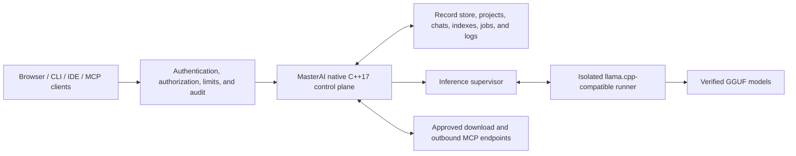
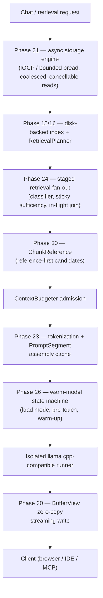

# MasterAI

**A secure, native, local programming AI control plane built from the ground up
in ISO C++17.**

[](docs/architecture/ADR-0001-cpp17-native-architecture.md)
[](docs/architecture/platform-matrix.md)
[](LICENSE)
[](docs/PLAN.md)

MasterAI coordinates local language models, authenticated users, programming
projects, chats, source context, verified downloads, benchmarks, IDE clients,
and Model Context Protocol (MCP) integrations from one security-focused native
service.

The project is designed for developers who want local ownership of models and
project data without making an inference engine, a container platform, or a
third-party application framework the foundation of the system.

> [!IMPORTANT]
> MasterAI is under active development and is **not yet production-ready**.
> Several major capabilities are implemented and test-covered, but real-model,
> external-client, distribution-packaging, and large-project exit checks remain
> outstanding. See [Project status](#project-status) and the authoritative
> [implementation plan](docs/PLAN.md).

## Why MasterAI?

MasterAI is intended to provide a dependable local AI programming environment
with explicit security and resource boundaries:

- **Local ownership** — models, projects, chats, indexes, benchmarks, and
  operational state remain on systems you control.
- **Native C++17 control plane** — no Docker runtime and no inherited web or
  application framework.
- **Programming-first workflows** — chat, code completion, review, debugging,
  documentation, project search, IDE integration, and reproducible model
  comparison.
- **Process-isolated inference** — model runners execute outside the main
  control-plane process, so model memory and runner failures remain isolated.
- **Deny-by-default security** — listeners, routes, files, model sources, MCP
  tools, and administrative operations require explicit authority.
- **Verified model lifecycle** — manifests bind model identity, provenance,
  license, size, digest, backend, and hardware suitability.
- **Bounded resource use** — queues, memory reservations, contexts, background
  work, downloads, and indexes are designed around enforced ceilings.
- **Replaceable adapters** — inference, hardware, storage, embedding, speech,
  secret, and MCP integrations do not dictate the internal architecture.
- **Evidence-driven optimization** — performance work must be measured without
  bypassing correctness, security, cancellation, or auditing.

## Project aims

MasterAI aims to become a native, modular programming AI host that can:

1. Run securely on developer workstations and approved local servers.
2. Discover and validate categorized local programming models.
3. Assess whether a model can run safely on the current hardware.
4. Supervise local inference backends without loading model weights into the
   control process.
5. Provide authenticated browser, API, CLI, IDE, and MCP workflows.
6. Preserve durable projects, chats, attachments, indexes, jobs, and audit
   records with recovery support.
7. Download model artifacts only from approved immutable sources, resume
   interrupted transfers, and verify them before promotion.
8. Compare models with reproducible performance and programming-quality
   evidence.
9. Operate safely on lower-memory systems through deterministic admission,
   pressure handling, and degradation.
10. Add retrieval, caching, prompt reuse, and advanced throughput only after
    their security, memory, and quality boundaries are proven.

## Architecture

MasterAI separates the security-sensitive control plane from replaceable model
runner processes:



The control plane owns configuration, authentication, authorization, users,
projects, chats, model metadata, downloads, benchmarks, MCP policy, process
supervision, health, metrics, and graceful lifecycle operations. It does not
map large model weights into its own address space.

Initial inference uses an optional, version-pinned `llama.cpp` server behind a
validated process adapter. `llama.cpp` is not the architectural foundation and
can be replaced without changing MasterAI's external contract.

### Core design principles

- Strict ISO C++17 for application source; optional Assembly only when profiling
  proves a benefit and a C++17 boundary is retained.
- Native Windows and Linux operation without a container runtime.
- Loopback-only network binding by default.
- Authentication and authorization even in local-only mode.
- Canonical, authorized filesystem paths with symlink traversal denied by
  default.
- OS-backed cryptography and secret protection; no custom cryptographic
  primitives.
- Strict configuration schemas, bounded inputs, atomic persistence, and
  recoverable state.
- Process isolation, cancellation, timeouts, backpressure, and graceful
  shutdown.
- Explicit model provenance, licensing, size, and SHA-256 verification.
- Current authorization checks remain authoritative; caches never become an
  access-control source.

Further design detail is available in
[ADR-0001](docs/architecture/ADR-0001-cpp17-native-architecture.md), the
[release 1 baseline](docs/architecture/ADR-0003-release-1-product-baseline.md),
and the [security threat model](docs/security/threat-model.md).

## Implemented capability areas

The current source includes native implementations for:

- Schema-versioned configuration with precedence, atomic replacement, reset,
  migration metadata, and objective-hash verification.
- OS-principal authentication, first-administrator setup, persistent roles,
  hashed sessions, scoped tokens, CSRF/origin/host controls, rate limits, and
  hash-chained audit records.
- Categorized model discovery, strict manifest parsing, exact size and SHA-256
  checks, license/provenance preservation, suitability decisions, quarantine,
  and load-time integrity revalidation.
- Process-isolated `llama.cpp` supervision with readiness checks, loopback IPC,
  tokenization, streamed generation, cancellation, unload, logs, and metrics.
- Authenticated native web pages, projects, chats, model selection,
  attachments, prompt context assembly, streaming, and cancellation. Chat
  bubbles show per-message token counts (prompt tokens on the query,
  generated tokens on the response), and reply budgets are fitted to the
  model's context window up front so oversized attachments produce a clear
  error instead of a runner failure or context-shift repetition loop. Replies
  render Markdown links and bare URLs as real clickable anchors. The model
  picker carries a per-model Effort/Thinking settings panel (opens
  automatically on selection, persisted in the browser and restored whenever
  that model is chosen again): for a reasoning-capable architecture (Qwen,
  gpt-oss) the choice is sent to the model as an explicit reasoning
  directive, and for every other architecture it is instead applied as a
  sampling-preset adjustment (temperature/top_p/reply length), so the
  setting is never a silent no-op. System-error notifications are a
  contained, auto-fading floating bubble with a copy button rather than a
  full-width banner. Each
  user also has durable, owner-scoped chat memory: `save to memory: <detail>`
  stores a detail without invoking the model, common self-disclosures (names,
  preferences, contact details, work, and suggestions) are captured by
  deterministic bounded rules, and relevant saved details are read once when
  a conversation starts, then retained as bounded user reference data on that
  chat for later turns and restarts regardless of the selected model. New
  durable details apply automatically to newly created conversations; an
  active conversation retains its own history and startup snapshot. The
  collapsed Memory sidebar makes every capture visible and removable.
- Resumable, journaled, hash-verified model downloads with quarantine on
  integrity failure.
- Quick, standard, and extended benchmark profiles with compatible comparison
  and recommendation records.
- Inbound MCP over newline-delimited `stdio` and Streamable HTTP using protocol
  revision `2025-11-25`.
- Policy-separated outbound MCP over restricted `stdio` and loopback
  Streamable HTTP, with executable pinning, allow-lists, approval, cancellation,
  timeouts, response bounds, secret references, and audit.
- Native VS Code/Agent-Coder and Visual Studio connection profiles, protected
  IDE tokens, diagnostics, and read-only diff preview contracts.
- Backup, restore, secret/log rotation, recovery, hash-bound upgrade and
  rollback, standalone lifecycle scripts, and hardened systemd operations.
- Query-stage measurement, resource attribution, hardware/storage probes,
  authenticated metrics, and repeatable control-plane performance baselines.
- System-wide memory admission, OS reserve protection, bounded work queues,
  pressure actions, profiles, status, and inference leases.
- A cancellable, checksummed, disk-generation project index foundation with
  recovery, partial publication, unchanged-file elimination, affected-path
  updates, literal and exact-boundary symbol search, typed/coalesced triggers,
  bounded background work, and authenticated status/rebuild/cancel/notify
  routes, plus a native `ProjectWatcher` file-watcher/branch-switch adapter
  (`indexing.watchProjectFiles`, on by default) that drives the same service
  automatically without any external editor or version-control hook.
- Deadline-bound hybrid retrieval (`RetrievalPlanner`/`ContextBudgeter`) that
  chooses the least expensive sufficient index-backed strategy, runs bounded
  parallel strategy steps, fuses results on canonical chunk identity, and
  discloses every included and omitted candidate on the query trace.
- A security-partitioned, byte-bounded cache (`CacheManager`) in front of
  retrieval results, with segmented LRU eviction, versioned keys that make
  file, index, and policy changes an automatic miss, atomic
  checksum-verified disk entries, and authenticated status/trim/clear
  administration.
- Compatible runner prompt-prefix/KV-session reuse (`PromptSessionManager`)
  that resumes a chat's previous llama.cpp KV-cache slot only on an exact
  fingerprint match and a literal byte-prefix-extending prompt, refusing
  reuse on any model switch, reindex, or edited earlier turn.
- Adaptive hardware/model calibration (`CalibrationService`): a real
  cold-load-plus-generation measurement persisted as a host/model/backend/
  build-keyed `TuningProfile`, with automatic invalidation and a safe-default
  fallback on any identity change, plus GPU-layer/mmap/mlock/thread/batch
  launch tuning and CPU%/disk-byte calibration evidence.
- Real GPU memory (VRAM) detection (`probe_hardware`, DXGI-backed on
  Windows) feeding an evidence-based GPU-layer offload decision
  (`select_gpu_layers`): a model whose weights comfortably fit the detected
  VRAM (minus a reserved headroom for the backend's own context/runtime
  overhead) is recommended for full `--n-gpu-layers` offload; otherwise the
  always-safe CPU-only default is kept rather than guessing a partial layer
  count. Applied automatically to every chat auto-load and manual model
  load, not only after an administrator runs an explicit calibration.
- Phase 30A: CPU-only/GPU-disabled low-memory operation. A strict
  `hardware.acceleratorPolicy` config (`auto` / `cpu_only` / `gpu_allowed`,
  default `auto`). Under `cpu_only`, every runner launch is forced to zero
  GPU layers -- `CalibrationService` never recommends GPU offload, a stale
  persisted profile that does is rejected rather than silently zeroed, and
  `LlamaCppAdapter::build_launch_spec()` refuses to launch at all if a
  nonzero GPU-layer request reaches it. The runner process is also launched
  with GPU-visibility environment overrides (`CUDA_VISIBLE_DEVICES=-1` and
  equivalents) so a backend library cannot enumerate or initialize a GPU
  even if it ignores the launch flags. Before that runner process is ever
  started, `admit_runner_weights()` reserves a `MemoryCategory::
  runner_weights` budget lease sized from the model's real weight bytes plus
  compute-buffer/KV heuristics, rejecting an oversized model with a concrete
  reason instead of letting it map/load first and fail later; a released
  lease on every unload path keeps the next model's admission check
  accurate. `MemoryPolicy::maximum_active_inference` (one request under the
  minimal/cpu_only profile) is enforced on every chat request instead of
  being a validated-but-unread field. A background `MemorySweeper` thread
  unloads an idle runner once past its calibrated idle-unload seconds
  (unconditionally under a profile that does not keep a warm idle model by
  default, otherwise once real memory pressure appears) and trims bounded
  caches under sustained pressure. `GET /api/v1/system/resources` reports
  the effective `acceleratorPolicy`; `GET /api/v1/runner/status` adds
  requested-vs-actual GPU layers and an unload countdown; `GET /api/v1/
  system/memory` adds pagefile/swap headroom (`totalVirtualMemoryMiB`/
  `availableVirtualMemoryMiB`, already pagefile-inclusive via Windows
  `GlobalMemoryStatusEx`), process commit bytes, and hard-fault count.
  Reconfiguring the OS pagefile itself is out of scope -- MasterAI reports
  virtual-memory/pagefile state, it never changes it. An administrator-only
  `GET`/`POST /api/v1/admin/config` reads and writes the live `settings.json`
  (surfaced in the web UI's Settings -> System configuration panel), applying
  every field a live request path already re-reads immediately and reporting
  which changed fields need a restart. The one remaining deliverable is the
  matched `auto`-vs-`cpu_only` real-model benchmark matrix, which needs a
  pinned local GGUF and dedicated hardware run.
- A durable, administrator-controlled Phase 20 registry for optional
  advanced-throughput candidates (continuous batching, speculative decoding,
  NUMA affinity, storage prefetch, multiple warm runners, GPU/CPU KV
  placement). Evidence records are strictly validated and restart-safe;
  recording evidence never enables a feature; admission additionally requires
  a wired implementation, no recorded regression, and a verified fallback;
  every admitted feature remains independently disableable. The safe Phase 19
  profile is always retained. No optional candidate is currently admitted.
- Phase 31: storage tiering and scratch-volume management. Five measured
  storage tiers (fast local NVMe, local SATA SSD, local HDD, removable/
  network, RAM-backed) classified from Phase 21's real device-type/latency
  evidence, never assumed. `ScratchVolumeManager` bounds ephemeral per-job
  scratch storage with per-job and global byte quotas, refuses admission
  once free disk space would fall below a configured reserve, publishes
  finished output atomically (stage-then-rename, so a durable destination is
  never partially observable), cleans up on shutdown, and recovers orphaned
  scratch left by a previous crashed run via a durable journal at the next
  startup (also re-runnable on demand via `POST /api/v1/system/scratch/
  cleanup`). A hard, code-enforced prohibition (`durable_data_class_allows_
  ram_tier()`) refuses -- never silently downgrades -- any attempt to place a
  GGUF model, durable chat, audit/security record, user database, resumable
  download, backup, or sole-copy index generation on RAM-backed storage.
  `GET /api/v1/system/storage` (administrator-only) reports measured
  filesystem-integrity flags (compression/encryption/dedup/virtual-disk/
  network-redirection, best-effort on Windows) and a resulting model-
  placement recommendation, plus separate physical/committed/commit-limit/
  pagefile/page-fault-rate/model-resident memory accounting so none of those
  figures are conflated into one number. `GET /api/v1/system/scratch`
  reports live quota/usage/active-job status. A dedicated multi-tier
  migration workflow (relocating already-placed durable data between tiers)
  is also implemented: `migrate_durable_file()` verifies a SHA-256 digest
  match between source and staged copy before an atomic rename, enforces
  the same RAM-tier prohibition, and is exposed administrator-only via
  `POST /api/v1/system/storage/migrate`. Every migration is recorded in a
  durable, journaled `DurableFileManifest`, and `resolve_durable_path()`
  transparently follows it -- wired into the model-launch path so a Model
  Registry entry's model file is still found after being migrated, and
  visible administrator-only at `GET /api/v1/system/storage/manifest`.
- Phase 33: distributed runners, both halves. Local multi-runner
  orchestration: `LocalRunnerPool` generalizes the existing single-runner
  `RunnerSupervisor` supervision pattern to N concurrent local runner
  processes (per-GPU runner, CPU+GPU split, or dedicated embedding/router/
  benchmark runners), configured via the `localRunnerPool` settings array,
  which stays empty (unchanged single-runner mode) unless an administrator
  opts in. Requests are routed by resident-model match, runner health/
  state, capability, and priority, with Phase 2 project-bound authorization
  enforced as a hard filter; a failing runner is isolated (marked
  unhealthy, excluded from routing) rather than taking down the control
  plane, and a retry is only ever attempted when nothing from the failed
  attempt has already reached the caller or been persisted. The runner
  that actually served each query is recorded on the Phase 13 query trace
  and visible administrator-only at `GET /api/v1/runner/pool`. Intranet
  worker protocol: `IntranetWorkerPool`/`WorkerListener`
  (`src/intranet_worker.cpp`) add mutual-TLS routing to administrator-
  approved remote worker machines, using OpenSSL as this codebase's first
  vendored TLS/crypto dependency (optional at build time via
  `find_package(OpenSSL)`; fails closed at runtime with a clear error when
  unavailable, never falls back to plaintext). A worker's certificate is
  verified against a pinned private CA plus a pinned leaf digest; the
  worker equally verifies this control plane's own client certificate.
  Worker certificates are issued from an in-process private CA
  (`POST /api/v1/system/pki/initialize`, `POST /api/v1/system/pki/workers`)
  and copied to the physical worker machine out of band -- there is no
  self-service worker registration. Each worker's self-reported loaded-
  model digest is verified against this control plane's own model registry
  before that worker is ever selectable (`GET`/`POST /api/v1/worker/pool[/refresh]`).
  `WorkerListener` (`AppConfig::workerMode`, disabled by default) is this
  codebase's one deliberate exception to the administrator HTTP server's
  loopback-only constraint, speaking only the narrow authenticated worker
  protocol, never the administrator surface. Wired into the live
  chat-generation dispatch path: a chat request automatically fails over
  onto a healthy, verified remote worker (before falling back further to
  the default local runner) whenever the local runner it tried fails and
  nothing from that attempt has already reached the caller.
- Phase 34: adaptive performance controller. `AdaptiveController`
  (`src/adaptive_controller.cpp`) extends Phase 19 calibration into a live,
  bounded controller with real minimum-dwell-time, cooldown, bounded-step-
  size, rolling-measurement, confidence-requirement, and safe-rollback
  stability controls, and all eight named modes (Minimal Memory, Balanced,
  Lowest Latency, Maximum Throughput, Battery Saver, Quiet/Thermal
  Conservative, Administrator Custom, Automatic). Applies live to the one
  genuinely mutable target in this codebase
  (`MemoryBudgetManager::set_policy()` -- inference concurrency, queued-
  inference ceiling, index worker count, default context tokens); every
  other named knob (prefetch distance, batch size, NUMA/GPU offload, KV
  placement, background-job rate, and others) is computed and disclosed as
  a recommendation rather than applied, since no live setter exists for
  them yet. Administrator-only routes: `GET /api/v1/performance/adaptive`,
  `POST .../mode`, `POST .../ceilings`, `POST .../rollback`.
- Phase 35: a "Performance" administration page (`/app/performance`)
  consolidating live visibility into the local runner pool, the intranet
  worker pool, the adaptive controller (mode selection, applied/
  recommended adjustments with reasons and confidence, rollback), memory,
  caches, storage tiers and the tier-migration manifest, the request
  scheduler, advanced optimizations, and calibration profiles, backed
  entirely by the real routes above -- condensed from the plan's full
  named-page enumeration into one working page rather than many
  placeholders.
- Phase 32 (evidence-pending): speculative decoding. `check_draft_target_
  compatibility()`, `SpeculativeDecodingStats`, and
  `decide_speculative_decoding_for_request()`
  (`src/speculative_decoding.cpp`) implement exact draft/target
  compatibility checking, rolling acceptance-rate tracking, and the bounded
  per-request enable/disable rule the plan describes, wired to a real
  dual-model (draft+target concurrently resident) launch path
  (`LlamaCppAdapter::build_launch_spec`'s `--model-draft` flags) and gated
  behind the same evidence/admission registry `continuous_batching` uses.
  The sampling-compatibility gate correctly reflects that llama.cpp's
  rejection-sampling verification supports this codebase's real (non-greedy)
  chat sampling presets, so the feature activates for live chat traffic once
  admitted and evidenced. Still unvalidated on real hardware -- no measured
  throughput run has exercised the launch path yet.
- A native asynchronous storage and prefetch engine (`IAsyncFileReader`):
  IOCP-backed overlapped reads on Windows and a bounded worker-pool `pread`
  fallback on POSIX, adjacent-request read coalescing, an adaptive
  queue-depth policy keyed to a measured `StorageLatencyProfile`, and
  cancellable requests, wired into model-manifest and index-segment reads
  with automatic fallback to the prior blocking path.
- Tokenization, chat-template, and segmented prompt-fragment caching: a
  content/tokenizer-fingerprinted tokenization cache, compiled
  process-lifetime chat-template execution plans, `PromptSegment`-based
  assembly over shared immutable buffers, a restricted identifier intern
  table, and an extended `PromptSessionManager` reuse decision reporting
  exact reusable-prefix length, divergence offset, invalidation reason, and
  a configurable prefix byte ceiling.
- Low-risk control-plane hot-path reductions: Windows CNG SHA-256/HMAC
  algorithm-provider handles are reused for the process lifetime instead of
  reopened for each authenticated request, frequency-sketch slots use a
  power-of-two mask instead of integer modulo, and both JSON encoders use a
  complete 256-entry escape table plus bulk clean-run copies. These are
  implementation optimizations, not new throughput claims; correctness and
  measured performance gates remain authoritative.
- Staged, classified retrieval fan-out on top of `RetrievalPlanner`:
  filename/path and recent-change strategies, a deterministic request
  classifier, sticky-sufficiency staged execution, an authorization-scoped
  in-flight request join table, and reference-first (`ChunkReference`)
  candidate materialization gated on `ContextBudgeter` admission, with
  not-yet-adapted strategies (semantic embedding, MCP-resource, call-graph,
  and others) declared but disabled and disclosed on the query trace.
- Explicit model load-mode/pre-touch selection and a warm-model state
  machine: `ModelLoadMode`/`PreTouchLevel` chosen from measured storage and
  RAM evidence, and a `WarmModelState` machine layered onto the existing
  runner-state tracking via a regression-tested translation table, with
  cancellable background warm-up that yields under memory pressure.
- An immutable shared-buffer and request-scoped memory architecture:
  `SharedBuffer`/`BufferView`/`MappedBufferView`/`ChunkReference`/
  `TokenSpan`/`PromptSegment`, a debug-poison-checked `RequestArena`, and a
  `FixedSizePool<T>` bridged into `MemoryBudgetManager` accounting, plus a
  zero-copy write path for streamed chat tokens.
- A "PageFile" storage setting (`storage.pageFileRoot`, restart required):
  redirects MasterAI's own disk-backed, per-category, key-indexed cache
  (`CacheManager` -- tokenization, prompt/retrieval, model manifests, and
  more) to an administrator-chosen directory instead of the default
  `runtime_root/cache`, so that disk activity can be pointed at a faster
  drive or away from the drive backing the real Windows pagefile, with no
  admin privilege required and no data outside MasterAI's own use. Left
  empty, behavior is unchanged. Configurable in the web UI's Settings ->
  System configuration panel; resolved via `resolve_page_file_root()`.
- A "System Report" (web UI: Report -> System Report, administrator-only,
  `GET /api/v1/system/report`): one consolidated read of hardware (RAM, GPU
  memory, CPU/NUMA), the real Windows pagefile's commit headroom,
  `MemoryBudgetManager` pressure, this process's resident/commit memory, the
  configured PageFile location's drive capacity/free space and MasterAI's
  own used/capacity bytes there, and which optional features (retrieval,
  cache, session reuse, automatic calibration, project-file watching,
  local-password/OS sign-in) are currently enabled.
- A stall watchdog on live generation requests (`inference.stallTimeoutSeconds`,
  default 120s, hot-reloadable): `RunnerSupervisor::generate()`'s wait on the
  runner's `/completion` stream now has a deadline measured from the last
  byte actually received, so a runner that stalls mid-request (most likely
  on a cold model's first prompt) surfaces as a timeout error instead of
  hanging the request indefinitely; a still-streaming generation is never
  cut off since the deadline resets on every byte received.
- Weighted-fair request scheduling and bounded backpressure across eight
  priority classes, deterministic KV-cache reservation and eviction,
  hardware-topology discovery, and evidence-driven model-routing/cascade
  decision logic. Continuous backend batching, live worker affinity, and
  transparent multi-model cascade execution remain gated follow-up work.
- An administrator-only Machine Learning control-plane foundation with a
  dashboard and durable lifecycle records for ML projects, model registry
  entries, datasets, subject packages, labeling and preparation work,
  training and fine-tuning jobs, evaluations, experiments, model-builder
  configurations, instruction and synthetic-data records, vector stores,
  RAG configurations, subject exams, hyperparameter searches,
  model-optimization runs, training checkpoints, and deployments — plus a
  real execution engine (Phases 56-61) that ingests validated CSV dataset
  content, trains tabular models by gradient descent with genuine loss
  curves and held-out metrics, captures measured-loss checkpoints, scores
  trained models with real evaluation metrics, compares two trained models
  on a shared benchmark with a measured winner, serves live predictions
  from persisted weight artifacts, ingests and hashes approved text files,
  persists either authored hashing vectors or validated learned vectors from
  a verified local embedding GGUF, and executes ranked, cited retrieval/
  context assembly. LLM fine-tuning, generative RAG answers, exam
  administration, hyperparameter search execution, and deployment promotion
  do not run yet.

Implementation does not automatically mean operational certification. The next
section records the distinction.

## Project status

Status below reflects the evidence recorded in
[docs/PLAN.md](docs/PLAN.md) on **6 August 2026**.

| Phase | Area | Status |
|---:|---|---|
| 0 | Requirements and release decisions | Complete |
| 1 | Native foundation and lifecycle | Complete |
| 2 | Identity and security baseline | Complete |
| 3 | Model registry and hardware assessment | Complete |
| 4 | First isolated inference adapter | Complete; real pinned backend/GGUF path validated |
| 5 | Chat and project web application | Complete; actual-browser real-model chat validated |
| 6 | Secure resumable downloads | Complete; interrupted immutable HTTPS resume and digest promotion validated |
| 7 | Reproducible benchmarking | Complete; same-host real-model comparison validated |
| 8 | Inbound MCP | Complete; live project-bound independent-inspector connection validated |
| 9 | Outbound MCP | Complete |
| 10 | IDE integrations | Complete; VS Code and Visual Studio 2022 hosts live-validated |
| 11 | Operations hardening | Complete |
| 12 | Measured control-plane optimization | Complete for measured native scope |
| 13 | Query measurement and resource baseline | Complete |
| 14 | Bounded-memory foundation | Complete |
| 15 | Incremental disk-backed indexing | Complete; deeper symbol extraction remains a forward enhancement |
| 16 | Deadline-bound hybrid retrieval | Complete; authored hybrid-vs-full-text evaluation passes |
| 17 | Security-partitioned cache hierarchy | Complete; representative cache latency benchmark passes |
| 18 | Prompt-prefix and KV/session reuse | Complete; real repeated-turn prefix reuse validated |
| 19 | Hardware/model calibration | Comparative Qwen 3B offload/throughput matrix validated; broader semantic-quality scoring remains forward work |
| 20 | Optional advanced throughput | Complete admission layer; all candidates remain disabled by default |
| 21 | Native asynchronous storage and prefetch engine | Implementation complete; bounded IOCP/`pread` fallback, mapped regions, coalescing, cancellation |
| 22 | Hierarchical content and model-data caching | Implementation complete; immutable resident L1 and streaming-aware segmented eviction |
| 23 | Tokenization, template, and prompt-fragment caching | Implementation complete; exact recorded token-prefix reuse |
| 24 | Advanced retrieval fan-out and adaptive query planning | Implementation complete; authored Release evaluation clears Phase 16 baseline |
| 25 | Continuous inference batching and request scheduling | Implementation complete; backend activation remains calibrated and default-off |
| 26 | Model loading, mapping, pre-touch, and warm-state management | Implementation complete; all selective pre-touch levels actionable |
| 27 | KV-cache compression, placement, and lifecycle management | Accounting/placement/lifecycle implemented at a scoped-down level; compression and prefix sharing gated |
| 28 | NUMA, processor-group, and topology-aware execution | Discovery and recommendation implemented at a scoped-down level; live affinity pending evidence |
| 29 | Model tiering, routing, and cascade inference | Decision logic implemented at a scoped-down level; live chat routing/cascade execution pending |
| 30 | Memory deduplication and immutable shared-data architecture | Implemented at a scoped-down level |
| 30A | CPU-only and GPU-disabled low-memory operation | Implemented; matched real-model benchmark matrix pending |
| 31 | Storage tiering, virtual drives, and scratch-volume management | Implemented, including Priority B tier-migration tooling |
| 32 | Speculative decoding and draft-model acceleration | Planned |
| 33 | Distributed local runners and multi-device orchestration | Planned |
| 34 | Adaptive performance controller | Planned |
| 35 | Performance administration interfaces | Planned |
| 36 | Full performance certification and regression gates | Planned |
| 37 | Machine Learning module foundation | Implemented at a scoped-down level |
| 38 | Machine Learning projects | Implemented at a scoped-down level |
| 39 | ML model registry and dataset manager | Implemented at a scoped-down level |
| 40 | Subject Knowledge Manager | Implemented at a scoped-down level |
| 41 | Data labeling and preparation | Implemented at a scoped-down level |
| 42 | Training Jobs | Implemented; real tabular training executor (Phase 56) |
| 43 | Evaluation Lab | Implemented; real tabular scoring harness (Phase 56) |
| 44 | Experiment Tracking | Implemented at a scoped-down level initially; Phase 80 adds a real training/evaluation executor and side-by-side comparison |
| 45 | Fine-Tuning Interface | Implemented at a scoped-down level; no fine-tuning executor |
| 46 | Model Builder | Fully implemented (full section 9 design sheet, basic/advanced modes); no construction executor |
| 47 | Prompt and Instruction Training | Implemented at a scoped-down metadata level initially; Phase 81 adds the real content record, generation, multi-model testing, duplicate/contradiction detection, and structured-output validation |
| 48 | Synthetic Data Generation | Implemented at a scoped-down metadata level; no generator |
| 49 | Embeddings and Vector Stores | Registry implemented; real local hashing-vector index added in Phase 59 |
| 50 | Retrieval-Augmented Generation | Configuration implemented; real retrieval/context executor added in Phase 60 |
| 51 | Subject Examination System | Implemented at a scoped-down record level; no exam administration |
| 52 | Hyperparameter Optimization | Implemented at a scoped-down record level; no search executor |
| 53 | Model Optimization | Implemented at a scoped-down record level; no optimizer executor |
| 54 | Checkpoint Management | Implemented at a scoped-down retention-record level initially; Phase 79 adds real mid-training weight-snapshot capture and a resume-training executor |
| 55 | Deployment Manager | Implemented at a scoped-down approval-record level; no deployment executor |
| 56 | Real ML execution engine (tabular training, evaluation, prediction) | Implemented |
| 57 | Model Comparison (real baseline-vs-candidate benchmark executor) | Implemented |
| 58 | Knowledge-file ingestion | Implemented; bounded text upload, SHA-256 provenance, durable chunk records |
| 59 | Local embedding and vector indexing | Implemented; authored 128-dimensional hashing vectors and index profiles |
| 60 | RAG retrieval and grounded context assembly | Implemented; approved-config query execution with ranked chunks and citations |
| 61 | Learned embeddings and once-per-chat memory recall | Implemented; isolated llama.cpp embedding adapter, durable vector provenance, and retained chat memory snapshots |
| 62 | Inference Endpoints | Implemented at a scoped-down record level initially; Phase 77 adds a real network listener |
| 63 | Hardware and Compute | Implemented at a scoped-down record level initially; Phase 67/75 add real local and remote telemetry |
| 64 | Automation Pipelines | Implemented at a scoped-down record level initially; Phase 69/71/72 add real stage execution |
| 65 | Safety and Governance | Implemented at a scoped-down policy/model-card approval level initially; Phase 74 adds real heuristic content scanning |
| 66 | Audit Logs and Machine Learning Settings | Implemented; real read over the existing audit trail, and a real ML-scoped subset of System Configuration |
| 67 | Hardware and Compute live telemetry | Implemented; a compute node flagged as the local host reports a genuinely fresh `probe_hardware()` snapshot on demand |
| 68 | Monitoring and Diagnostics | Implemented; real aggregation of live local-host hardware, training-job counts, evaluation metrics, and benchmark throughput |
| 69 | Automation Pipelines real executor | Implemented; "Train model"/"Evaluate model" stages genuinely run, every other named stage honestly reported as skipped |
| 70 | Fine-Tuning real executor | Implemented; genuine warm-start gradient descent from a base model's trained weights, registered as a new model |
| 71 | Automation Pipelines: more real stages and live progress | Implemented; "Validate data"/"Validate model"/"Safety tests"/"Request approval"/"Deploy staging"/"Deploy production"/"Rollback"/"Monitor" all genuinely execute (Import/clean/label/split data, optimize, and staging tests remain honestly skipped); a run now executes on a background thread and reports live per-stage progress the web UI renders as a progress bar |
| 72 | Automation Pipelines: final six real stages | Implemented; all six stages genuinely execute, including "Label data", which now runs a real heuristic auto-labeler (quantile-binning or existing-label validation) when no completed labeling task is on record |
| 73 | Real LLM LoRA fine-tuning | Implemented when `llama_finetune_executable`/`llama_export_lora_executable` are configured (administrator-vendored, same manual-placement convention as `llama-server`); a `"llm:"`-prefixed fine-tuning job method runs a real LoRA train-and-merge pipeline on a background thread |
| 74 | Safety and Governance real content scanning | Implemented; local heuristic secret/prompt-injection/restricted-term scanning (`scan_content_for_risks`) plus a real LLM-as-judge ML classifier pass (`scan_content_with_model_classifier`) for bias/hallucination/subtler harmful content |
| 75 | Hardware and Compute remote telemetry agent | Implemented; `masterai telemetry-agent` run on a remote node, polled for real by a `ComputeNode` with a matching `agentUrl` |
| 76 | RAG real answer generation | Implemented; the RAG query route's optional `"generate":true` mode produces a real generated answer grounded in the same retrieved context |
| 77 | Inference Endpoints real listener | Implemented; an `active` endpoint opens a real listener enforcing authentication, rate limiting, and a real per-endpoint safety policy (scan on/off, block-on-finding, attached `SafetyPolicy`, opt-in Phase 74 model classifier), re-read live on every request |
| 78 | Monitoring real per-request telemetry | Implemented; real latency percentiles, queue depth, requests/minute, live per-step tabular-training progress, and KV-session cache-hit rate |
| 79 | Checkpoint Management real capture and resume | Implemented; training/fine-tuning runs capture a genuine weight snapshot at each checkpoint epoch, and "Resume training" continues gradient descent from one, registering the result as a new model |
| 80 | Experiment Tracking real executor | Implemented; "Run now" genuinely trains and evaluates the experiment's dataset (real training/validation/evaluation metrics, checkpoints, hardware, runtime), and "Compare" builds a genuine side-by-side diff of two or more already-run experiments |
| 81 | Prompt and Instruction Training real content and operations | Implemented; a real content record (system/user instruction, context, expected/rejected response, tool calls/results, output format, difficulty, safety classification), real draft generation and multi-model testing via `execute_rag_generation`, heuristic duplicate/contradiction detection, real JSON structured-output validation, and enforced approval-requires-content |

Current validation includes Windows x64 Debug and Release builds and tests under
strict C++17, plus a Linux x86-64 Release build and test run under Ubuntu 26.04
WSL. Release packaging certification on the pinned Ubuntu 24.04 and Debian 13
hosts is still outstanding.

Phase 1 was revalidated on the current tree on 5 August 2026 without an
additional rebuild: the Windows Debug native suite passed, both loopback health
endpoints returned HTTP 200 on port 7070, and the documented graceful-stop path
completed successfully.

Phase 15 has a bounded native indexing service, affected-path updates,
typed/coalesced trigger admission, disk-generation recovery tests, a native
`ProjectWatcher` file-watcher/branch-switch adapter that calls the indexing
service automatically (no external editor or VCS hook required), a
representative large-project ceiling measurement (`masterai index-probe`),
and a recorded platform-I/O backend decision. Both of its exit criteria now
have current evidence on Windows Debug and Release; deeper language-aware
symbol extraction remains a forward enhancement, not an exit-criterion
blocker.

Phase 16 adds a `RetrievalPlanner` that reads a project's Phase 15 index
directly (exact symbol, exact text, and per-token lexical strategies),
runs bounded parallel strategy steps under a hard request deadline, fuses
and deduplicates results on canonical chunk identity, and discloses exactly
which evidence was used through `/api/v1/queries/{id}`. Phase 17 adds a
byte-bounded, security-partitioned `CacheManager` in front of Phase 16
retrieval results, keyed so that a file change, an index republish, or a
membership/policy change makes a stale entry unreachable automatically,
with authenticated `GET/POST /api/v1/system/cache*` administrative routes.
Both are Windows Debug- and Release-validated; Phase 24's authored evaluation
also closes Phase 16's previously outstanding evaluation-set criterion.

Phases 21–30 add a native performance/architecture layer on top of Phases 15–19:
an asynchronous storage/prefetch engine, hierarchical and prompt caches,
staged retrieval fan-out, weighted-fair scheduling, model warm-state
management, KV-cache governance, hardware-topology decisions, model-routing
logic, and an immutable shared-buffer/arena architecture with a zero-copy
chat-streaming write path. Phases 21–26 are implementation-complete; Phases
27–30 retain the explicit scope limits recorded in [docs/PLAN.md](docs/PLAN.md).
Linux uses the documented bounded `pread` fallback instead of `io_uring`, and
continuous batching remains default-off until host/model/backend calibration
admits it. Phase 31 adds storage tiering (`StorageTier`, measured from the
same Phase 21 device-type/latency evidence), a `ScratchVolumeManager` (bounded
per-job/global quotas, atomic publish, crash-recovery journal, orphan cleanup,
free-space reserve), a hard code-enforced prohibition on placing durable data
(models, chats, audit/security records, user databases, downloads, backups,
sole-copy indexes) on RAM-backed storage, separate physical/commit/pagefile/
page-fault/model-resident memory accounting, and best-effort Windows
filesystem-integrity detection (compression/encryption/dedup/virtual-disk/
network-redirection) feeding a measured, not assumed, model-placement
recommendation. Its tier-migration workflow remains future work; Phases
32–36 remain planned.

Phases 37–55 establish the Machine Learning administration layer:
administrators manage durable, permission-gated records through native web
pages and `/api/v1/ml/*` routes, with lifecycle, review, approval, reload,
and deletion behavior covered by native tests. Phase 56 adds the module's
first real execution engine on top of those records: administrators upload
CSV dataset content (validated server-side), run Training Jobs that
actually train tabular models by gradient descent (linear regression, and
logistic/softmax classification) with genuine loss curves, deterministic
held-out splits, measured-loss checkpoints, and persisted weight artifacts;
run Evaluation Lab scoring that produces real accuracy/precision/recall/F1/
confusion-matrix or MSE/MAE/R² metrics; and serve live predictions from any
trained model through the Model Registry, all surviving server restarts.
Phase 57 extends that engine with Model Comparison: a baseline and a
candidate model are both evaluated against one shared benchmark dataset,
and the stored verdict reports both metric sets, the primary-metric delta,
and the measured winner.
Phases 58–61 add a second evidence-producing path: administrators select a
local text, Markdown, CSV, JSON, JSONL, or Parquet file in the Subject
Knowledge Manager (Parquet is converted to text via a configured,
process-isolated DuckDB CLI helper); MasterAI bounds and hashes the accepted
content, creates overlapping
chunks, persists authored 128-dimensional hashing vectors, and exposes a
measured vector-store profile. An approved RAG configuration can then run
hybrid, vector, or keyword retrieval and return ranked source chunks plus a
citation-ready context package.
Phase 61 lets a Vector Store instead select a verified, ready GGUF from the
`embeddings-code-search` category. MasterAI loads it through the existing
isolated llama.cpp runner, validates and normalizes its learned vectors, and
persists the exact model and dimensions so retrieval cannot silently mix
embedding spaces. Durable user-memory records are also recalled only when a
conversation starts; the bounded snapshot is retained with that chat and
reused on later turns and after restart.
The honest remaining boundary: the authored fallback is still lexical
feature hashing, no learned embedding GGUF is installed in this checkout for
model-specific semantic-quality or latency evidence, and the RAG executor
retrieves and assembles grounded context but does not generate an LLM answer.
LLM fine-tuning still does not execute. For the concepts, current workflows, exact capability boundary,
and a sequential teaching guide, read
[How to Use Machine Learning and Models with MasterAI](docs/HowToUse-MachineLearning.md).

No release may be called production-ready until the functional, security,
migration, recovery, MCP conformance, performance, resource-ceiling, retrieval,
cache-isolation, licensing, provenance, and documentation gates all pass.

## Supported targets and baseline hardware

The release 1 target matrix is:

- Windows 11 x86-64
- Windows Server 2022 x86-64
- Ubuntu Server 24.04 LTS x86-64
- Debian 13 x86-64

Other distributions, ARM64, WSL, and containers are experimental build or
validation environments rather than supported release targets.

Release 1 baseline hardware:

- x86-64 CPU with SSE4.2 and at least four logical processors
- 16 GiB physical RAM, retaining at least 2 GiB for the operating system
- 20 GiB free storage plus model and backup requirements
- Optional GPU; CPU inference remains the compatibility baseline
- For GPU acceleration: a supported CUDA, Vulkan, or HIP backend, a compatible
  driver, and at least 8 GiB dedicated VRAM. Dedicated VRAM size is
  auto-detected on Windows (DXGI); the largest real (non-software) adapter
  found decides whether a given model's weights are recommended for full
  GPU offload.

Individual model manifests may require more capable hardware. MasterAI reports
`Unsupported`, `Memory Risk`, `Slow`, `Usable`, or `Recommended` and blocks
unsafe loads according to policy.

## Building from source

### Prerequisites

Common requirements:

- Git
- CMake
- A C++17 compiler
- Sufficient disk space for generated builds and any local models

Windows development currently uses:

- Visual Studio 2022 with the MSVC x64 C++ toolchain
- Ninja, as supplied by the configured Visual Studio installation
- PowerShell 7 or Windows PowerShell

Linux development uses:

- GCC or Clang with C++17 support
- CMake
- A supported build tool generated by CMake
- POSIX `sh`

The project owns its CMake entry point under `scripts/CMakeLists.txt`.

### Windows x64

Run from the repository root:

```powershell
.\scripts\build.ps1 -Platform Windows-x64 -BuildType Release
.\scripts\test.ps1 -Platform Windows-x64 -BuildType Release
```

For a development build:

```powershell
.\scripts\build.ps1 -Platform Windows-x64 -BuildType Debug
.\scripts\test.ps1 -Platform Windows-x64 -BuildType Debug
```

The build helper searches supported Visual Studio installation roots and
currently expects the Visual Studio-integrated Ninja path configured in
`scripts/build.ps1`. See the
[Visual Studio guidance](docs/ide/visual-studio.md) if local tool discovery
needs adjustment.

### Linux x86-64

```sh
sh ./scripts/build.sh Release Linux-x86_64
sh ./scripts/test.sh Release Linux-x86_64
```

`Linux-arm64` is accepted by the build helper as an experimental validation
target, not a release 1 supported platform.

### Cleaning generated builds

Preview before deleting:

```powershell
.\scripts\clean.ps1 -WhatIf
```

Clean on Windows:

```powershell
.\scripts\clean.ps1
```

Clean on Linux:

```sh
sh ./scripts/clean.sh --dry-run
sh ./scripts/clean.sh
```

The clean helpers remove only the repository's generated `build/` tree. They do
not remove source, configuration, runtime data, or model artifacts.

## First run

This walks through everything needed between "I just built MasterAI" and "I
sent a chat message and got a reply." Skipping a step is the most common
cause of the two errors new installs hit first:
`inference_backend_not_configured` (no runner executable configured) and
`model_not_ready` (no model has passed verification yet). Do the steps in
order.

> [!NOTE]
> **Where to get `llama-server` / `llama-server.exe`.** MasterAI supervises
> this executable as a separate, process-isolated runner — it does not
> vendor, bundle, or build it. Prebuilt archives (CPU, CUDA, Vulkan, and HIP
> builds, for Windows, Linux, and macOS) are published on the upstream
> `llama.cpp` project's own GitHub Releases page:
> https://github.com/ggml-org/llama.cpp/releases. Download the archive
> matching your OS and backend, extract it anywhere, and note the full path
> to `llama-server.exe` (Windows) or `llama-server` (Linux/macOS) — you'll
> need it in step 2 below and again when the configuration wizard in step 3
> asks for the inference backend path. Building it yourself from the same
> repository's source is also supported, and is the only way to pin an
> exact revision (see [ADR-0003](docs/architecture/ADR-0003-release-1-product-baseline.md)
> for the revision MasterAI's own Phase 4 validation was pinned against).

> [!NOTE]
> **Where to get `llama-finetune` / `llama-export-lora` (optional, real LLM
> LoRA fine-tuning only).** Machine Learning's Fine-Tuning page can adapt an
> LLM with real LoRA training when a `FineTuningJob`'s method starts with
> `llm:` (e.g. `llm:code assistant`) — everything else in this module trains
> the tabular linear/logistic models Phase 56 implements instead, which
> needs neither of these tools. Like `llama-server` above, MasterAI does not
> vendor or build these: download them from the same
> `ggml-org/llama.cpp` GitHub Releases page and place them alongside
> `llama-server.exe` in `tools/llama.cpp/` (or wherever you keep it), then
> point `llama_finetune_executable` / `llama_export_lora_executable` in
> `config/settings.json` at their full paths. Their exact command-line flags
> have changed across `llama.cpp` releases; if a fine-tuning run fails,
> check `GET /api/v1/ml/fine-tuning-jobs/{id}/llm-result` for the tool's own
> error output, and use each job's `extraFinetuneArguments` /
> `extraExportLoraArguments` request fields to adapt to whatever your
> vendored build actually expects.

### 1. Build the binary

See [Building from source](#building-from-source) above if you have not
already. The rest of this section assumes
`.\build\Windows-x64\Release\masterai.exe` (or the Linux equivalent) exists.

### 2. Get an inference backend and a model onto the machine

Chat needs two things this repository does not provide: a `llama.cpp`
server executable and at least one GGUF model with a valid manifest.

- Build or download a version-pinned `llama.cpp` server executable
  (`llama-server` / `llama-server.exe`) and note its full path — see the
  note above for where to get one. MasterAI supervises it as a separate
  process; it does not vendor or build it. A convenient (not required)
  place to keep it is `tools/llama.cpp/` at the repository root — already
  covered by `.gitignore`'s `*.exe`/`*.dll` patterns, so it never gets
  committed.
- Place a GGUF model file under `models/<category>/<model-id>/` (see
  [Models](#models) below for the category list) with a
  `manifest.json` next to it that validates against
  [models/manifest.schema.json](models/manifest.schema.json). The manifest
  must declare the model's exact size, SHA-256 digest, license, and
  approved source (Hugging Face, GitHub releases, or ModelScope).
- Optional: an approved `curl` executable, only if you want MasterAI to
  manage model downloads itself (`masterai download-model`) instead of
  placing files manually.

### 3. Run the configuration wizard

```powershell
.\scripts\configure.ps1 -BuildType Release
```

```sh
sh ./scripts/configure.sh ./config/settings.json Release
```

The wizard writes `config/settings.json` and asks for, in order: the
loopback port, the runtime data directory, the model directory, the
**approved `llama.cpp` server executable path from step 2** (leaving this
blank disables inference and every chat request will fail with
`inference_backend_not_configured`), an approved `curl` executable (blank
disables downloads), and whether to allow locally stored password accounts
and/or OS-integrated sign-in. Re-running the wizard against an existing
file offers **U**pdate, **R**eset, or **C**ancel.

### 4. Verify the model

MasterAI never hashes multi-gigabyte model files on a page load or chat
request — it only trusts a persisted verification cache. Build that cache
(or refresh it any time you add, replace, or remove a file under
`models-root`) before a model can reach `Ready` state:

```powershell
.\build\Windows-x64\Release\masterai.exe verify-models .\models
# or: .\scripts\rehash.ps1 -BuildType Release
```

```sh
./build/Linux-x86_64/Release/masterai verify-models ./models
```

Large model files print `NN%` progress lines while they hash (every 10%, for
files 256 MB or larger) instead of leaving the command silent until the whole
file finishes — helpful when verifying several multi-gigabyte GGUF files back
to back.

If this step is skipped, chat creation fails with `model_not_ready` even
though the model file is present.

### 5. Start the service

```powershell
.\scripts\start.ps1 -BuildType Release -Foreground
```

```sh
sh ./scripts/start.sh ./config/settings.json Release --foreground
```

To run in the background instead, drop `-Foreground` / `--foreground`:

```powershell
.\scripts\start.ps1 -BuildType Release
```

```sh
sh ./scripts/start.sh ./config/settings.json Release
```

`start` runs the configuration wizard automatically (interactively only) if
`config/settings.json` does not exist yet, so steps 3 and 5 can be combined
on a first run if you prefer.

On startup, before any administrator account exists, MasterAI logs a
one-time setup token at warning level, e.g.:

```text
One-time first-administrator token: 3f9c1a...
```

Keep this token; you need it in the next step and it is not shown again
(it is not persisted anywhere the process can hand back out).

### 6. Create the first administrator and sign in

Open the default local endpoint in a browser:

```text
http://127.0.0.1:7070
```

The page detects that no administrator exists yet and shows a setup form
instead of a login form. Paste the setup token from step 5, choose a
username and password (or complete OS-identity setup if
`allow_os_identity_accounts` was enabled), and submit. You are then signed
in as the first administrator.

### 7. Create a project (optional) and chat

From `/app/projects`, register a project pointing at a local source
directory if you want project-aware context; this is optional — chat also
works with no project attached. From `/app/chat`, pick the verified model
from step 4 and send a message.

To save a detail for future conversations, send a message containing only:

```text
save to memory: I prefer concise answers with C++17 examples.
```

MasterAI confirms the save directly without running inference. Expand
**Chats → Memory** in the sidebar to inspect, add, or forget saved details.
Automatic captures are labelled in their tooltip and use only a small,
fixed set of self-disclosure phrases; the model does not decide what is
persisted.

### Health checks

```text
GET /health/live
GET /health/ready
```

`live` indicates that the process is running. `ready` stays unavailable
until the first administrator exists and the configured sign-in path
(local password and/or OS identity) is usable — it does not mean a model
is loaded or verified.

### Stopping and diagnostics

Stop a background service:

```powershell
.\scripts\stop.ps1 -BuildType Release
```

```sh
sh ./scripts/stop.sh ./config/settings.json Release
```

Run native security and hardware diagnostics:

```powershell
.\scripts\diagnose.ps1 -BuildType Release
```

```sh
sh ./scripts/diagnose.sh ./config/settings.json Release
```

## Configuration

For a complete, field-by-field explanation of every `config/settings.json`
entry — what it does, its default, and its enforced policy ceiling — see
[docs/architecture/configuration.md](docs/architecture/configuration.md).
The summary below covers precedence and environment overrides only.

Configuration precedence is:

1. Compiled safe defaults
2. Persisted settings
3. Approved environment variables
4. Command-line overrides

Supported environment overrides currently include:

```text
MASTERAI_HOST
MASTERAI_PORT
MASTERAI_ALLOW_INTRANET
MASTERAI_RUNTIME_ROOT
MASTERAI_MODELS_ROOT
MASTERAI_LLAMA_SERVER
MASTERAI_CURL
MASTERAI_PARQUET_HELPER
```

These approved overrides are resolved consistently by the service and every
settings-backed operational CLI command.

Unknown fields are rejected unless they belong to an explicitly approved
extension namespace. Changes are written through temporary files and atomic
replacement.

The default listener is loopback-only. Release 1 intranet access uses an
administrator-managed same-host reverse proxy with trusted TLS, while MasterAI
continues to enforce authentication, host/origin policy, CSRF controls, and
request limits. Direct plaintext non-loopback startup is prohibited.

## Models

Models are organized by programming purpose:

```text
models/
├── general-programming/
├── code-completion/
├── code-review/
├── debugging/
├── documentation/
└── embeddings-code-search/
```

Each installed model uses:

```text
models/<category>/<model-id>/manifest.json
```

The manifest must identify the model, category, format, backend, immutable
source revision, HTTPS source, exact file size, SHA-256 digest, license,
administrator acceptance, hardware estimates, and backend requirements.
Validation follows [models/manifest.schema.json](models/manifest.schema.json)
and the [model taxonomy](docs/architecture/model-taxonomy.md).

Model files are intentionally excluded from Git by `.gitignore`; only the
repository-owned directory markers and manifest schema are tracked.

Scan the model tree:

```powershell
.\build\Windows-x64\Release\masterai.exe scan-models .\models
```

```sh
./build/Linux-x86_64/Release/masterai scan-models ./models
```

A discovered file is not automatically trusted. `scan()` — used by every
inventory, chat, and download request — only ever reads a persisted
verification cache (`models_root/.verified-cache.json`); it never hashes
files itself, so a page load never blocks on multi-gigabyte SHA-256 work. Run
`verify-models` after adding, replacing, or removing files under
`models-root` to hash every discovered model against its manifest and refresh
that cache:

```powershell
.\build\Windows-x64\Release\masterai.exe verify-models .\models
# or: .\scripts\rehash.ps1 -BuildType Release
```

```sh
./build/Linux-x86_64/Release/masterai verify-models ./models
```

Verification covers size, digest, provenance, license state, path
containment, backend compatibility, and hardware suitability before
promotion to `Ready`; load time rechecks integrity again regardless of the
cache.

The current release baseline supports a separately supervised
`llama.cpp`-compatible GGUF backend. The pinned backend and a verified
programming GGUF have completed the Phase 4 end-to-end inference check;
remaining browser, download, MCP, IDE, packaging, and optional voice checks
are listed in [Project status](#project-status).

## Web application and API

The native service provides browser workflows for:

- First-administrator setup and login
- Project and auto-titled chat management, with each workspace section
  (`/app/chat`, `/app/projects`, `/app/models/inventory`,
  `/app/models/download`, `/app/models/benchmarks`, `/app/admin/create`,
  `/app/admin/users`) served at its own URL and gated by role
- Ready-model selection and loading, with best-effort background model
  pre-warming triggered the moment a chat is opened, created, or its model
  is switched — instead of only starting the cold load once the first
  message is sent — so the runner has a head start on the wait. Concurrent
  first-message loads wait on that same bounded operation, and duplicate
  background warm requests are coalesced
- Incrementally streamed responses and cancellation
- Model-independent, per-user remembered chat details with explicit
  `save to memory:` commands, bounded automatic capture, later-turn recall,
  and an inspect/add/forget sidebar
- Bounded UTF-8 source/text attachments
- Model inventory and suitability, including a cached verification state so
  page loads never block on hashing model files
- Download jobs and progress, with pause, resume, cancel, and remove controls
- Benchmarks and recommendations
- Resource, memory, request, and indexing status
- Administrator-only Machine Learning dashboard and lifecycle-management pages
- Administrative settings and operations

HTTP APIs are versioned under `/api/v1/`. Implemented capability areas include
authentication, users, projects, chats, user memories (`GET/POST
/api/v1/memories` and `POST /api/v1/memories/{id}/delete`), models, downloads (including
`.../model-downloads/{id}/pause`, `.../cancel`, and `.../remove`),
benchmarks, resources, memory, request metrics, project indexes, MCP
integrations, IDE connections, and administrator-only Machine Learning
records under `/api/v1/ml/*`.

Inputs are bounded and strictly parsed. Administrative mutations require the
applicable identity, role, scope, project binding, host/origin checks, CSRF
protection, and audit record.

## Machine Learning

MasterAI now provides a native, administrator-only Machine Learning
administration area at `/app/ml`. Its current pages manage scoped lifecycle
records for projects, registered models, datasets, subject knowledge,
labeling, data preparation, training and fine-tuning jobs, evaluation,
experiments, model building, instruction examples, synthetic data, vector
stores, RAG configurations, subject exams, hyperparameter searches,
model-optimization runs, training checkpoints, deployments, model
comparisons, inference endpoints, compute nodes, automation pipelines, and
safety-governance policies/model cards. All 25 interfaces the plan names are
now present in the sidebar; two of the newest -- Audit Logs and Machine
Learning Settings -- are genuinely functional rather than lifecycle
metadata (a real read over the existing audit trail, and a real ML-scoped
subset of System Configuration), covered in more detail below.

Since Phase 56, the module executes real machine learning for tabular data:
uploading CSV content to a dataset makes it trainable, "Train now" on a
training job runs actual gradient-descent optimization (linear regression
for numeric targets, logistic/softmax classification for categorical ones)
with a genuine loss curve, a deterministic held-out split, and measured-loss
checkpoints; "Evaluate now" on an evaluation run computes real
accuracy/precision/recall/F1/confusion-matrix or MSE/MAE/R² scores; and the
Model Registry serves live predictions from the persisted learned weights.
Since Phase 57, "Compare now" on a Model Comparison evaluates a baseline
and a candidate model against the same benchmark dataset and stores the
measured verdict — both metric sets, the macro-F1 (classification) or MSE
(regression) delta, and the winner.

Since Phases 58–61, the Subject Knowledge Manager uses a native browser file
dialog to ingest bounded text sources into a selected vector store. The
server records the source filename, media type, byte count, SHA-256 digest,
and real chunk count, then persists deterministic 128-dimensional hashing
vectors, or learned vectors from a selected verified embedding GGUF through
the isolated llama.cpp adapter. The RAG page executes approved hybrid,
vector-only, or keyword-only retrieval and displays the ranked scores, source
citations, exact source text, and assembled context. Dataset upload and all
cross-record ML forms now
use file dialogs and named selectors instead of requiring pasted file content
or copied opaque IDs. Knowledge ingestion also recognizes the fixed JSON/
JSONL export shapes produced by the separate Scraper Project dataset
builder and rewrites them to clean text before chunking, instead of
chunking raw JSON syntax.

Since Phase 66, every `ml.*` administrator action across every interface is
visible in a dedicated read-only Audit Logs page (the most recent 200
entries, newest first), and a Machine Learning Settings page exposes the
genuinely-enforced subset of server configuration (the Dataset Manager's
CSV upload cap, the Subject Knowledge Manager's document cap and Parquet
helper path) without requiring a trip to the general System Configuration
page.

Phases 67-71 turned the module's remaining "records intent" interfaces into
real executors one by one: Hardware and Compute reports genuinely fresh
local-host telemetry (Phase 67), Monitoring and Diagnostics aggregates real
hardware/training/evaluation/benchmark data (Phase 68), Automation
Pipelines and Fine-Tuning gained real "Train model"/"Evaluate model" and
warm-start fine-tuning executors (Phases 69-70), and Phase 71 wires seven
more Automation Pipeline stages to real, already-existing executors:
"Validate data" (the same CSV structural check the trainer relies on),
"Validate model" (a trained-weights lookup), "Safety tests" (an approved
Model Card lookup), "Request approval"/"Deploy staging"/"Deploy
production" (a real Deployment record created and approved for that
environment — an approval decision, not a live traffic cutover), and
"Rollback" (that deployment's approval revoked); "Monitor" also becomes
real, reusing Phase 68's aggregation. A pipeline run now executes on a
background thread and reports live per-stage progress that the web UI
renders as a progress bar, instead of blocking the page until every stage
finishes. Import/clean/label/split data, optimize, and staging tests are
still honestly recorded as skipped, since no executor for those exists in
this codebase yet.

The honest boundary that remains: creating or advancing the other job types
records administrative intent and state, not execution. Creating an empty
vector-store record alone does not populate it, and RAG retrieval does not
generate or validate a model-authored answer. The authored fallback is not a
learned semantic embedding model, and learned-adapter quality depends on the
verified embedding GGUF an administrator installs. LLM fine-tuning does not
run.
Approved externally trained models must still be deliberately packaged
as verified GGUF artifacts in the inference model tree before MasterAI can
serve them for chat.

For a classroom-style explanation of machine learning, model preparation,
the current interfaces, exact limitations, existing-model setup, and the
sequential workflow for teaching a specialized model, read
[How to Use Machine Learning and Models with MasterAI](docs/HowToUse-MachineLearning.md).

## MCP and IDE integration

MasterAI pins MCP protocol revision `2025-11-25`.

Inbound MCP supports:

- Newline-delimited UTF-8 JSON-RPC over `stdio`
- Streamable HTTP at `/mcp`
- Authenticated, project-bound tools and resources
- Scope checks, cancellation, bounded reads, and native conformance tests

Outbound MCP uses a separate registry and authority boundary. It supports
restricted native `stdio` processes and loopback Streamable HTTP clients with
pinned executable digests, tool allow-lists, project/scope policy, per-call
approval, timeouts, cancellation, response limits, protected secret
references, and hash-chained audit.

Legacy MCP HTTP+SSE is disabled.

Generate protected IDE material and connection profiles with:

```text
masterai ide-token-store <settings-file> <vscode|visual-studio>
masterai ide-profile <settings-file> <vscode|visual-studio>
masterai mcp-stdio <settings-file> <vscode|visual-studio>
```

Tokens are retrieved from the native OS secret provider. They must not be
placed in command arguments, environment variables, source control, or IDE
workspace files.

See:

- [VS Code and Agent-Coder integration](docs/ide/vscode-agent-coder.md)
- [Visual Studio integration](docs/ide/visual-studio.md)
- [IDE integration contract](docs/ide/integration-contract.md)

The native contracts and narrowly authorized host adapters are implemented.
The VS Code extension under `integrations/vscode` stores its token in VS Code
`SecretStorage`; the Visual Studio 2022 VSIX under `integrations/visual-studio`
uses current-user DPAPI. Both launch the native `mcp-stdio` profile without a
shell or plaintext credential and were live-validated on 5 August 2026 against
protocol `2025-11-25`, discovering four project-bound tools.

## Command-line interface

The native executable currently exposes:

```text
masterai configure [settings-file]
masterai serve [settings-file]
masterai probe [storage-root]
masterai scan-models [models-root]
masterai verify-models [models-root]
masterai download-model <settings> <url> <revision> <sha256> <category> <model-id> <filename> <display-name> <architecture> <quantization> <license-spdx-id> <size-bytes> <minimum-ram-mib> <recommended-ram-mib> --accept-license
masterai benchmark-model <settings> <model-id> <quick|standard|extended>
masterai mcp-stdio [settings-file] [vscode|visual-studio]
masterai ide-token-store <settings-file> <vscode|visual-studio>
masterai ide-profile <settings-file> <vscode|visual-studio>
masterai backup <settings-file>
masterai restore-backup <backup> <settings-destination> <runtime-destination>
masterai rotate-secret <settings> <secret-alias>
masterai rotate-logs <settings> <maximum-bytes> <retained-files>
masterai recover <settings>
masterai runtime-root <settings>
masterai models-root <settings>
masterai upgrade <settings> <active> <candidate> <rollback-root>
masterai rollback <settings> <active> <receipt>
masterai performance-probe [iterations]
masterai index-probe <project-root> [index-root]
masterai calibrate <settings> <model-id> <auto|minimal|balanced|performance>
masterai security-status [runtime-root]
```

Download sources require approved immutable HTTPS URLs, explicit license
acceptance, an immutable revision, exact size policy, and SHA-256 verification.
Failed integrity checks are quarantined rather than promoted.

`runtime-root <settings>` and `models-root <settings>` print the workspace's
resolved, absolute `runtimeRoot`/`modelsRoot` directories. A relative path in
`settings.json` resolves against **the directory holding that settings file**,
not the process's current working directory or the project root — every
lifecycle script (`start.ps1`, `stop.ps1`, `diagnose.ps1`, `rehash.ps1`) asks
the binary for these instead of re-deriving the path itself, so they always
agree with what the running server actually uses.

## Scripts reference

Every `scripts/*.ps1` (Windows) has a matching `scripts/*.sh` (Linux) with the
same behavior and argument order unless noted. Run them from the repository
root. `[settings-file]` always defaults to `config/settings.json` when
omitted; `[BuildType]` always defaults to `Release` except where noted.

| Script | Arguments | Purpose |
|---|---|---|
| `build.ps1` / `build.sh` | `-BuildType <Debug\|Release>` `-Platform <Windows-x64>` `-VerifyModels` `-ModelsRoot <path>` &nbsp;/&nbsp; `<BuildType> <Platform>` | Configures CMake (Ninja) and builds `masterai`, `masterai_core`, and the test binaries. Default `BuildType` is **Debug**. `-VerifyModels`/`-Platform Linux-x86_64\|Linux-arm64` runs `verify-models` after a successful build. |
| `configure.ps1` / `configure.sh` | `[settings-file] [BuildType]` (`.ps1` takes `-Settings`/`-BuildType` named params) | Runs the interactive first-run/update/reset configuration wizard (`masterai configure`) and writes validated settings. Requires the binary from `build` to already exist. |
| `start.ps1` / `start.sh` | `[settings-file] [BuildType] [-Foreground\|--foreground]` | Starts `masterai serve`. Runs `configure` automatically first if settings are missing (interactive terminals only). Without `-Foreground`/`--foreground`, launches detached and records the PID under `<runtime-root>/run/masterai.pid`. |
| `stop.ps1` / `stop.sh` | `[settings-file] [BuildType]` | Requests graceful shutdown of the PID recorded by `start` and waits for exit. |
| `test.ps1` / `test.sh` | `-BuildType <Debug\|Release> -Platform <Windows-x64>` &nbsp;/&nbsp; `<BuildType> <Platform>` | Runs `ctest` (the full native suite, `masterai_core_tests`) against an already-built tree. Default `BuildType` is **Debug**. |
| `diagnose.ps1` / `diagnose.sh` | `[settings-file] [BuildType]` | Runs `masterai security-status` against the settings' configured runtime root. |
| `rehash.ps1` (Windows only; Linux: run `masterai verify-models` directly) | `-Settings <path> -BuildType <Debug\|Release> -ModelsRoot <path>` | Hashes every file under `models-root` against its manifest and refreshes the verification cache (`models_root/.verified-cache.json`). Run after adding, replacing, or removing model files. When `-ModelsRoot` is omitted it resolves `workspace.modelsRoot` via `masterai models-root <settings>` (see above) rather than re-implementing the path resolution in PowerShell, so it always finds the same directory the server uses. Prints live `NN%` progress lines while hashing any file 256 MB or larger, instead of going silent until the whole model finishes. |
| `clean.ps1` / `clean.sh` | `-WhatIf` &nbsp;/&nbsp; `--dry-run` | Deletes only the generated `build/` tree. Source, configuration, runtime data, and models are untouched. |
| `verify-objectives.ps1` / `verify-objectives.sh` | none | Fails if `docs/objectives.md` has changed without a corresponding reassessed and re-cached hash in `docs/objectives.sha256`. |
| `install-systemd.sh` (Linux only) | `<binary> <settings> <runtime-root> <models-root> <service-user>` | Installs and enables a hardened `masterai.service` systemd unit from fixed absolute paths. Does not build, download, create users, or modify settings. |
| `uninstall-systemd.sh` (Linux only, run as root) | none | Disables and removes the installed systemd unit. Runtime data, settings, models, backups, and credentials are preserved. |

## Persistence, operations, and recovery

MasterAI uses an internally authored bounded record store with explicit schema
versions, checksummed journals, atomic replacement, recovery scanning,
checkpointing, and replaceable repository interfaces.

Runtime state is kept separate from source and model files and can include:

```text
runtime/
├── projects/
├── attachments/
├── indexes/
├── cache/
├── downloads/
├── benchmarks/
├── logs/
├── run/
└── backups/
```

Implemented operational controls include:

- Offline backup and clean-destination restore
- Manifest and integrity validation
- OS-protected secret rotation
- Bounded log rotation
- Crash-residue recovery
- Hash-bound executable upgrade and rollback
- Graceful stop requests and bounded drain
- Windows lifecycle helpers
- Hardened systemd install/start/stop/uninstall helpers

See the [operations documentation](docs/operations/) for current procedures and
validation boundaries.

## Security model

MasterAI treats browser input, source trees, attachments, model manifests,
model weights, downloads, inference responses, and MCP data as untrusted.

Key controls include:

- Locally stored, MasterAI-hashed password accounts as the default sign-in
  path (`allow_local_password_accounts`, on by default), so setup and login
  do not depend on an external identity provider being present.
- Optional native OS identity verification (`LogonUserW` on Windows and PAM
  on Linux) as an explicit opt-in (`allow_os_identity_accounts`, off by
  default) for operators who want accounts mapped to their OS/Windows
  identity instead of, or alongside, locally stored passwords.
- No storage, hashing, reversible encryption, logging, or forwarding of OS
  passwords
- Immediate erasure of transient credential buffers
- Random opaque sessions stored only as hashes
- Scoped, revocable, project-bound service and IDE tokens
- Windows DPAPI and approved Linux secret-provider boundaries
- Loopback-only native listener and explicit reverse-proxy trust
- Host, origin, CSRF, rate, body-size, timeout, and concurrency enforcement
- Canonical path containment and symlink traversal rejection
- Structured process arguments without shell interpolation
- Model and executable digest pinning
- Append-oriented, sanitized, hash-chained audit records
- Bounded queues, output, attachments, downloads, and MCP responses
- Deny-by-default inbound and outbound MCP policy

MasterAI never logs passwords, raw session tokens, API keys, or private keys.
Security is not disabled merely because the service listens on localhost.

For detailed assumptions and threats, read
[docs/security/threat-model.md](docs/security/threat-model.md).

## Performance and bounded-memory direction

MasterAI measures before optimizing. The system distinguishes time to first
token, prompt throughput, generation throughput, retrieval quality and latency,
peak memory, and output correctness.

The completed bounded-memory foundation provides:

- One system-wide memory admission authority
- A mandatory operating-system safety reserve
- Hard limits for request and background-work categories
- Minimal, balanced, and performance profiles
- Deterministic pressure handling
- Bounded prioritized work
- Inference admission and actionable rejection
- Resource and request telemetry

Deadline-bound hybrid retrieval, a security-partitioned cache hierarchy,
compatible prompt/KV reuse, and host-specific calibration are now
implemented on top of that foundation (Phases 16–19 in the status table
above). Phase 18's real-model repeated-turn reuse check is complete; Phases
16, 17, and 19 retain the evaluation or comparative evidence listed in the
status table. Phase 20 now provides durable evidence review, explicit
admission, independent disable, implementation-availability checks, audit,
and safe-profile fallback through `GET`/`POST
`/api/v1/performance/advanced-optimizations`. The optional candidates remain
disabled until their individual measurements satisfy that gate. The POST
contract accepts `record-evidence`, `admit`, or `disable`; evidence recording
requires the baseline/change, host/model/backend SHA-256 identities, TTFT,
prompt and generation throughput, peak resident memory, quality and
power/thermal notes, regression decision, and fallback result. Admission is a
separate action and cannot succeed without a wired native implementation.

The performance layer adds asynchronous/coalesced storage, a hierarchical
resident/streaming cache, exact token/prefix reuse, staged retrieval fan-out,
weighted-fair scheduling and calibrated continuous batching, selective model
pre-touch and warm-state management, bounded KV-cache lifecycle,
topology-aware placement, model-tier routing, and immutable shared-buffer/
arena data flow. Phases 21–26 are implementation-complete and wired into the
live paths described below; backend-specific optimization activation remains
default-off until the Phase 20 evidence gate admits it. None may bypass
authorization, integrity, auditing, cancellation, quality checks, or memory
ceilings.

How a chat request moves through the performance layer:



The diagram shows where each mechanism sits in the request path. The Phase 24
authored Release evaluation measured 213 us total/145 us high case versus 736
us/401 us for the Phase 16 bounded-fan-out baseline. Continuous batching is
implemented but remains disabled until host/model/backend-specific evidence
passes the existing admission gate. Scheduling, KV governance, topology, and
model routing are supporting layers omitted from this simplified view. See
[docs/PLAN.md](docs/PLAN.md) for the itemized status and evidence boundaries.

## Repository layout

```text
MasterAI/
├── docs/       Architecture, security, operations, APIs, objectives, and plan
├── models/     Categorized local model layout and manifest schema
├── rules/      Durable project implementation rules
├── scripts/    CMake, build, test, lifecycle, clean, and service automation
├── src/        Native ISO C++17 production source
├── test/       Native test cases and isolated fixtures
├── integrations/ Thin, authorized VS Code and Visual Studio host glue
├── .gitignore  Generated binary, build, model, archive, and editor exclusions
├── LICENSE     MIT license
└── README.md   Current GitHub project overview
```

Generated `build/` and runtime state are not source. Large model payloads and
compiled binaries must not be committed.

## Testing and validation

Run the native correctness suite after building:

```powershell
.\scripts\test.ps1 -Platform Windows-x64 -BuildType Debug
.\scripts\test.ps1 -Platform Windows-x64 -BuildType Release
```

```sh
sh ./scripts/test.sh Release Linux-x86_64
```

The test suite covers configuration, persistence and recovery, identity,
sessions and tokens, secrets, path security, model integrity and suitability,
runner isolation, projects/chats/attachments, downloads, benchmarks, MCP,
operations, query metrics, bounded memory, indexing, retrieval, caching,
scheduling, topology and routing decisions, and Machine Learning record,
permission, lifecycle, reload, and removal behavior.

Fixture and implementation tests do not replace external exit checks. Claims of
phase completion are governed by the evidence and exit criteria in
[docs/PLAN.md](docs/PLAN.md).

Verify that project objectives have not changed without reassessment:

```powershell
.\scripts\verify-objectives.ps1
```

```sh
sh ./scripts/verify-objectives.sh
```

## Roadmap

Near-term work is:

1. Author the Phase 16 retrieval-quality evaluation set demonstrating
   improvement over full-text-only retrieval.
2. Author the Phase 17 representative-query latency benchmark comparing
   cached against uncached retrieval preparation time.
3. ~~Complete the Phase 19 comparative calibration evidence and the Phase 30A
   matched `auto`-versus-`cpu_only` real-model benchmark matrix~~ — done
   (2026-08-13): GPU utilization/thermal-trend probing is wired into
   `CalibrationService` with real measured evidence, and both `auto`/
   `cpu_only` states now persist a `TuningProfile` on the same pinned host/
   model, see [docs/performance/phase-19-qwen3b-matrix.md](docs/performance/phase-19-qwen3b-matrix.md).
4. Evaluate Phase 20 throughput options independently after prerequisite
   evidence closes; use the durable admission API and never enable an
   unavailable, regressing, or fallback-unverified candidate.
5. Longer term: evaluate deeper language-aware symbol extraction for
   Phase 15.
6. Close the documented scope trims across Phases 21–30, including Linux
   `io_uring`, unadapted retrieval strategies, live backend batching,
   backend-actionable pre-touch, validated KV compression/prefix sharing,
   measured worker affinity, live cascade routing, and broader zero-copy use.
7. Implement the still-planned Phase 36 full performance benchmark matrix
   and regression gates (Phase 31 storage tiering, Phase 33 local and
   intranet-worker distributed runners, Phase 34 adaptive performance
   controller, and Phase 35 performance administration are all now
   implemented; Phase 32 speculative decoding has real, tested decision
   logic but is not wired to a live generation path -- see docs/PLAN.md).
   Wire `IntranetWorkerPool` into the live chat-generation dispatch path
   the way `LocalRunnerPool` already is, and extend the Phase 35
   administration page toward the plan's remaining named pages (Query
   Traces, Runner Configuration, Model Comparison, Calibration, Advanced
   Optimizations, Benchmarks, Regression History, Recommendations).
8. Extend the Phase 61 Machine Learning executors with governed LLM
   fine-tuning, generated-answer RAG
   evaluation, and the remaining planned job executors without allowing
   lifecycle state to substitute for proof that work ran successfully.

Outstanding operational certification also includes:

- Real-model browser generation-cancellation validation
- Ubuntu 24.04 and Debian 13 packaging-host certification
- Optional pinned `whisper.cpp` integration, if enabled
- Broader Phase 19 semantic-quality scoring beyond the fixed successful calibration workload

The detailed roadmap, deliverables, dependencies, installation outcomes, and
exit criteria are maintained in [docs/PLAN.md](docs/PLAN.md).

## Non-goals

The initial release does not aim to provide:

- In-process foundation-model training in the current release
- A custom transformer inference engine
- Public internet SaaS hosting
- Multi-node distributed inference
- Kubernetes deployment
- Custom cryptographic algorithms
- An unrestricted shell agent
- Automatic execution of model-proposed commands without policy and approval
- Unmeasured replacement of mature inference kernels
- Unrelated image, audio, or general media-generation hosting

MasterAI is the secure local programming-AI host and orchestration layer.

## Contributing

Before proposing a change:

1. Read [docs/objectives.md](docs/objectives.md),
   [docs/PLAN.md](docs/PLAN.md), and
   [rules/initial-ruleset.md](rules/initial-ruleset.md).
2. Search for the authoritative existing implementation before creating a new
   service, helper, workflow, or document.
3. Keep application source strictly ISO C++17 and isolate platform behavior
   behind explicit native boundaries.
4. Store production source in `src/`, tests in `test/`, automation in
   `scripts/`, documentation in `docs/`, models in `models/`, and durable rules
   in `rules/`.
5. Add focused responsibility and operational-flow comments to new or
   materially changed source.
6. Preserve deny-by-default behavior, input bounds, cancellation, integrity,
   authorization, audit, and memory ceilings.
7. Add or update tests in proportion to the change.
8. Update `docs/PLAN.md` when implementation or validation status changes.
9. Update this `README.md` whenever behavior, capabilities, commands,
   requirements, limitations, or validation status materially changes.
10. Do not mark a phase complete until every deliverable and real exit criterion
    has current evidence.

Third-party coding foundations, frameworks, source libraries, and
dependency-provided application foundations are prohibited. The current
explicit exceptions are an optional, isolated, replaceable `llama.cpp`
inference backend, an optional, isolated, replaceable DuckDB CLI
(`duckdb.exe`) backend used for Parquet-document ingestion, and NVIDIA
NVML/AMD ADLX for GPU utilization/thermal-trend probing (Phase 19). The
first two are distributed separately, never vendored or linked, and
configured by filesystem path in `settings.json`. NVML/ADLX are narrower:
no vendor binary is linked (both are loaded from the driver-installed DLL
at runtime and fail closed when that driver is absent), but AMD's public
interface headers and helper source are vendored under `third_party/ADLX`
since ADLX has no CUDA-Toolkit-style pre-installed system location to load
headers from; see `docs/architecture/ADR-0001-cpp17-native-architecture.md`.
Established audited cryptographic providers are required; MasterAI does not
implement cryptographic primitives.

## Documentation

- [Authoritative implementation plan](docs/PLAN.md)
- [How to use Machine Learning and models](docs/HowToUse-MachineLearning.md)
- [Project objectives](docs/objectives.md)
- [Architecture decisions](docs/architecture/)
- [`settings.json` field reference](docs/architecture/configuration.md)
- [Security design](docs/security/)
- [Operations guides](docs/operations/)
- [Performance evidence](docs/performance/)
- [IDE integration](docs/ide/)
- [API version policy](docs/api/version-policy.md)
- [Model manifest schema](models/manifest.schema.json)
- [Project rules](rules/initial-ruleset.md)

## License

MasterAI is released under the [MIT License](LICENSE).

Copyright © 2026 LordAries1972.
