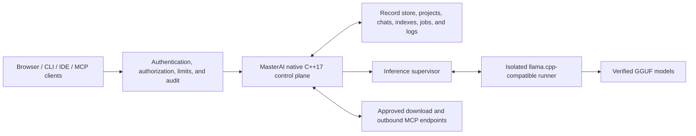

# MasterAI

**A secure, native, local programming AI control plane built from the ground up
in ISO C++17.**

[](docs/architecture/ADR-0001-cpp17-native-architecture.md)
[](docs/architecture/platform-matrix.md)
[](LICENSE)
[](docs/PLAN.md)

MasterAI coordinates local language models, authenticated users, programming
projects, chats, source context, verified downloads, benchmarks, IDE clients,
and Model Context Protocol (MCP) integrations from one security-focused native
service.

The project is designed for developers who want local ownership of models and
project data without making an inference engine, a container platform, or a
third-party application framework the foundation of the system.

> [!IMPORTANT]
> MasterAI is under active development and is **not yet production-ready**.
> Several major capabilities are implemented and test-covered, but real-model,
> external-client, distribution-packaging, and large-project exit checks remain
> outstanding. See [Project status](#project-status) and the authoritative
> [implementation plan](docs/PLAN.md).

## Why MasterAI?

MasterAI is intended to provide a dependable local AI programming environment
with explicit security and resource boundaries:

- **Local ownership** — models, projects, chats, indexes, benchmarks, and
  operational state remain on systems you control.
- **Native C++17 control plane** — no Docker runtime and no inherited web or
  application framework.
- **Programming-first workflows** — chat, code completion, review, debugging,
  documentation, project search, IDE integration, and reproducible model
  comparison.
- **Process-isolated inference** — model runners execute outside the main
  control-plane process, so model memory and runner failures remain isolated.
- **Deny-by-default security** — listeners, routes, files, model sources, MCP
  tools, and administrative operations require explicit authority.
- **Verified model lifecycle** — manifests bind model identity, provenance,
  license, size, digest, backend, and hardware suitability.
- **Bounded resource use** — queues, memory reservations, contexts, background
  work, downloads, and indexes are designed around enforced ceilings.
- **Replaceable adapters** — inference, hardware, storage, embedding, speech,
  secret, and MCP integrations do not dictate the internal architecture.
- **Evidence-driven optimization** — performance work must be measured without
  bypassing correctness, security, cancellation, or auditing.

## Project aims

MasterAI aims to become a native, modular programming AI host that can:

1. Run securely on developer workstations and approved local servers.
2. Discover and validate categorized local programming models.
3. Assess whether a model can run safely on the current hardware.
4. Supervise local inference backends without loading model weights into the
   control process.
5. Provide authenticated browser, API, CLI, IDE, and MCP workflows.
6. Preserve durable projects, chats, attachments, indexes, jobs, and audit
   records with recovery support.
7. Download model artifacts only from approved immutable sources, resume
   interrupted transfers, and verify them before promotion.
8. Compare models with reproducible performance and programming-quality
   evidence.
9. Operate safely on lower-memory systems through deterministic admission,
   pressure handling, and degradation.
10. Add retrieval, caching, prompt reuse, and advanced throughput only after
    their security, memory, and quality boundaries are proven.

## Architecture

MasterAI separates the security-sensitive control plane from replaceable model
runner processes:



The control plane owns configuration, authentication, authorization, users,
projects, chats, model metadata, downloads, benchmarks, MCP policy, process
supervision, health, metrics, and graceful lifecycle operations. It does not
map large model weights into its own address space.

Initial inference uses an optional, version-pinned `llama.cpp` server behind a
validated process adapter. `llama.cpp` is not the architectural foundation and
can be replaced without changing MasterAI's external contract.

### Core design principles

- Strict ISO C++17 for application source; optional Assembly only when profiling
  proves a benefit and a C++17 boundary is retained.
- Native Windows and Linux operation without a container runtime.
- Loopback-only network binding by default.
- Authentication and authorization even in local-only mode.
- Canonical, authorized filesystem paths with symlink traversal denied by
  default.
- OS-backed cryptography and secret protection; no custom cryptographic
  primitives.
- Strict configuration schemas, bounded inputs, atomic persistence, and
  recoverable state.
- Process isolation, cancellation, timeouts, backpressure, and graceful
  shutdown.
- Explicit model provenance, licensing, size, and SHA-256 verification.
- Current authorization checks remain authoritative; caches never become an
  access-control source.

Further design detail is available in
[ADR-0001](docs/architecture/ADR-0001-cpp17-native-architecture.md), the
[release 1 baseline](docs/architecture/ADR-0003-release-1-product-baseline.md),
and the [security threat model](docs/security/threat-model.md).

## Implemented capability areas

The current source includes native implementations for:

- Schema-versioned configuration with precedence, atomic replacement, reset,
  migration metadata, and objective-hash verification.
- OS-principal authentication, first-administrator setup, persistent roles,
  hashed sessions, scoped tokens, CSRF/origin/host controls, rate limits, and
  hash-chained audit records.
- Categorized model discovery, strict manifest parsing, exact size and SHA-256
  checks, license/provenance preservation, suitability decisions, quarantine,
  and load-time integrity revalidation.
- Process-isolated `llama.cpp` supervision with readiness checks, loopback IPC,
  tokenization, streamed generation, cancellation, unload, logs, and metrics.
- Authenticated native web pages, projects, chats, model selection,
  attachments, prompt context assembly, streaming, and cancellation.
- Resumable, journaled, hash-verified model downloads with quarantine on
  integrity failure.
- Quick, standard, and extended benchmark profiles with compatible comparison
  and recommendation records.
- Inbound MCP over newline-delimited `stdio` and Streamable HTTP using protocol
  revision `2025-11-25`.
- Policy-separated outbound MCP over restricted `stdio` and loopback
  Streamable HTTP, with executable pinning, allow-lists, approval, cancellation,
  timeouts, response bounds, secret references, and audit.
- Native VS Code/Agent-Coder and Visual Studio connection profiles, protected
  IDE tokens, diagnostics, and read-only diff preview contracts.
- Backup, restore, secret/log rotation, recovery, hash-bound upgrade and
  rollback, standalone lifecycle scripts, and hardened systemd operations.
- Query-stage measurement, resource attribution, hardware/storage probes,
  authenticated metrics, and repeatable control-plane performance baselines.
- System-wide memory admission, OS reserve protection, bounded work queues,
  pressure actions, profiles, status, and inference leases.
- A cancellable, checksummed, disk-generation project index foundation with
  recovery, partial publication, unchanged-file elimination, affected-path
  updates, literal and exact-boundary symbol search, typed/coalesced triggers,
  bounded background work, and authenticated status/rebuild/cancel/notify
  routes, plus a native `ProjectWatcher` file-watcher/branch-switch adapter
  (`indexing.watchProjectFiles`, on by default) that drives the same service
  automatically without any external editor or version-control hook.

Implementation does not automatically mean operational certification. The next
section records the distinction.

## Project status

Status below reflects the evidence recorded in
[docs/PLAN.md](docs/PLAN.md) on **29 July 2026**.

| Phase | Area | Status |
|---:|---|---|
| 0 | Requirements and release decisions | Complete |
| 1 | Native foundation and lifecycle | Complete |
| 2 | Identity and security baseline | Complete |
| 3 | Model registry and hardware assessment | Complete |
| 4 | First isolated inference adapter | Implemented; verified real GGUF/backend exit check pending |
| 5 | Chat and project web application | Implemented; real-model browser and optional voice checks pending |
| 6 | Secure resumable downloads | Implemented; interrupted real HTTPS transfer check pending |
| 7 | Reproducible benchmarking | Implemented; same-host real-model comparison pending |
| 8 | Inbound MCP | Implemented; live supported IDE/inspector connection pending |
| 9 | Outbound MCP | Complete |
| 10 | IDE integrations | Native boundary implemented; host packaging and live-IDE checks pending |
| 11 | Operations hardening | Complete |
| 12 | Measured control-plane optimization | Complete for measured native scope |
| 13 | Query measurement and resource baseline | Complete |
| 14 | Bounded-memory foundation | Complete |
| 15 | Incremental disk-backed indexing | Exit criteria evidence recorded; Release validation pending |
| 16 | Deadline-bound hybrid retrieval | Planned |
| 17 | Security-partitioned cache hierarchy | Planned |
| 18 | Prompt-prefix and KV/session reuse | Planned |
| 19 | Hardware/model calibration | Planned |
| 20 | Optional advanced throughput | Planned and evidence-gated |

Current validation includes Windows x64 Debug and Release builds and tests under
strict C++17, plus a Linux x86-64 Release build and test run under Ubuntu 26.04
WSL. Release packaging certification on the pinned Ubuntu 24.04 and Debian 13
hosts is still outstanding.

Phase 15 has a bounded native indexing service, affected-path updates,
typed/coalesced trigger admission, disk-generation recovery tests, a native
`ProjectWatcher` file-watcher/branch-switch adapter that calls the indexing
service automatically (no external editor or VCS hook required), a
representative large-project ceiling measurement (`masterai index-probe`),
and a recorded platform-I/O backend decision. Both of its exit criteria now
have current evidence on Windows Debug; Windows Release build/test validation
for this change set, and deeper language-aware symbol extraction, remain
outstanding.

No release may be called production-ready until the functional, security,
migration, recovery, MCP conformance, performance, resource-ceiling, retrieval,
cache-isolation, licensing, provenance, and documentation gates all pass.

## Supported targets and baseline hardware

The release 1 target matrix is:

- Windows 11 x86-64
- Windows Server 2022 x86-64
- Ubuntu Server 24.04 LTS x86-64
- Debian 13 x86-64

Other distributions, ARM64, WSL, and containers are experimental build or
validation environments rather than supported release targets.

Release 1 baseline hardware:

- x86-64 CPU with SSE4.2 and at least four logical processors
- 16 GiB physical RAM, retaining at least 2 GiB for the operating system
- 20 GiB free storage plus model and backup requirements
- Optional GPU; CPU inference remains the compatibility baseline
- For GPU acceleration: a supported CUDA, Vulkan, or HIP backend, a compatible
  driver, and at least 8 GiB dedicated VRAM

Individual model manifests may require more capable hardware. MasterAI reports
`Unsupported`, `Memory Risk`, `Slow`, `Usable`, or `Recommended` and blocks
unsafe loads according to policy.

## Building from source

### Prerequisites

Common requirements:

- Git
- CMake
- A C++17 compiler
- Sufficient disk space for generated builds and any local models

Windows development currently uses:

- Visual Studio 2022 with the MSVC x64 C++ toolchain
- Ninja, as supplied by the configured Visual Studio installation
- PowerShell 7 or Windows PowerShell

Linux development uses:

- GCC or Clang with C++17 support
- CMake
- A supported build tool generated by CMake
- POSIX `sh`

The project owns its CMake entry point under `scripts/CMakeLists.txt`.

### Windows x64

Run from the repository root:

```powershell
.\scripts\build.ps1 -Platform Windows-x64 -BuildType Release
.\scripts\test.ps1 -Platform Windows-x64 -BuildType Release
```

For a development build:

```powershell
.\scripts\build.ps1 -Platform Windows-x64 -BuildType Debug
.\scripts\test.ps1 -Platform Windows-x64 -BuildType Debug
```

The build helper searches supported Visual Studio installation roots and
currently expects the Visual Studio-integrated Ninja path configured in
`scripts/build.ps1`. See the
[Visual Studio guidance](docs/ide/visual-studio.md) if local tool discovery
needs adjustment.

### Linux x86-64

```sh
sh ./scripts/build.sh Release Linux-x86_64
sh ./scripts/test.sh Release Linux-x86_64
```

`Linux-arm64` is accepted by the build helper as an experimental validation
target, not a release 1 supported platform.

### Cleaning generated builds

Preview before deleting:

```powershell
.\scripts\clean.ps1 -WhatIf
```

Clean on Windows:

```powershell
.\scripts\clean.ps1
```

Clean on Linux:

```sh
sh ./scripts/clean.sh --dry-run
sh ./scripts/clean.sh
```

The clean helpers remove only the repository's generated `build/` tree. They do
not remove source, configuration, runtime data, or model artifacts.

## First run

MasterAI uses `config/settings.json` by default. The interactive configuration
wizard writes validated settings and preserves recoverable state when settings
are reset.

### Windows

```powershell
.\scripts\configure.ps1 -BuildType Release
.\scripts\start.ps1 -BuildType Release -Foreground
```

To run in the background instead:

```powershell
.\scripts\start.ps1 -BuildType Release
```

### Linux

```sh
sh ./scripts/configure.sh ./config/settings.json Release
sh ./scripts/start.sh ./config/settings.json Release --foreground
```

When running, the default local endpoint is:

```text
http://127.0.0.1:7070
```

Useful health checks:

```text
GET /health/live
GET /health/ready
```

`live` indicates that the process is running. `ready` can remain unavailable
until required setup and security prerequisites are satisfied.

Stop a background service:

```powershell
.\scripts\stop.ps1 -BuildType Release
```

```sh
sh ./scripts/stop.sh ./config/settings.json Release
```

Run native security and hardware diagnostics:

```powershell
.\scripts\diagnose.ps1 -BuildType Release
```

```sh
sh ./scripts/diagnose.sh ./config/settings.json Release
```

## Configuration

Configuration precedence is:

1. Compiled safe defaults
2. Persisted settings
3. Approved environment variables
4. Command-line overrides

Supported environment overrides currently include:

```text
MASTERAI_HOST
MASTERAI_PORT
MASTERAI_ALLOW_INTRANET
MASTERAI_RUNTIME_ROOT
MASTERAI_MODELS_ROOT
MASTERAI_LLAMA_SERVER
MASTERAI_CURL
```

Unknown fields are rejected unless they belong to an explicitly approved
extension namespace. Changes are written through temporary files and atomic
replacement.

The default listener is loopback-only. Release 1 intranet access uses an
administrator-managed same-host reverse proxy with trusted TLS, while MasterAI
continues to enforce authentication, host/origin policy, CSRF controls, and
request limits. Direct plaintext non-loopback startup is prohibited.

## Models

Models are organized by programming purpose:

```text
models/
├── general-programming/
├── code-completion/
├── code-review/
├── debugging/
├── documentation/
└── embeddings-code-search/
```

Each installed model uses:

```text
models/<category>/<model-id>/manifest.json
```

The manifest must identify the model, category, format, backend, immutable
source revision, HTTPS source, exact file size, SHA-256 digest, license,
administrator acceptance, hardware estimates, and backend requirements.
Validation follows [models/manifest.schema.json](models/manifest.schema.json)
and the [model taxonomy](docs/architecture/model-taxonomy.md).

Model files are intentionally excluded from Git by `.gitignore`; only the
repository-owned directory markers and manifest schema are tracked.

Scan the model tree:

```powershell
.\build\Windows-x64\Release\masterai.exe scan-models .\models
```

```sh
./build/Linux-x86_64/Release/masterai scan-models ./models
```

A discovered file is not automatically trusted. `scan()` — used by every
inventory, chat, and download request — only ever reads a persisted
verification cache (`models_root/.verified-cache.json`); it never hashes
files itself, so a page load never blocks on multi-gigabyte SHA-256 work. Run
`verify-models` after adding, replacing, or removing files under
`models-root` to hash every discovered model against its manifest and refresh
that cache:

```powershell
.\build\Windows-x64\Release\masterai.exe verify-models .\models
# or: .\scripts\rehash.ps1 -BuildType Release
```

```sh
./build/Linux-x86_64/Release/masterai verify-models ./models
```

Verification covers size, digest, provenance, license state, path
containment, backend compatibility, and hardware suitability before
promotion to `Ready`; load time rechecks integrity again regardless of the
cache.

The current release baseline supports a separately supervised
`llama.cpp`-compatible GGUF backend. Real-model operational certification is
still pending, as noted in [Project status](#project-status).

## Web application and API

The native service provides browser workflows for:

- First-administrator setup and login
- Project and auto-titled chat management, with each workspace section
  (`/app/chat`, `/app/projects`, `/app/models/inventory`,
  `/app/models/download`, `/app/models/benchmarks`, `/app/admin/create`,
  `/app/admin/users`) served at its own URL and gated by role
- Ready-model selection and loading
- Incrementally streamed responses and cancellation
- Bounded UTF-8 source/text attachments
- Model inventory and suitability, including a cached verification state so
  page loads never block on hashing model files
- Download jobs and progress, with pause, resume, cancel, and remove controls
- Benchmarks and recommendations
- Resource, memory, request, and indexing status
- Administrative settings and operations

HTTP APIs are versioned under `/api/v1/`. Implemented capability areas include
authentication, users, projects, chats, models, downloads (including
`.../model-downloads/{id}/pause`, `.../cancel`, and `.../remove`),
benchmarks, resources, memory, request metrics, project indexes, MCP
integrations, and IDE connections.

Inputs are bounded and strictly parsed. Administrative mutations require the
applicable identity, role, scope, project binding, host/origin checks, CSRF
protection, and audit record.

## MCP and IDE integration

MasterAI pins MCP protocol revision `2025-11-25`.

Inbound MCP supports:

- Newline-delimited UTF-8 JSON-RPC over `stdio`
- Streamable HTTP at `/mcp`
- Authenticated, project-bound tools and resources
- Scope checks, cancellation, bounded reads, and native conformance tests

Outbound MCP uses a separate registry and authority boundary. It supports
restricted native `stdio` processes and loopback Streamable HTTP clients with
pinned executable digests, tool allow-lists, project/scope policy, per-call
approval, timeouts, cancellation, response limits, protected secret
references, and hash-chained audit.

Legacy MCP HTTP+SSE is disabled.

Generate protected IDE material and connection profiles with:

```text
masterai ide-token-store <settings-file> <vscode|visual-studio>
masterai ide-profile <settings-file> <vscode|visual-studio>
masterai mcp-stdio <settings-file> <vscode|visual-studio>
```

Tokens are retrieved from the native OS secret provider. They must not be
placed in command arguments, environment variables, source control, or IDE
workspace files.

See:

- [VS Code and Agent-Coder integration](docs/ide/vscode-agent-coder.md)
- [Visual Studio integration](docs/ide/visual-studio.md)
- [IDE integration contract](docs/ide/integration-contract.md)

The native contracts are implemented. JavaScript/TypeScript VS Code packaging
and managed Visual Studio VSIX glue are outside the project's current
C++17/Assembly language authorization, and live-host exit validation remains
pending.

## Command-line interface

The native executable currently exposes:

```text
masterai configure [settings-file]
masterai serve [settings-file]
masterai probe [storage-root]
masterai scan-models [models-root]
masterai verify-models [models-root]
masterai download-model <settings> <url> <revision> <sha256> <category> <model-id> <filename> <display-name> <architecture> <quantization> <license-spdx-id> <size-bytes> <minimum-ram-mib> <recommended-ram-mib> --accept-license
masterai benchmark-model <settings> <model-id> <quick|standard|extended>
masterai mcp-stdio [settings-file] [vscode|visual-studio]
masterai ide-token-store <settings-file> <vscode|visual-studio>
masterai ide-profile <settings-file> <vscode|visual-studio>
masterai backup <settings-file>
masterai restore-backup <backup> <settings-destination> <runtime-destination>
masterai rotate-secret <settings> <secret-alias>
masterai rotate-logs <settings> <maximum-bytes> <retained-files>
masterai recover <settings>
masterai runtime-root <settings>
masterai upgrade <settings> <active> <candidate> <rollback-root>
masterai rollback <settings> <active> <receipt>
masterai performance-probe [iterations]
masterai index-probe <project-root> [index-root]
masterai security-status [runtime-root]
```

Download sources require approved immutable HTTPS URLs, explicit license
acceptance, an immutable revision, exact size policy, and SHA-256 verification.
Failed integrity checks are quarantined rather than promoted.

## Persistence, operations, and recovery

MasterAI uses an internally authored bounded record store with explicit schema
versions, checksummed journals, atomic replacement, recovery scanning,
checkpointing, and replaceable repository interfaces.

Runtime state is kept separate from source and model files and can include:

```text
runtime/
├── projects/
├── attachments/
├── indexes/
├── downloads/
├── benchmarks/
├── logs/
├── run/
└── backups/
```

Implemented operational controls include:

- Offline backup and clean-destination restore
- Manifest and integrity validation
- OS-protected secret rotation
- Bounded log rotation
- Crash-residue recovery
- Hash-bound executable upgrade and rollback
- Graceful stop requests and bounded drain
- Windows lifecycle helpers
- Hardened systemd install/start/stop/uninstall helpers

See the [operations documentation](docs/operations/) for current procedures and
validation boundaries.

## Security model

MasterAI treats browser input, source trees, attachments, model manifests,
model weights, downloads, inference responses, and MCP data as untrusted.

Key controls include:

- Locally stored, MasterAI-hashed password accounts as the default sign-in
  path (`allow_local_password_accounts`, on by default), so setup and login
  do not depend on an external identity provider being present.
- Optional native OS identity verification (`LogonUserW` on Windows and PAM
  on Linux) as an explicit opt-in (`allow_os_identity_accounts`, off by
  default) for operators who want accounts mapped to their OS/Windows
  identity instead of, or alongside, locally stored passwords.
- No storage, hashing, reversible encryption, logging, or forwarding of OS
  passwords
- Immediate erasure of transient credential buffers
- Random opaque sessions stored only as hashes
- Scoped, revocable, project-bound service and IDE tokens
- Windows DPAPI and approved Linux secret-provider boundaries
- Loopback-only native listener and explicit reverse-proxy trust
- Host, origin, CSRF, rate, body-size, timeout, and concurrency enforcement
- Canonical path containment and symlink traversal rejection
- Structured process arguments without shell interpolation
- Model and executable digest pinning
- Append-oriented, sanitized, hash-chained audit records
- Bounded queues, output, attachments, downloads, and MCP responses
- Deny-by-default inbound and outbound MCP policy

MasterAI never logs passwords, raw session tokens, API keys, or private keys.
Security is not disabled merely because the service listens on localhost.

For detailed assumptions and threats, read
[docs/security/threat-model.md](docs/security/threat-model.md).

## Performance and bounded-memory direction

MasterAI measures before optimizing. The system distinguishes time to first
token, prompt throughput, generation throughput, retrieval quality and latency,
peak memory, and output correctness.

The completed bounded-memory foundation provides:

- One system-wide memory admission authority
- A mandatory operating-system safety reserve
- Hard limits for request and background-work categories
- Minimal, balanced, and performance profiles
- Deterministic pressure handling
- Bounded prioritized work
- Inference admission and actionable rejection
- Resource and request telemetry

Planned performance phases add deadline-bound hybrid retrieval,
security-partitioned caches, compatible prompt/KV reuse, host-specific
calibration, and optional throughput features. None may bypass authorization,
integrity, auditing, cancellation, quality checks, or memory ceilings.

## Repository layout

```text
MasterAI/
├── docs/       Architecture, security, operations, APIs, objectives, and plan
├── models/     Categorized local model layout and manifest schema
├── rules/      Durable project implementation rules
├── scripts/    CMake, build, test, lifecycle, clean, and service automation
├── src/        Native ISO C++17 production source
├── test/       Native test cases and isolated fixtures
├── .gitignore  Generated binary, build, model, archive, and editor exclusions
├── LICENSE     MIT license
└── README.md   Current GitHub project overview
```

Generated `build/` and runtime state are not source. Large model payloads and
compiled binaries must not be committed.

## Testing and validation

Run the native correctness suite after building:

```powershell
.\scripts\test.ps1 -Platform Windows-x64 -BuildType Debug
.\scripts\test.ps1 -Platform Windows-x64 -BuildType Release
```

```sh
sh ./scripts/test.sh Release Linux-x86_64
```

The test suite covers configuration, persistence and recovery, identity,
sessions and tokens, secrets, path security, model integrity and suitability,
runner isolation, projects/chats/attachments, downloads, benchmarks, MCP,
operations, query metrics, bounded memory, and indexing behavior.

Fixture and implementation tests do not replace external exit checks. Claims of
phase completion are governed by the evidence and exit criteria in
[docs/PLAN.md](docs/PLAN.md).

Verify that project objectives have not changed without reassessment:

```powershell
.\scripts\verify-objectives.ps1
```

```sh
sh ./scripts/verify-objectives.sh
```

## Roadmap

Near-term work is:

1. Validate Phase 15 on Windows Release (Debug already validated) and, longer
   term, evaluate deeper language-aware symbol extraction.
2. Implement Phase 16 deadline-bound hybrid retrieval with disclosed,
   authorized context.
3. Add Phase 17 byte-bounded, security-partitioned caches with precise
   invalidation.
4. Validate Phase 18 compatible runner prompt-prefix and KV/session reuse.
5. Add Phase 19 evidence-backed host/model/backend calibration.
6. Evaluate Phase 20 throughput options independently and only after all
   prerequisite gates pass.

Outstanding operational certification also includes:

- Pinned real `llama.cpp` plus a verified programming GGUF
- Real-model browser chat and generation cancellation
- A deliberately interrupted and resumed real HTTPS model transfer
- Same-host real-model benchmark comparison
- Live inbound MCP connection from a supported IDE or independent inspector
- Live IDE-host validation
- Ubuntu 24.04 and Debian 13 packaging-host certification
- Optional pinned `whisper.cpp` integration, if enabled

The detailed roadmap, deliverables, dependencies, installation outcomes, and
exit criteria are maintained in [docs/PLAN.md](docs/PLAN.md).

## Non-goals

The initial release does not aim to provide:

- Foundation-model training
- A custom transformer inference engine
- Public internet SaaS hosting
- Multi-node distributed inference
- Kubernetes deployment
- Custom cryptographic algorithms
- An unrestricted shell agent
- Automatic execution of model-proposed commands without policy and approval
- Unmeasured replacement of mature inference kernels
- Unrelated image, audio, or general media-generation hosting

MasterAI is the secure local programming-AI host and orchestration layer.

## Contributing

Before proposing a change:

1. Read [docs/objectives.md](docs/objectives.md),
   [docs/PLAN.md](docs/PLAN.md), and
   [rules/initial-ruleset.md](rules/initial-ruleset.md).
2. Search for the authoritative existing implementation before creating a new
   service, helper, workflow, or document.
3. Keep application source strictly ISO C++17 and isolate platform behavior
   behind explicit native boundaries.
4. Store production source in `src/`, tests in `test/`, automation in
   `scripts/`, documentation in `docs/`, models in `models/`, and durable rules
   in `rules/`.
5. Add focused responsibility and operational-flow comments to new or
   materially changed source.
6. Preserve deny-by-default behavior, input bounds, cancellation, integrity,
   authorization, audit, and memory ceilings.
7. Add or update tests in proportion to the change.
8. Update `docs/PLAN.md` when implementation or validation status changes.
9. Update this `README.md` whenever behavior, capabilities, commands,
   requirements, limitations, or validation status materially changes.
10. Do not mark a phase complete until every deliverable and real exit criterion
    has current evidence.

Third-party coding foundations, frameworks, source libraries, and
dependency-provided application foundations are prohibited. The current
explicit exception is an optional, isolated, replaceable `llama.cpp` inference
backend. Established audited cryptographic providers are required; MasterAI
does not implement cryptographic primitives.

## Documentation

- [Authoritative implementation plan](docs/PLAN.md)
- [Project objectives](docs/objectives.md)
- [Architecture decisions](docs/architecture/)
- [Security design](docs/security/)
- [Operations guides](docs/operations/)
- [Performance evidence](docs/performance/)
- [IDE integration](docs/ide/)
- [API version policy](docs/api/version-policy.md)
- [Model manifest schema](models/manifest.schema.json)
- [Project rules](rules/initial-ruleset.md)

## License

MasterAI is released under the [MIT License](LICENSE).

Copyright © 2026 LordAries1972.
