# How to Use Machine Learning and Models with MasterAI

## A classroom guide to understanding, preparing, teaching, evaluating, and safely using models

**Audience:** Administrators, developers, data owners, model trainers, evaluators, and technical users who want to understand machine learning before using MasterAI's model and Machine Learning facilities.

**Purpose:** This document teaches the mechanics of machine learning and models from first principles, then turns that knowledge into a clear, sequential workflow for setting up an existing model or developing a specialized model for use with MasterAI.

**Project basis:** This guide is derived from the architecture, security rules, model lifecycle, Machine Learning Abilities, and phased implementation status in [PLAN.md](PLAN.md). Where the plan describes a future capability, this guide labels it as planned rather than presenting it as currently executable.

**Last aligned with the plan:** 17 August 2026, through Phase 81 (Prompt and Instruction Training gains a real content record, generation, multi-model testing, duplicate/contradiction detection, and structured-output validation). Hardware and Compute (Phase 67), Monitoring and Diagnostics (Phase 68), Automation Pipelines (Phase 69, extended in Phase 71), Fine-Tuning (Phase 70), Experiment Tracking (Phase 80), and Prompt and Instruction Training (Phase 81) are available, alongside the earlier scoped-down approval/registry interfaces Deployment Manager (Phase 55), Inference Endpoints (Phase 62), and Safety and Governance (Phase 65); Synthetic Data remains a scoped-down identity/lifecycle record rather than a real executor.

---

## How to study this guide

Read Sections 1–10 in order the first time. They form the classroom theory: what learning is, what a model contains, how a transformer produces an answer, how training changes weights, how data and evaluation control the result, and which parts MasterAI can operate today. Then use Section 11 when installing an existing model and Section 12 when developing a specialized one.

The document uses four recurring labels:

- **Concept** explains what something means.
- **Mechanism** explains how it works internally.
- **Decision** explains when to choose it.
- **Gate** is a condition that must be satisfied before proceeding.

The major lessons are:

1. Machine learning foundations.
2. Model anatomy.
3. Transformer and inference mechanics.
4. Training mechanics.
5. Teaching-method selection.
6. Dataset design.
7. Evaluation and approval.
8. MasterAI's current capability boundary.
9. Existing-model setup.
10. Specialized-model development.
11. Security, troubleshooting, and final review.

Do not skip directly to training commands. A training tool can execute a bad plan much faster than a person can repair the resulting data leakage, licensing problem, or misleading evaluation.

---

## Table of contents

- [1. Learning outcomes](#1-learning-outcomes)
- [2. The essential idea: learning a function from examples](#2-the-essential-idea-learning-a-function-from-examples)
  - [2.1 What machine learning is not](#21-what-machine-learning-is-not)
  - [2.2 The complete machine-learning system](#22-the-complete-machine-learning-system)
- [3. The main families of machine learning](#3-the-main-families-of-machine-learning)
  - [3.1 Supervised learning](#31-supervised-learning)
  - [3.2 Unsupervised learning](#32-unsupervised-learning)
  - [3.3 Self-supervised learning](#33-self-supervised-learning)
  - [3.4 Semi-supervised and active learning](#34-semi-supervised-and-active-learning)
  - [3.5 Reinforcement and preference learning](#35-reinforcement-and-preference-learning)
  - [3.6 Transfer learning and fine-tuning](#36-transfer-learning-and-fine-tuning)
  - [3.7 Classical models and neural networks](#37-classical-models-and-neural-networks)
- [4. What a model actually contains](#4-what-a-model-actually-contains)
  - [4.1 Architecture](#41-architecture)
  - [4.2 Parameters and weights](#42-parameters-and-weights)
  - [4.3 Hyperparameters](#43-hyperparameters)
  - [4.4 Tokenizer and vocabulary](#44-tokenizer-and-vocabulary)
  - [4.5 Embeddings](#45-embeddings)
  - [4.6 Checkpoints, adapters, and final artifacts](#46-checkpoints-adapters-and-final-artifacts)
  - [4.7 A complete model identity](#47-a-complete-model-identity)
  - [4.8 From one artificial neuron to a network](#48-from-one-artificial-neuron-to-a-network)
  - [4.9 Features and representations](#49-features-and-representations)
  - [4.10 Architecture, weights, runtime, and application are separate](#410-architecture-weights-runtime-and-application-are-separate)
- [5. How a transformer language model works](#5-how-a-transformer-language-model-works)
  - [5.1 From prompt to output](#51-from-prompt-to-output)
  - [5.2 Attention](#52-attention)
  - [5.3 Transformer layers](#53-transformer-layers)
  - [5.4 Logits, probabilities, and sampling](#54-logits-probabilities-and-sampling)
  - [5.5 Context windows](#55-context-windows)
  - [5.6 KV-cache reuse](#56-kv-cache-reuse)
  - [5.7 Why hallucinations occur](#57-why-hallucinations-occur)
- [6. How training changes a model](#6-how-training-changes-a-model)
  - [6.1 The training loop](#61-the-training-loop)
  - [6.2 Epochs, steps, and batches](#62-epochs-steps-and-batches)
  - [6.3 Learning rate](#63-learning-rate)
  - [6.4 Backpropagation and gradients](#64-backpropagation-and-gradients)
  - [6.5 Overfitting and underfitting](#65-overfitting-and-underfitting)
  - [6.6 Catastrophic forgetting](#66-catastrophic-forgetting)
  - [6.7 Fine-tuning methods](#67-fine-tuning-methods)
  - [6.8 Training from scratch](#68-training-from-scratch)
  - [6.9 A small numerical training example](#69-a-small-numerical-training-example)
  - [6.10 What training metrics are telling you](#610-what-training-metrics-are-telling-you)
- [7. Four ways to "teach" a model](#7-four-ways-to-teach-a-model)
  - [7.1 Prompting: temporary instructions](#71-prompting-temporary-instructions)
  - [7.2 Project context: current working evidence](#72-project-context-current-working-evidence)
  - [7.3 Retrieval-augmented generation: managed external knowledge](#73-retrieval-augmented-generation-managed-external-knowledge)
  - [7.4 Fine-tuning: persistent behavior adaptation](#74-fine-tuning-persistent-behavior-adaptation)
  - [7.5 The decision tree](#75-the-decision-tree)
  - [7.6 Comparison table](#76-comparison-table)
- [8. Data is the curriculum](#8-data-is-the-curriculum)
  - [8.1 Define the target before collecting data](#81-define-the-target-before-collecting-data)
  - [8.2 Source approval and provenance](#82-source-approval-and-provenance)
  - [8.3 Cleaning and normalization](#83-cleaning-and-normalization)
  - [8.4 Training, validation, and test separation](#84-training-validation-and-test-separation)
  - [8.5 Labels and instruction examples](#85-labels-and-instruction-examples)
  - [8.6 Synthetic data](#86-synthetic-data)
  - [8.7 Dataset quality checklist](#87-dataset-quality-checklist)
- [9. Evaluation: proving that learning occurred](#9-evaluation-proving-that-learning-occurred)
  - [9.1 Build the evaluation before training](#91-build-the-evaluation-before-training)
  - [9.2 Select task-appropriate metrics](#92-select-task-appropriate-metrics)
  - [9.3 Compare against a baseline](#93-compare-against-a-baseline)
  - [9.4 Human evaluation](#94-human-evaluation)
  - [9.5 Approval gates](#95-approval-gates)
- [10. MasterAI's current capability boundary](#10-masterais-current-capability-boundary)
  - [10.1 What is usable now](#101-what-is-usable-now)
  - [10.2 What must not be assumed yet](#102-what-must-not-be-assumed-yet)
  - [10.3 Two model catalogs with different purposes](#103-two-model-catalogs-with-different-purposes)
  - [10.4 When to use MasterAI today](#104-when-to-use-masterai-today)
  - [10.5 Current Machine Learning classroom map](#105-current-machine-learning-classroom-map)
  - [10.6 Status is state, not evidence](#106-status-is-state-not-evidence)
  - [10.7 Hands-on lesson: train, evaluate, and use a real tabular model](#107-hands-on-lesson-train-evaluate-and-use-a-real-tabular-model)
  - [10.8 Hands-on lesson: ingest knowledge and test grounded retrieval](#108-hands-on-lesson-ingest-knowledge-and-test-grounded-retrieval)
  - [10.9 Hands-on lesson: importing a Scraper Project dataset](#109-hands-on-lesson-importing-a-scraper-project-dataset)
- [11. Sequential lesson: set up an existing model for MasterAI](#11-sequential-lesson-set-up-an-existing-model-for-masterai)
  - [Step 1 — Define the intended use](#step-1--define-the-intended-use)
  - [Step 2 — Confirm the host and storage](#step-2--confirm-the-host-and-storage)
    - [Understand the memory budget](#understand-the-memory-budget)
    - [Understand the compute budget](#understand-the-compute-budget)
  - [Step 3 — Obtain an approved inference runner](#step-3--obtain-an-approved-inference-runner)
  - [Step 4 — Choose a compatible model artifact](#step-4--choose-a-compatible-model-artifact)
  - [Step 5 — Create the strict manifest](#step-5--create-the-strict-manifest)
  - [Step 6 — Build MasterAI if necessary](#step-6--build-masterai-if-necessary)
  - [Step 7 — Configure MasterAI](#step-7--configure-masterai)
  - [Step 8 — Verify the model](#step-8--verify-the-model)
  - [Step 9 — Start the service and create the first administrator](#step-9--start-the-service-and-create-the-first-administrator)
  - [Step 10 — Confirm service and model state](#step-10--confirm-service-and-model-state)
  - [Step 11 — Run a reproducible benchmark](#step-11--run-a-reproducible-benchmark)
  - [Step 12 — Test in chat with controlled context](#step-12--test-in-chat-with-controlled-context)
  - [Step 13 — Record approval and operating limits](#step-13--record-approval-and-operating-limits)
- [12. Sequential lesson: build and teach a specialized model](#12-sequential-lesson-build-and-teach-a-specialized-model)
  - [Step 1 — Create the capability contract](#step-1--create-the-capability-contract)
  - [Step 2 — Establish a baseline](#step-2--establish-a-baseline)
  - [Step 3 — Create a Machine Learning project](#step-3--create-a-machine-learning-project)
  - [Step 4 — Choose the teaching method](#step-4--choose-the-teaching-method)
  - [Step 5 — Register the base model and its provenance](#step-5--register-the-base-model-and-its-provenance)
  - [Step 6 — Create the subject knowledge package](#step-6--create-the-subject-knowledge-package)
  - [Step 7 — Acquire and register approved data](#step-7--acquire-and-register-approved-data)
  - [Step 8 — Prepare and label the data](#step-8--prepare-and-label-the-data)
  - [Step 9 — Design the experiment](#step-9--design-the-experiment)
  - [Step 10 — Run a small pilot before a full job](#step-10--run-a-small-pilot-before-a-full-job)
  - [Step 11 — Create and execute the real training or fine-tuning job](#step-11--create-and-execute-the-real-training-or-fine-tuning-job)
  - [Step 12 — Evaluate the candidate](#step-12--evaluate-the-candidate)
  - [Step 13 — Review errors and iterate](#step-13--review-errors-and-iterate)
  - [Step 14 — Convert and optimize for MasterAI inference](#step-14--convert-and-optimize-for-masterai-inference)
  - [Step 15 — Package the model in MasterAI](#step-15--package-the-model-in-masterai)
  - [Step 16 — Benchmark on the target host](#step-16--benchmark-on-the-target-host)
  - [Step 17 — Deploy to staging](#step-17--deploy-to-staging)
  - [Step 18 — Approve production deployment](#step-18--approve-production-deployment)
  - [Step 19 — Monitor production](#step-19--monitor-production)
  - [Step 20 — Version, roll back, or retire](#step-20--version-roll-back-or-retire)
- [13. Worked classroom example: a C++17 subject assistant](#13-worked-classroom-example-a-c17-subject-assistant)
  - [13.1 Objective](#131-objective)
  - [13.2 First attempt: no training](#132-first-attempt-no-training)
  - [13.3 Add retrieval when current rules matter](#133-add-retrieval-when-current-rules-matter)
  - [13.4 Fine-tune only for persistent review behavior](#134-fine-tune-only-for-persistent-review-behavior)
  - [13.5 Evaluation rubric](#135-evaluation-rubric)
  - [13.6 Deployment decision](#136-deployment-decision)
- [14. Security, privacy, and governance rules](#14-security-privacy-and-governance-rules)
  - [14.1 Treat models and datasets as sensitive assets](#141-treat-models-and-datasets-as-sensitive-assets)
  - [14.2 Least privilege](#142-least-privilege)
  - [14.3 Untrusted model code](#143-untrusted-model-code)
  - [14.4 Poisoning and prompt injection](#144-poisoning-and-prompt-injection)
  - [14.5 Reproducibility and audit](#145-reproducibility-and-audit)
  - [14.6 Production model card](#146-production-model-card)
- [15. Troubleshooting guide](#15-troubleshooting-guide)
- [16. Glossary of essential terms](#16-glossary-of-essential-terms)
- [17. Classroom review questions](#17-classroom-review-questions)
- [18. Final sequential checklist](#18-final-sequential-checklist)
- [19. Closing lesson](#19-closing-lesson)
- [Related project documentation](#related-project-documentation)

---

## 1. Learning outcomes

By the end of this guide, you should be able to:

1. Explain what machine learning is and how it differs from conventional programming.
2. Describe what a model contains, what parameters and weights do, and how training changes them.
3. Explain tokenization, embeddings, transformer attention, inference, context windows, sampling, and hallucinations.
4. Distinguish prompting, project context, retrieval-augmented generation, fine-tuning, and training from scratch.
5. Select a suitable teaching method for a real requirement.
6. Design a controlled dataset with separate training, validation, and test data.
7. Set up a verified GGUF model for MasterAI's current `llama.cpp` inference path.
8. Organize a model-development project using the current Machine Learning administration foundation.
9. Build an evidence-based training and evaluation plan without leaking test data or accepting unsafe data.
10. Package, verify, benchmark, approve, deploy, monitor, and, when necessary, roll back a specialized model.

---

## 2. The essential idea: learning a function from examples

Conventional software is usually written as explicit rules:

```text
Input + rules written by a programmer -> output
```

For example, a conventional program can classify a file by checking its extension with an `if` statement. Machine learning is useful when the complete rule set would be too large, subtle, variable, or difficult to write by hand. Instead of specifying every rule, we provide examples and an objective. A training procedure searches for model parameters that make the model perform well on those examples.

```text
Examples + desired outcomes + learning algorithm -> learned model
Learned model + new input                         -> prediction or generated output
```

The compact mathematical description is:

```text
prediction = f(input; parameters)
          ŷ = f(x; θ)
```

Where:

- `x` is the input;
- `f` is the model architecture and its computation;
- `θ` represents all learned parameters, commonly called weights;
- `ŷ` is the model's prediction.

During training, the system compares the prediction with a desired answer, calculates an error called the **loss**, and adjusts the parameters to reduce future error.

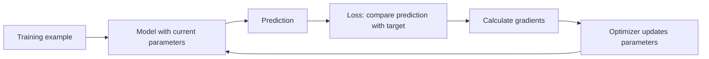

That loop may run thousands or millions of times. The model is not storing a conventional list of all answers. It is compressing useful statistical patterns into its parameters. This is why a model may generalize to a new example, but it is also why it may be confidently wrong.

### 2.1 What machine learning is not

Machine learning is not:

- guaranteed truth;
- human understanding in a machine;
- a database with perfect recall;
- automatically secure because it runs locally;
- automatically improved by adding more data;
- automatically production-ready when training finishes;
- a replacement for validation, authorization, audit, or ordinary software engineering.

A model is a probabilistic component. A dependable system surrounds it with verified data, explicit policy, deterministic controls, evaluation, monitoring, and human accountability. MasterAI's control plane is intended to provide those boundaries while keeping the inference runner isolated and replaceable.

### 2.2 The complete machine-learning system

People often use *the model* to mean the whole product. In practice, the model is only one component. A usable machine-learning system also needs data acquisition, preparation, policy, retrieval, runtime infrastructure, application logic, evaluation, and monitoring.

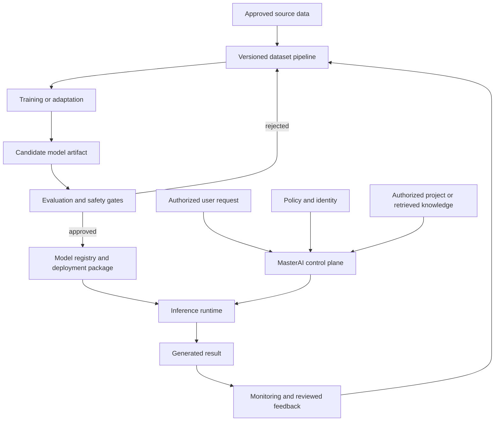

Each arrow represents a boundary that must preserve identity and provenance. If an output cannot be traced back through model, configuration, evidence, and authorization, the system is not ready for controlled use.

---

## 3. The main families of machine learning

Different problems require different kinds of learning. Begin with the task, not with a fashionable model name.

### 3.1 Supervised learning

Supervised learning uses labeled examples containing both an input and a desired result.

Examples:

- source code -> `secure` or `vulnerable`;
- support message -> issue category;
- equipment readings -> predicted failure risk;
- photograph -> object class;
- instruction -> approved response.

Common tasks include classification, regression, object detection, instruction tuning, and question answering.

### 3.2 Unsupervised learning

Unsupervised learning looks for structure without a supplied target label.

Examples:

- grouping similar documents;
- clustering customers by behavior;
- finding unusual activity;
- reducing a large feature space for visualization.

The discovered groups are patterns, not automatically meaningful business categories. A subject expert must interpret them.

### 3.3 Self-supervised learning

Self-supervised learning creates its learning signal from the data itself. Large language models are commonly pre-trained by predicting missing or next tokens. The text supplies both the input and the target without a person labeling every sentence.

This is how a foundation model acquires broad language and code patterns. It is expensive and does not by itself teach the model an organization's current private facts or approval rules.

### 3.4 Semi-supervised and active learning

Semi-supervised learning combines a smaller labeled dataset with a larger unlabeled dataset. Active learning asks a reviewer to label the examples that are expected to be most informative. Both can reduce labeling effort, but machine-suggested labels must remain distinguishable from reviewed labels.

### 3.5 Reinforcement and preference learning

These methods use rewards, rankings, or preferences rather than only one exact target answer. They are useful for teaching behavior such as response quality or tool-selection policy. Poorly designed rewards can teach shortcuts that score well while violating the true intention.

### 3.6 Transfer learning and fine-tuning

Transfer learning begins with an already trained model and adapts it to a new task. Fine-tuning is a common transfer-learning method. It usually requires much less data and compute than training a foundation model from scratch.

### 3.7 Classical models and neural networks

Not every job needs a language model.

| Problem | Often suitable starting point | Why |
|---|---|---|
| Numeric prediction | Linear model, decision tree, boosted trees | Efficient and measurable |
| Fixed category classification | Logistic regression, tree model, small neural network | Clear targets and metrics |
| Anomaly discovery | Statistical detector, isolation method, clustering | Designed for unusual patterns |
| Semantic text or code search | Embedding model plus vector index | Retrieves meaning-related items |
| Long-form language or code generation | Transformer language model | Produces variable-length sequences |
| Images, audio, or multiple media types | Specialized or multimodal neural model | Architecture matches input structure |

The best model is the smallest, simplest model that satisfies the measured requirement within the security, latency, memory, and maintenance limits.

---

## 4. What a model actually contains

A model is the combination of several related artifacts and decisions. The weights alone are not enough to reproduce its behavior.

### 4.1 Architecture

The architecture defines the computation graph: which layers exist, how information flows, and what operations are performed. Examples include linear models, decision trees, convolutional networks, and transformers.

Architecture is comparable to the design of a machine. Parameters are the adjustable settings inside that design.

### 4.2 Parameters and weights

Parameters are learned numeric values. A neural network can contain millions or billions of them. During inference, the model repeatedly multiplies and combines inputs with these values.

Parameter count affects capacity and usually affects memory and compute, but a larger model is not automatically better for a particular task. Data quality, architecture, training procedure, quantization, prompt design, and evaluation all matter.

### 4.3 Hyperparameters

Hyperparameters control training rather than being directly learned. Examples include:

- learning rate;
- batch size;
- epoch count;
- optimizer;
- weight decay;
- context or sequence length;
- dropout;
- gradient accumulation and clipping;
- adapter rank for low-rank adaptation;
- random seed;
- checkpoint and validation frequency.

Hyperparameters must be recorded with every experiment. Without them, a result is not reproducible.

### 4.4 Tokenizer and vocabulary

A language model does not directly read words. A tokenizer converts text into integer token identifiers. A token may represent a word, part of a word, punctuation, whitespace, or code fragment.

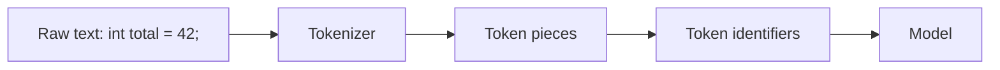

The tokenizer is part of the model identity. Using the wrong tokenizer changes the input symbols and can make valid weights unusable.

### 4.5 Embeddings

An embedding maps a discrete item, such as a token or document chunk, to a numeric vector. During language-model inference, token embeddings are internal model inputs. In semantic search, document and query embeddings are compared to locate meaning-related content.

Vectors that are near one another under a chosen distance metric are treated as similar. They are not proof that two documents are factually equivalent.

```text
"C++ memory ownership" -> [ 0.12, -0.41, 0.08, ... ]
"RAII resource safety" -> [ 0.10, -0.39, 0.11, ... ]
```

An embedding model, its exact version, vector dimensions, distance metric, chunking rules, and index must be versioned together.

### 4.6 Checkpoints, adapters, and final artifacts

- A **checkpoint** is a saved training state. It may include weights, optimizer state, scheduler state, and progress.
- An **adapter** contains a smaller set of learned changes applied to a base model.
- A **merged model** combines an adapter with the base weights.
- A **quantized model** stores weights at reduced precision to lower memory and often improve inference speed.
- A **GGUF** is an inference-oriented model file format supported by MasterAI's current `llama.cpp` adapter.

Quantization changes the representation used for inference. It is not the same as teaching the model. It may reduce quality, so the quantized result must be evaluated separately from the source checkpoint.

### 4.7 A complete model identity

For controlled use, identify a model with all of the following:

```text
Architecture + exact weights + tokenizer + template + configuration
+ source revision + license + hashes + runtime + evaluation evidence
```

A filename is not identity. MasterAI therefore requires model metadata and an exact SHA-256 digest before an inference model can become Ready.

### 4.8 From one artificial neuron to a network

A simplified artificial neuron receives input values, multiplies each by a learned weight, adds a learned bias, and applies an activation function:

```text
z = (w₁x₁ + w₂x₂ + ... + wₙxₙ) + b
output = activation(z)
```

The weights control how strongly each input influences the result. The bias shifts the decision. The activation function allows a network to represent nonlinear relationships rather than collapsing into one large linear calculation.

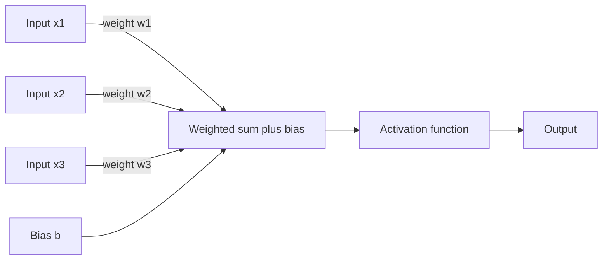

A neural network connects many such transformations into layers:

- the **input layer** receives features or embeddings;
- **hidden layers** form increasingly useful intermediate representations;
- the **output layer** produces task scores, numeric predictions, or next-token logits.

The term *deep learning* generally means that the network has many learned transformation layers. Depth gives the network greater representational capacity, but also increases its data, compute, debugging, and evaluation requirements.

### 4.9 Features and representations

A feature is information presented to a model. In a classical tabular model, a person may explicitly supply features such as file size, error count, or transaction age. In a neural network, lower layers often learn useful representations from rawer inputs.

Feature design still matters. Units, missing values, normalization, category encoding, image dimensions, audio sample rates, tokenization, and document chunking all change what the model can learn. A model cannot recover information that the data pipeline consistently discarded.

### 4.10 Architecture, weights, runtime, and application are separate

Keep these boundaries clear:

| Layer | Example | Can it change model knowledge or behavior? |
|---|---|---|
| Architecture | Transformer layer arrangement | Defines capacity and computation |
| Weights or adapter | Learned numeric parameters | Yes; this is what training changes |
| Tokenizer and template | Text-to-token rules and role formatting | Changes how the same text is presented |
| Runtime | `llama.cpp`, context size, batching, quantization support | Changes execution and may affect outputs/performance |
| Prompt and retrieved context | Instructions and current evidence | Changes this request, not stored weights |
| MasterAI control plane | Identity, authorization, storage, policy, routing, audit | Governs access and use; it is not the model |

This separation is central to MasterAI. The native C++17 control plane must remain authoritative even though an isolated external runner performs model inference.

---

## 5. How a transformer language model works

MasterAI's current local inference path is aimed at GGUF language and programming models behind an isolated `llama.cpp` server. Understanding a transformer makes the visible behavior less mysterious.

### 5.1 From prompt to output

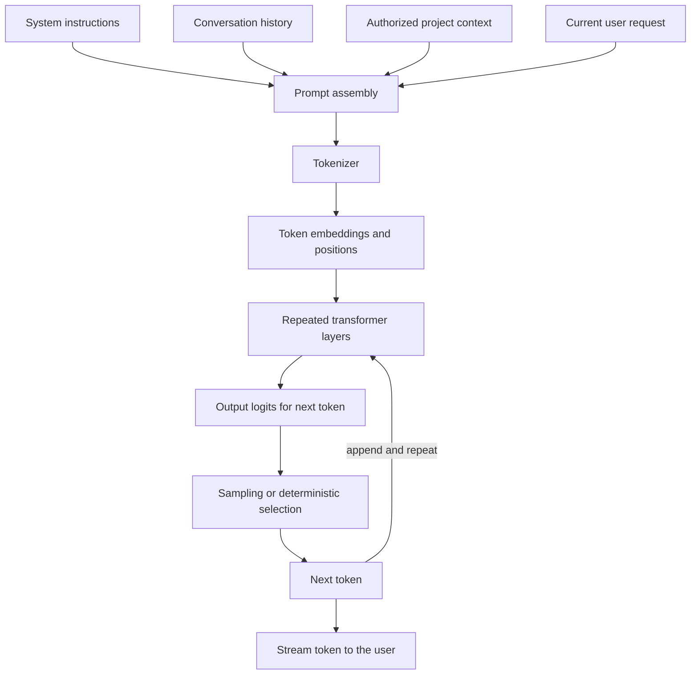

The model generates one token at a time. Each new token becomes part of the next step's input until an end token, a configured output limit, cancellation, or an error stops generation.

### 5.2 Attention

Attention allows each position to combine information from relevant earlier positions. At a simplified level, each token creates:

- a **query** describing what information it is seeking;
- a **key** describing what information it offers;
- a **value** containing the information to combine.

The model compares queries with keys, converts the scores into attention weights, and forms a weighted mixture of values.

```text
Attention(Q, K, V) = softmax(QKᵀ / √d) V
```

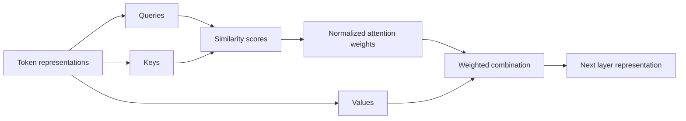

This mechanism helps a model connect names with later references, opening braces with closing logic, or a question with relevant context. It does not guarantee that the attended information is true or that the model will follow it correctly.

### 5.3 Transformer layers

A transformer stacks attention, feed-forward transformations, normalization, and residual connections. Early layers often capture local or syntactic patterns; later layers can represent more abstract relationships. This is an observed tendency, not a simple one-layer-per-concept map.

### 5.4 Logits, probabilities, and sampling

The final layer produces one score, called a logit, for every possible next token. Those scores are converted into probabilities. Generation settings control how the next token is selected.

- Lower temperature makes high-probability choices more dominant.
- Higher temperature increases variety and risk.
- A fixed seed can improve repeatability, but hardware and runtime differences may still matter.
- Greedy selection chooses the highest-scoring token but does not make the answer factual.

### 5.5 Context windows

The context window is the bounded token space visible during one inference sequence. It may contain system instructions, chat history, retrieved material, project context, tool results, and the current request.

When the context is too large, the system must omit, summarize, rank, or reject content. Increasing context length consumes more memory, especially for the key-value cache. It is not free storage and is not permanent learning.

### 5.6 KV-cache reuse

During attention, the runner calculates key and value representations for earlier tokens. Reusing those values can avoid recalculating an unchanged prompt prefix. MasterAI only permits session reuse when model, backend, template, settings, project index generation, and literal prompt-prefix conditions match. A changed model or context invalidates reuse.

KV-cache reuse improves performance. It does not modify model weights or teach the model.

### 5.7 Why hallucinations occur

A generative model predicts plausible continuations. It does not consult a built-in truth oracle. Hallucinations are more likely when:

- the requested fact was absent, rare, conflicting, or outdated in training;
- supplied context is missing or ambiguous;
- the prompt rewards confident completion;
- sampling is too permissive;
- retrieved evidence is irrelevant;
- the model is too small or unsuitable for the task;
- the task demands exact calculation, citation, or tool state not available to the model.

Controls include retrieval with provenance, constrained outputs, deterministic code, tools, explicit uncertainty, evaluation, and human review.

---

## 6. How training changes a model

### 6.1 The training loop

For a supervised language example, the model receives input tokens and tries to predict target tokens. The loss measures how poorly it assigned probability to the desired output.

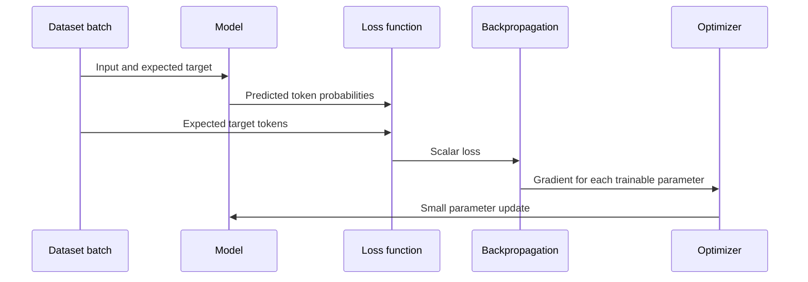

The steps are:

1. Select a batch of training examples.
2. Run a forward pass to calculate predictions.
3. Calculate loss against the targets.
4. Backpropagate the loss to calculate gradients.
5. Clip or otherwise control unsafe gradients if configured.
6. Let the optimizer update trainable parameters.
7. Record metrics.
8. Periodically evaluate on validation data.
9. Save recoverable checkpoints.
10. Stop when the objective is met, progress stalls, or a safety/resource boundary is reached.

### 6.2 Epochs, steps, and batches

- A **sample** is one training record.
- A **batch** is a group processed before an optimizer update.
- A **step** is usually one optimizer update.
- An **epoch** is one pass through the selected training data.

More epochs can improve learning until the model begins memorizing noise or overspecializing. Validation behavior matters more than a chosen epoch count by itself.

### 6.3 Learning rate

The learning rate controls update size. Too high may destabilize or erase useful prior behavior; too low may learn very slowly or stall. A schedule can warm up, reduce, or otherwise change the rate during training.

### 6.4 Backpropagation and gradients

A gradient estimates how a small parameter change would affect loss. Backpropagation applies the chain rule through the computation graph to calculate these gradients efficiently. The optimizer uses them to update weights.

This process is numerical optimization. It does not insert a human-readable rule into a known location. That is why dataset design and evaluation are essential.

### 6.5 Overfitting and underfitting

**Underfitting** occurs when the model has not learned the required pattern. Training and validation results are both poor.

**Overfitting** occurs when the model fits training examples too closely and performs poorly on unseen examples. Training results improve while validation or test results stagnate or degrade.

Controls include better data, regularization, early stopping, fewer epochs, smaller capacity, data augmentation, and a genuinely independent test set.

### 6.6 Catastrophic forgetting

Aggressive fine-tuning can damage capabilities learned by the base model. Always run both target-subject tests and broad regression tests. Parameter-efficient methods can reduce, but do not eliminate, this risk.

### 6.7 Fine-tuning methods

| Method | What changes | Typical benefit | Main caution |
|---|---|---|---|
| Full fine-tuning | Most or all weights | Maximum adaptation capacity | Highest compute and forgetting risk |
| Adapter training | Added small trainable modules | Modular specialization | Runtime must load the correct adapter |
| LoRA | Low-rank weight updates | Lower memory and storage | Rank and target layers require testing |
| Quantized LoRA | LoRA with a quantized base during training | Makes adaptation possible on smaller hardware | Numerical and conversion quality must be checked |
| Preference optimization | Behavior from preferred/rejected outputs | Improves style or choice behavior | Preferences may encode bias or shortcuts |
| Distillation | Smaller model learns from a larger teacher | Lower inference cost | Can inherit teacher errors |

### 6.8 Training from scratch

Training a foundation language model from scratch requires enormous datasets, compute, engineering, filtering, evaluation, and legal review. It is an explicit non-goal for MasterAI's initial release. For most MasterAI use cases, begin with an approved base model and use retrieval, prompting, or parameter-efficient fine-tuning.

### 6.9 A small numerical training example

Consider a deliberately simple model that predicts `y = wx` and begins with `w = 0.5`. For the example `x = 2` and target `y = 4`:

1. Prediction: `ŷ = 0.5 × 2 = 1`.
2. Error: `ŷ - y = 1 - 4 = -3`.
3. Squared loss: `(-3)² = 9`.
4. The gradient says how the loss changes when `w` changes.
5. The optimizer moves `w` a small distance in the loss-reducing direction.
6. On the next pass, the prediction should be closer to `4` if the learning rate is suitable.

A language model applies the same broad principle to a vastly larger differentiable computation. Instead of one weight and one numeric target, it has many parameters and target token probabilities. The optimizer still follows gradients; it does not reason about the meaning of the lesson as a human teacher would.

### 6.10 What training metrics are telling you

| Signal | What it can indicate | What it cannot prove alone |
|---|---|---|
| Training loss | Fit to batches the optimizer sees | Generalization or factual accuracy |
| Validation loss | Fit to held-out development data | Final unbiased test quality |
| Learning rate | Current update scale | Whether the chosen objective is correct |
| Gradient norm | Update stability or possible explosion | Subject competence |
| Throughput | Training speed | Output quality |
| GPU/CPU memory | Resource demand | Efficient production inference |
| Checkpoint saved | Recoverable parameter state | Approved model quality |

When training and validation loss both improve, the candidate may be learning a useful pattern. When training improves but validation worsens, suspect overfitting. When neither improves, inspect data, targets, architecture, optimizer, and learning rate before merely extending the run.

---

## 7. Four ways to “teach” a model

The word *teach* is used loosely. Choose the mechanism that matches the required kind of change.

### 7.1 Prompting: temporary instructions

Prompting supplies instructions or examples inside the current context. It changes neither model weights nor permanent knowledge.

Use prompting when:

- behavior can be described clearly;
- the task is short-lived;
- rapid iteration matters;
- the instruction fits comfortably in context.

### 7.2 Project context: current working evidence

MasterAI can attach authorized project content and retrieved indexed chunks to a request. This lets the model reason over current source without retraining. The current project retrieval foundation is lexical and disk-backed; the plan's semantic embedding and richer RAG work should not be assumed complete merely because vector-store or RAG metadata exists.

Use project context when:

- answers must reflect the current repository;
- source changes frequently;
- model responses should be grounded in files;
- the knowledge must stay separately controllable.

### 7.3 Retrieval-augmented generation: managed external knowledge

RAG retrieves relevant approved information at request time and includes it in the prompt. The model's weights remain unchanged.

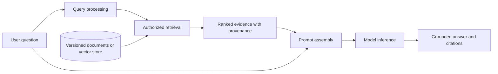

Use RAG when knowledge changes, citations are required, documents are private, facts must be deletable, or the subject is too large for a fine-tuning set.

### 7.4 Fine-tuning: persistent behavior adaptation

Fine-tuning changes weights or adapters. It is suited to repeated behavior, terminology, style, output formats, specialized task patterns, or tool-use behavior.

Fine-tuning is usually a poor way to maintain a frequently changing factual database. A model may blend or distort facts, cannot reliably cite their source, and is harder to update or delete than a document store.

### 7.5 The decision tree

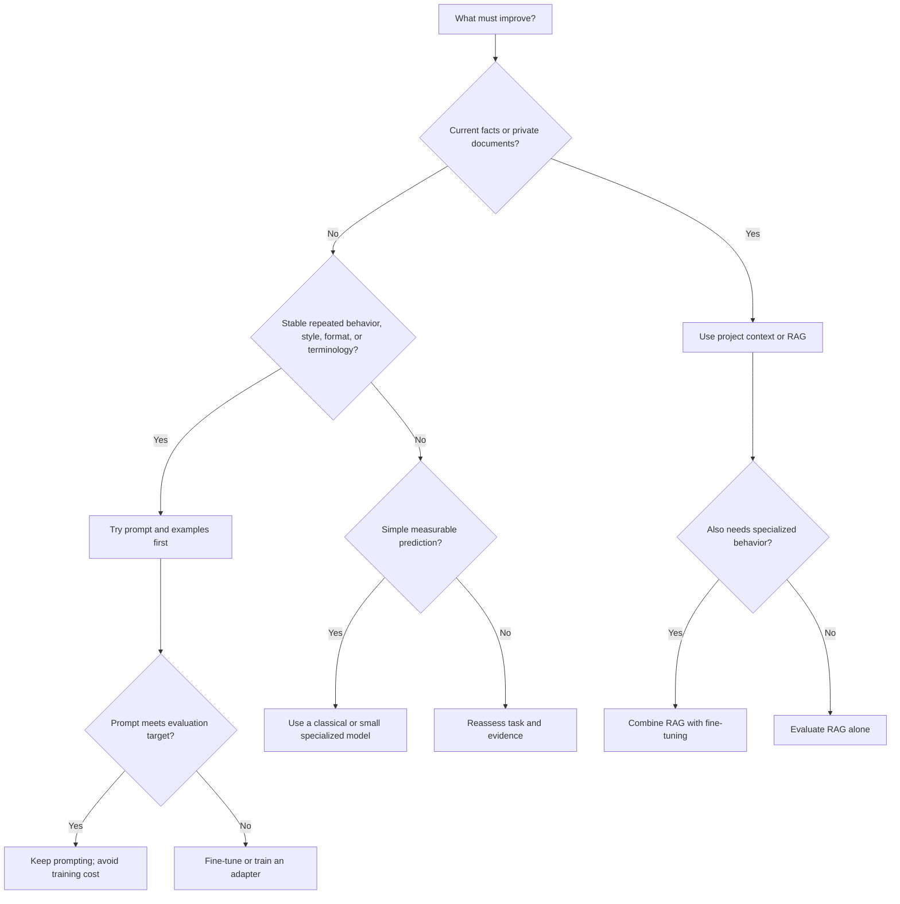

### 7.6 Comparison table

| Method | Changes weights | Knowledge freshness | Citations | Cost | Current MasterAI position |
|---|---:|---:|---:|---:|---|
| Prompting | No | Per request | Only if supplied | Low | Usable through chat |
| Project context | No | Re-indexed project state | Evidence disclosure is possible | Low to medium | Lexical foundation exists |
| Local hashing-vector RAG | No | Re-ingest changed documents | Stable source citations | Low to medium | Executable retrieval/context assembly; authored lexical vectors, not neural semantic embeddings |
| Local learned-embedding RAG | Uses a verified embedding GGUF for vector generation, not model training | Re-ingest when the source or embedding model changes | Stable source citations plus exact embedding-model provenance | Depends on the installed embedding GGUF and runner configuration | Executable through Phase 61; does not generate an answer |
| Adapter or LoRA fine-tuning | Yes, partially | Static until retrained | Weak by itself | Medium | Job records exist; executor is not yet implemented |
| Full fine-tuning | Yes | Static until retrained | Weak by itself | High | Planned executor |
| Foundation training | Yes, from initialization | Static until retrained | Weak by itself | Extreme | Initial-release non-goal |

---

## 8. Data is the curriculum

A model learns from the examples and objectives it receives, not from the trainer's unrecorded intentions. Dataset engineering is therefore part of model engineering.

### 8.1 Define the target before collecting data

Write a measurable capability statement:

> Given a self-contained C++17 function and its surrounding declarations, the model identifies ownership defects, explains the failure mechanism, and proposes a compilable correction without introducing non-C++17 dependencies.

Then define:

- intended users and use cases;
- prohibited uses;
- input and output contract;
- subject scope and exclusions;
- quality and safety thresholds;
- latency and resource ceilings;
- deployment environment;
- required evidence or citations;
- rollback conditions.

Without this contract, “make the model better” cannot be evaluated.

### 8.2 Source approval and provenance

For every source, record:

- owner and origin;
- license and permitted use;
- acquisition date and immutable revision where possible;
- security classification;
- personal information, credentials, and secrets status;
- integrity checksum;
- allowed projects and users;
- retention and deletion requirements.

Do not use material merely because it is accessible. Access does not establish permission to train on, reproduce, or publish it.

### 8.3 Cleaning and normalization

A controlled preparation pipeline should:

1. Verify files and types.
2. Scan for malicious content.
3. Decode text deterministically.
4. Remove irrelevant boilerplate.
5. Normalize only what the task permits.
6. Detect duplicates and near-duplicates.
7. find secrets, credentials, and personal information.
8. Reject or redact unsafe records.
9. Segment content without destroying meaning.
10. Validate schema and labels.
11. assign quality scores.
12. Require human review where policy demands it.
13. Publish an immutable dataset version and checksum.

### 8.4 Training, validation, and test separation

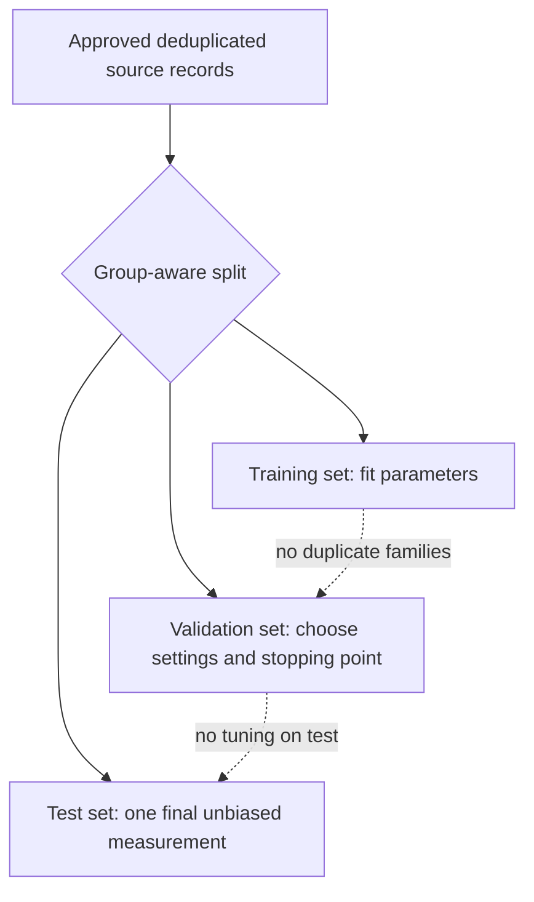

- **Training data** updates the model.
- **Validation data** selects hyperparameters and checkpoints.
- **Test data** estimates final performance and must not influence training decisions.

Split by meaningful groups, not just random rows. For example, keep all functions from the same repository, all variants of one question, or all messages from one conversation in the same partition. Otherwise near-duplicates can leak answers across sets.

### 8.5 Labels and instruction examples

A useful instruction record may contain:

- system instruction;
- user instruction;
- relevant context;
- expected response;
- rejected response where preference training is intended;
- permitted tool calls and expected results;
- required output format;
- subject and difficulty;
- safety classification;
- reviewer identity and status.

Examples should teach both desired behavior and boundaries. Include ordinary cases, edge cases, malformed inputs, ambiguous cases, safe refusals, and cases where the correct response is to request missing evidence.

### 8.6 Synthetic data

Synthetic examples can broaden coverage, but they can also amplify a generator's errors. Record the generator model, version, prompt, settings, source linkage, confidence, and review status. Never silently mix synthetic records with verified real records.

### 8.7 Dataset quality checklist

Before approval, confirm:

- scope matches the capability contract;
- records are valid and readable;
- labels are consistent;
- sources and licenses are documented;
- secrets and personal data are handled;
- duplicates and contamination are measured;
- classes and difficulty are appropriately balanced;
- train, validation, and test partitions are isolated;
- adversarial and negative cases exist;
- the version and checksum are fixed;
- reviewers have approved the result.

---

## 9. Evaluation: proving that learning occurred

Training loss is an optimization signal, not deployment approval.

### 9.1 Build the evaluation before training

Create a baseline evaluation set before changing the model. Run it against the base model and record the result. This establishes whether training actually improves the target capability.

### 9.2 Select task-appropriate metrics

Examples include:

- accuracy, precision, recall, and F1 for classification;
- mean absolute or squared error for regression;
- retrieval recall, ranking quality, groundedness, and citation correctness for RAG;
- compilation and unit-test success for code generation;
- structured-output conformance for machine-consumed responses;
- hallucination and unsupported-claim rate for factual tasks;
- safety-policy compliance and adversarial resistance;
- latency, throughput, memory, GPU use, model-load time, and failure rate.

One aggregate score can hide serious failures. Report results by topic, difficulty, user group, and risk category.

### 9.3 Compare against a baseline

Use the same:

- dataset version;
- evaluation harness;
- prompt or chat template;
- runtime and model settings;
- hardware identity;
- random-seed policy;
- output limits;
- scoring rules.

Compare target improvement, broad regressions, safety behavior, and resource cost. A specialized model that gains two points on its subject but loses critical tool-use safety should fail approval.

### 9.4 Human evaluation

Human review is essential when correctness is contextual or multiple responses are valid. Blind pairwise comparison reduces brand and version bias. Reviewers need a rubric and should record reasons, not only preferences.

### 9.5 Approval gates

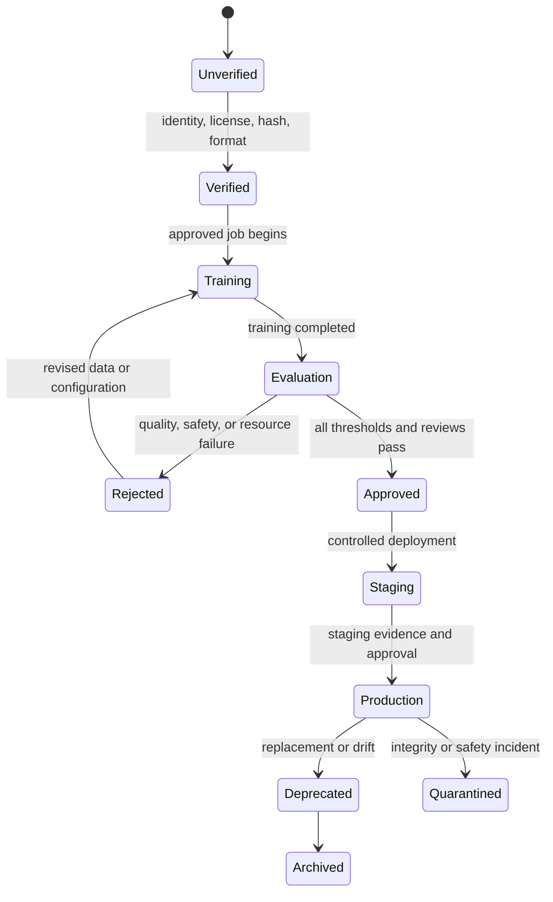

Training completion must never transition a model directly to production.

---

## 10. MasterAI's current capability boundary

This distinction is essential when following the practical lessons below.

### 10.1 What is usable now

MasterAI currently provides a real local inference control plane for verified GGUF models through an optional, version-pinned, process-isolated `llama.cpp` server. It includes model discovery and verification, hardware suitability checks, chat, project context, benchmarking, resource admission, runner supervision, cancellation, and administrative controls.

The Machine Learning administration foundation currently records and manages scoped lifecycle metadata for:

- the Machine Learning dashboard;
- Machine Learning projects;
- model registry entries;
- datasets;
- subject knowledge packages;
- labeling tasks;
- data-preparation jobs;
- training jobs;
- evaluation runs;
- experiments;
- fine-tuning jobs;
- model-builder configurations;
- instruction examples;
- synthetic-data records;
- vector-store registrations;
- retrieval-augmented-generation configuration registrations;
- subject exams;
- hyperparameter searches;
- model-optimization runs;
- training checkpoints;
- deployments;
- model comparisons (whose **Compare now** action is a real executor — see below);
- inference endpoints;
- compute nodes;
- safety-governance policies and per-model cards.

These are valuable control-plane records. They establish identity, ownership, intent, relationships, status, review, and approval boundaries.

Two further pages are genuinely functional rather than lifecycle metadata, but for a different reason than the tabular/retrieval engines below: **Audit Logs** (`/app/ml/audit-logs`) is a real read over the same hash-chained audit trail every administrator action already writes to, and **Machine Learning Settings** (`/app/ml/settings`) genuinely reads and writes real server configuration (the Dataset Manager's CSV upload cap, the Subject Knowledge Manager's document cap and Parquet helper path).

Since Phase 56, the module also contains a **real execution engine** for tabular machine learning, extended by Phase 57. This is genuine computation, not record-keeping:

- **Dataset content ingestion** — uploading a file to a registered dataset parses and validates it completely (header row, numeric feature enforcement, quoted fields, an administrator-configurable byte cap, default 8 MiB) before anything is stored, and returns a real profile: row count, feature columns, the target column, and whether the task is classification or regression. CSV, JSON (a top-level array of flat objects), JSONL (one flat object per line), and Parquet (converted via the same DuckDB helper Knowledge ingestion uses) are all accepted — the uploaded file's own extension picks the format, and every format converts to the identical CSV text before validation, so a JSON or Parquet dataset is trained/evaluated exactly like a hand-written CSV one. A record missing a field another record has renders that cell empty; a nested array/object field is rejected, since the tabular engine has no concept of a nested column.
- **A real training executor** — running a training job performs actual full-batch gradient descent on standardized features: linear regression when the target column is numeric, logistic or softmax classification when it is categorical. The job's lifecycle transitions (`queued → preparing → running → awaiting_evaluation`) happen for real, the per-epoch loss curve comes from real optimization steps, and checkpoint records carry genuinely measured losses.
- **Persisted learned weights** — every completed run stores the trained weights, standardization statistics, and schema as a reloadable artifact tied to a Model Registry entry, so a model trained today still predicts correctly after a server restart.
- **A real evaluation harness** — running an evaluation scores a trained model against any schema-matching dataset and stores genuine metrics: accuracy, macro precision/recall/F1, and a confusion matrix for classification; MSE, MAE, and R² for regression.
- **Live prediction** — the Model Registry serves real predictions (the winning class with per-class probabilities, or the predicted numeric value) computed from the persisted weights.
- **A real comparison harness (Phase 57)** — a Model Comparison names a baseline model, a candidate model, and one shared benchmark dataset; **Compare now** evaluates both trained artifacts against that dataset's real content and stores a measured verdict: both full metric sets, the primary-metric delta (macro F1 for classification, MSE for regression), and the winner. An exact tie is reported as a tie, and comparing a classification model against a regression model is rejected.
- **Real knowledge ingestion (Phase 58)** — the Subject Knowledge Manager accepts a selected local UTF-8 text, Markdown, CSV, JSON, JSONL, or Parquet file up to the administrator-configured `knowledge.maximumDocumentBytes` (default 25 MiB). Parquet files are converted to text first via a configured, process-isolated DuckDB CLI helper. The server hashes the exact accepted content with SHA-256, creates overlapping text chunks, and records the source filename, media type, byte count, chunk count, owner, subject, and target vector store.
- **A populated local vector index (Phase 59)** — every source chunk receives a persisted 128-dimensional vector from MasterAI's independently authored deterministic hashing vectorizer. Index profiles report the actual document count, chunk count, dimensions, and indexed text bytes, and the source/chunk/vector records survive restart together.
- **Executable grounded retrieval (Phase 60)** — an approved RAG configuration can execute hybrid, vector-only, or keyword-only retrieval against an approved populated vector store. The result contains ranked source chunks, vector and keyword score components, stable citations, exact evidence text, and an assembled context package.
- **Learned neural embedding inference (Phase 61)** — a vector store can select a verified, ready GGUF from `models/embeddings-code-search/<model-id>/`. MasterAI invokes llama.cpp's local embedding endpoint through the existing isolated runner, validates and L2-normalizes every vector, and persists the exact model id and dimensions. Retrieval refuses to compare vectors made by different models. The authored 128-dimensional hashing vectorizer remains available when a learned model is unnecessary or unavailable.
- **Once-per-conversation memory recall (Phase 61)** — durable user-memory records are read once when a chat starts and saved as a bounded snapshot on that chat. Later turns and restarts reuse the snapshot instead of querying the durable memory collection again. Facts disclosed during the active chat remain in normal chat history and newly saved durable facts apply automatically to newly created conversations.
- **Real automation-pipeline execution (Phase 69, extended Phase 71)** — an Automation Pipeline names a target dataset, an optional starting model, and an ordered stage list; **Run** now executes nine of the taxonomy's stages for real: **Train model** and **Evaluate model** (a genuine Training Job / Evaluation Run, chaining the model a Train model stage produced into the following Evaluate model stage — the exact same real training/evaluation code the Training Jobs and Evaluation Lab pages use), **Validate data** (parses the dataset's uploaded CSV the same way the trainer does, and fails with the same structural reason it would), **Validate model** (confirms the current model actually has trained weights), **Safety tests** (passes only if an approved Model Card already exists for the current model in Safety and Governance), **Request approval**/**Deploy staging**/**Deploy production** (create and approve a real Deployment record for that environment — this records an approval decision, matching Deployment Manager's own scope, not a live traffic cutover), and **Rollback** (revokes that run's deployment approval). **Monitor** attaches the same genuine snapshot the Monitoring and Diagnostics page reports. Every other named stage (data import/clean/label/split, optimize, staging tests) is still recorded as `"skipped"`, since no executor for those exists in this codebase — it is never reported as completed. A run also no longer blocks the page while it executes: **Run** returns immediately, and the pipeline detail panel shows a live progress bar (stages completed out of the total, and which stage is currently running) that updates once a second until the run finishes.
- **A real fine-tuning executor (Phase 70)** — a Fine-Tuning Job requires an already-trained base model (a Training Job whose model has completed at least one real training run) and a fine-tuning dataset with uploaded CSV content. **Fine-tune now** genuinely continues gradient descent from the base model's already-learned weights on the fine-tuning dataset (a real warm start, not zero-initialized training that happens to reuse the same optimizer) and stores the result as a new Model Registry entry — the base model is left untouched, so you can compare the two. The base model's feature columns, task (classification/regression), and — for classification — class labels must match the fine-tuning dataset exactly, or the run fails with a clear schema-mismatch error instead of producing a meaningless result.
- **Deployment Manager, Inference Endpoints, and Synthetic Data all become genuinely executable (Phase 82)** — Synthetic Data's **Generate** action invokes a model against a technique-specific prompt (any of section 20's thirteen named operations, or a free-text one) and stores the real generated text alongside generator model/version and a documented confidence heuristic. Deployment Manager's own **Deploy now**/**Rollback** actions require an approved Model Card for the model (the same gate Automation Pipelines already enforced), compute a real health signal from whether the model has trained weights, and track which deployment a new one superseded so a rollback can restore it. Inference Endpoints needed no new execution — Phase 77 had already given it a real listener, auth, and rate limiting — it only gained the Bearer-token and policy-editing form fields the API already accepted but the page never exposed.
- **Real content scanning for Safety and Governance (Phase 74, flipped to `available` in Phase 83)** — `POST /api/v1/ml/safety-policies/{id}/scan` runs a policy's own restricted data categories, plus every scanned request's text, through two real detectors: hand-rolled pattern matching for secret-shaped tokens (AWS/OpenAI/GitHub key shapes, PEM blocks, generic high-entropy tokens) and sixteen documented prompt-injection phrases, unconditionally; and, when the request includes a `modelId`, a real LLM-as-judge classifier that asks the locally loaded model to rate the text for bias, hallucination risk, and harmful content. The same scan runs live on every real request an active Inference Endpoint serves (`run_inference_endpoint`, gated by that endpoint's saved policy) and inside Automation Pipelines' "Safety tests" stage. A classifier that could not be evaluated (no model loaded, an unparseable reply) reports itself unavailable with a diagnostic rather than silently passing as clean.

Section 10.7 walks through this end to end. The engine's own honest boundary: it trains and fine-tunes **tabular** models. It does not fine-tune language models or run adapter/LoRA methods — that remains planned, and the boundary list below still applies to everything it names.

### 10.2 What must not be assumed yet

At the plan's current boundary, the tabular engine and local retrieval engine described in 10.1 are real, but the following must still not be represented as an operating end-to-end platform:

- training or fine-tuning of **language models** (the real executors cover tabular classification and regression only);
- external training-framework integration in general (PyTorch and similar remain unintegrated; Phase 73's LoRA path is the one deliberate exception, calling the pinned llama.cpp finetune/export-lora CLI directly, not a broader framework integration);
- immutable dataset version publication and transformation execution (Data Preparation jobs still record intent only);
- real label-record editing and consensus review;
- adapter (LoRA) execution against a language model (Phase 73 does execute real LoRA fine-tuning against the pinned llama.cpp finetune/export-lora CLI, but that interface is pinned to a historical version and may need administrator-supplied flags if it drifts; the tabular engine described above has no adapter/LoRA concept of its own);
- executed quantization, distillation, or other non-pruning optimization operations (magnitude pruning is now a real executor — see Model Optimization below — the remaining twelve of section 28's thirteen example operations are not);
- learned-embedding quality or speed without testing the exact installed GGUF on the target hardware (Phase 61 implements the adapter, not a universal quality claim);
- LLM answer generation from the Phase 60/61 context package, automated groundedness judging, or a complete generative RAG answer pipeline;
- canary/blue-green/shadow/A-B/rolling deployment strategies (the `strategy` field remains free text; Phase 82's real deploy/rollback action only ever performs a direct approve/supersede/restore, never a traffic-splitting rollout);
- continual learning from user conversations **beyond collecting and presenting draft candidates for review** (2026-08-24: `collect_continual_learning_candidates()` — see the Continual Learning section below — implements steps 1-6 of section 38's 12-step workflow for real: it collects real conversation turns, scrubs PII, scores quality, safety-scans, and creates real `draft` InstructionExamples. It does **not** itself add anything to an approved dataset, schedule fine-tuning, evaluate, compare, approve, or deploy — every one of those remaining steps is a separate, already-real, human-gated action on the resulting draft, exactly as before this pass);
- live hardware telemetry (temperature, power draw, queue length, current workload) behind a Compute Node record;
- automation-pipeline orchestration of data import/clean/label/split, optimize, or staging tests (these five stages still report `"skipped"`, never fabricated success); "deploy staging"/"deploy production" create and approve a Deployment **record** the same way Deployment Manager's own **Deploy now** action does — an approval decision, not a network listener or live traffic cutover;
- copyright/data-poisoning detectors, dataset ingestion-source screening, and retention/export/network policy enforcement behind Safety and Governance — the real content scanning that does exist (secret-token and prompt-injection pattern matching, an LLM-as-judge classifier for bias/hallucination/harmful content, and — 2026-08-24 — `scrub_pii()`'s real pattern-based redaction of email addresses/SSNs/credit-card-shaped/phone-shaped digit runs, used by Continual Learning collection) covers only content this codebase's own inference paths generate or conversation turns explicitly run through it; there is still no general-purpose PII scanner over arbitrary dataset content.

Creating a Fine-Tuning Job record still records administrative intent and lifecycle state; **Fine-tune now** (Phase 70) executes it for real, but only against MasterAI's own tabular models — it does not adapt a language model. Creating an empty Vector Store record alone does not index anything: a source file must be deliberately ingested through Subject Knowledge Manager. Likewise, a Subject Exam record does not administer questions, a Hyperparameter Search record does not run trials, a Model Optimization record does not quantize anything, and a Deployment record's `approved` status does not route a single request — each is a governed statement of intent and approval that a future executor will attach real evidence to. The deliberate executor exceptions through Phase 71 are tabular training, fine-tuning, evaluation, prediction and comparison, automation-pipeline stage execution (train/evaluate/validate data/validate model/safety-card check/request approval/deploy staging/deploy production/rollback/monitor, with live per-stage progress), bounded knowledge ingestion, authored or learned vector indexing, evidence-bearing retrieval/context assembly, and the genuinely functional Monitoring and Diagnostics, Audit Logs, and Machine Learning Settings reads.

### 10.3 Two model catalogs with different purposes

Do not confuse these concepts:

1. The **Machine Learning Model Registry** records the development and approval lifecycle of a model asset.
2. The **inference model tree** under `models/<category>/<model-id>/` contains a deployable GGUF plus a strict `manifest.json` used by the current runtime.

A future integrated workflow should promote an approved ML result into the inference model tree. Today, an administrator must deliberately package and verify the resulting GGUF for inference.

### 10.4 When to use MasterAI today

Use MasterAI now to:

- define and track the controlled ML project;
- register datasets, subjects, examples, jobs, experiments, and approvals as the supported fields permit;
- upload tabular CSV data and train, evaluate, compare, and serve real classification/regression models end to end (Section 10.7);
- ingest approved text sources, inspect their populated local vector index, and test citation-bearing retrieval (Section 10.8);
- keep ordinary users away from ML administration;
- run and compare verified GGUF inference models;
- test prompts and authorized project context;
- benchmark a model on the same host;
- serve an approved specialized GGUF after it has been trained and converted by a controlled external workflow.

Do not use a manually changed status as proof that anything ran. Trust the executor's own evidence instead: a Phase 56 training run leaves a real loss curve, held-out metrics, measured-loss checkpoints, and a weight artifact behind — a hand-edited status leaves nothing.

### 10.5 Current Machine Learning classroom map

The current administrator pages are easiest to understand as a chain of controlled records. The table explains what each page is for and the boundary a learner must remember.

| Interface | Browser path | Record's present purpose | Important present boundary |
|---|---|---|---|
| Dashboard | `/app/ml` | Shows real counts, a clickable five-step overview of the one real end-to-end pipeline (Section 10.7), and every other interface grouped as "Additional tools" | A zero count is real; a planned tag is not a hidden implementation |
| Projects | `/app/ml/projects` | Organizes one ML objective and lifecycle; a Governance & targets form records administrators (each validated against real accounts), approved data sources, security classification, target architecture/deployment environment, success/evaluation/safety criteria, and a storage allocation | Does not allocate compute or storage — the storage allocation field is a declared ceiling, not an enforced quota |
| Model Registry | `/app/ml/models` | Tracks model identity, provenance summary, quantization (e.g. `F16`, `Q8_0`, `Q4_K_M`, auto-filled when a downloaded model becomes a Fine-Tuning base, or set manually), and state; serves live predictions from trained tabular artifacts | Is not the deployable GGUF inventory |
| Dataset Manager | `/app/ml/datasets` | Tracks dataset identity, source, approval, and a "purpose" (Tabular data, or Instruction / fine-tuning text) chosen when the dataset is registered; holds real validated content uploaded as CSV, JSON, JSONL, or Parquet; every upload computes real record count, per-column schema, a content hash, duplicate rate, and a data quality score, and publishes one new immutable version (History button recalls the full list) | Sensitive-data status and train/validation/test split percentages are administrator-declared (Declare metadata form), never auto-detected |
| Subject Knowledge | `/app/ml/subjects` | Tracks a domain package and review status | Does not ingest its documents yet |
| Data Labeling | `/app/ml/label-tasks` | Tracks a target dataset, label mode, and task status | Does not yet store or edit the full label records |
| Data Preparation | `/app/ml/prep-jobs` | Tracks a target dataset, operation, and job status | Does not execute transformations |
| Training Jobs | `/app/ml/training-jobs` | Tracks project/model/dataset/method and lifecycle; **Train now** really trains a tabular model by gradient descent; an Execution policy form sets a real enforced max runtime, retry-once failure recovery, and checkpoint cadence, plus operator-reference-only compute/hardware/container fields | Trains tabular models only — it does not fine-tune language models; compute/hardware/container fields are recorded, not enforced (this server always trains in-process on its own host) |
| Evaluation Lab | `/app/ml/evaluation-runs` | Tracks the candidate, dataset, category, and run status; **Evaluate now** really computes and stores metrics, now including latency, throughput, memory use, a stability score, a robustness score, and an optional bias/fairness breakdown by a named feature column | Scores tabular models only — perplexity, hallucination rate, groundedness, retrieval accuracy, response relevance, code correctness, and adversarial-prompt resistance are LLM-evaluation categories this executor does not compute |
| Experiment Tracking | `/app/ml/experiments` | Relates a project, model, optional dataset, hyperparameters, seed, versions, tags, and notes; **Run now** really trains and evaluates the experiment's dataset, storing real training/validation/evaluation metrics, hardware, runtime, and checkpoints; **Compare** builds a genuine side-by-side diff of two or more run experiments | Trains tabular models only, and has no safety-scoring executor — comparisons report that honestly rather than fabricating a value |
| Fine-Tuning | `/app/ml/fine-tuning-jobs` | Tracks base model, dataset, method, and job lifecycle; **Fine-tune now** normally warm-starts gradient descent from a tabular base model's learned weights and registers the adapted result as a new model, but a job whose Method starts with `llm:` (a free-text convention, not a separate field) instead runs Phase 73's real LLM LoRA fine-tuning against the pinned llama.cpp `finetune`/`export-lora` CLI, using the job's Dataset content — which must be a Dataset Manager entry registered with purpose "Instruction / fine-tuning text" | The `llm:` LoRA path is pinned to a historical llama.cpp interface and may need administrator-supplied flags if it drifts; the plain (non-`llm:`) path adapts tabular models only |
| Model Builder | `/app/ml/model-builder-configs` | Tracks a proposed source type, design lifecycle, the full section 9 build-settings sheet (architecture through distributed training) edited in basic or advanced mode, and a target dataset | `POST .../run` creates a real `TrainingJob` against the dataset; when the build settings specify a hidden-layer architecture (`layer_configuration`, e.g. "256,128,64", or `hidden_dimensions`), that job trains a real from-scratch multi-layer perceptron — genuinely consuming activation, dropout, optimiser (sgd/sgd_momentum/adam), batch size, gradient clipping/accumulation, learning-rate schedule, early stopping, initialisation, epoch count, seed, and checkpoint frequency — instead of the plain linear/logistic/softmax model. Attention configuration, tokenizer/vocabulary, sequence length, and mixed precision stay honestly unconsumed: they are transformer-only concepts this tabular-row engine does not implement |
| Instruction Training | `/app/ml/instruction-examples` | Tracks a target dataset, subject, and review lifecycle; holds the full section 19 content record (system/user instruction, context, expected/rejected response, tool calls/results, output format, difficulty, safety classification); **Generate draft** and **Test against models** really invoke a model; **Validate** and duplicate/contradiction checks run real (heuristic) logic; approval is blocked until content exists | Duplicate/contradiction detection is a documented text-overlap heuristic, not semantic understanding |
| Synthetic Data | `/app/ml/synthetic-records` | Tracks generation technique, dataset, and review status; **Generate** really invokes a model against a technique-specific prompt (paraphrase, counterexample, edge case, and ten more named operations, plus any free-text technique) and stores the generated text, generator model/version, prompt, and a documented confidence heuristic | Confidence score is a documented heuristic (1.0 completed/non-empty, 0.0 otherwise), not a model-reported probability |
| Embeddings and Vector Stores | `/app/ml/vector-stores` | Registers store identity, embedding model name, metric, and approval; Phase 59/61 populate a real local index (authored hashing vectorizer or a verified learned GGUF) as documents are ingested | Index population happens through knowledge ingestion (Subject Knowledge Manager), not this page directly |
| Retrieval-Augmented Generation | `/app/ml/rag-configs` | Registers a search strategy, optional vector-store relationship, and approval; an approved config over a populated store can execute real `hybrid`/`vector`/`keyword` retrieval and return citation-ready evidence (Section 10.8) | Does not generate an LLM answer or claim a later answer is grounded — retrieval and context assembly only |
| Subject Examination | `/app/ml/subject-exams` | Tracks an exam for a registered subject package, its question format, review lifecycle, and a real question bank/passing threshold | `POST .../run` genuinely asks the target model each question, then grades the answer with a real LLM-as-judge (a fixed JSON-only judging prompt through the same generation path, parsed strictly) — falling back to the original plain text-overlap heuristic only when the judge call fails or its reply is unparseable; every result records `gradedBy` so a reviewer can see which path scored it; `GET .../result` retrieves the latest run |
| Hyperparameter Optimization | `/app/ml/hyperparameter-searches` | Tracks a search over a training job's settings, its strategy, an optional learning-rate/epoch search space, and a bounded trial budget | `POST .../run` runs a real, bounded grid search over learning rate and epochs, plus batch size, dropout, and optimiser choice too when the referenced job has a real Model Builder MLP architecture, and records the real best trial's parameters/score. The `Search strategy` field is not consulted — every run is this same grid search regardless of what you type there (`random`/`bayesian`/etc. are recorded but have no separate executor yet) |
| Model Optimization | `/app/ml/model-optimizations` | Tracks an operation (quantization, pruning, ...) against a registered model; requesting status `running` for `operation: "pruning"` really zeroes weights below an administrator-set magnitude threshold (default `1e-3`) and persists the pruned model | Only `pruning` has a real executor — every other named operation (quantization, distillation, ...) still only records intent and does not transform the artifact |
| Checkpoint Management | `/app/ml/checkpoints` | Tracks checkpoint records; training and fine-tuning runs capture them automatically at a computed epoch stride, each carrying a real epoch number and a genuine learned-weight snapshot (Phase 79); **Resume training** continues gradient descent from a snapshot-bearing checkpoint and registers the result as a new model | Manually-created checkpoint records (the form on this page) still have no weight snapshot to resume from; no promotion to a deployable artifact |
| Deployment Manager | `/app/ml/deployments` | Tracks an intended promotion of a registered model to an environment, with strategy and approval; **Deploy now** really requires an approved Model Card for the model (the same check Automation Pipelines' own Request approval/Deploy stages enforce), computes a real health signal from whether the model has trained weights, and supersedes any deployment already approved for the same environment; **Rollback** reverses that, restoring the superseded deployment | Health is "does a trained tabular artifact exist," not a live serving health check — that surface is Inference Endpoints, a different resource |
| Model Comparison | `/app/ml/model-comparisons` | Names a baseline model, candidate model, and shared benchmark; **Compare now** really evaluates both and stores the measured winner | Compares trained tabular models only — no latency, safety, or blind response comparison for language models |
| Inference Endpoints | `/app/ml/inference-endpoints` | Registers an endpoint (host, port, protocol, auth method, Bearer token, rate limit) and a per-endpoint policy (content scan, block-on-finding, safety policy, model classifier); setting status **active** really opens a network listener serving `POST /v1/completions`, enforcing Bearer auth and the per-minute rate limit for real, and applying the live policy to every prompt/answer | The wire protocol is this codebase's own minimal `/v1/completions` surface, not an OpenAI-compatible API; the rate limiter is in-memory and resets on restart |
| Hardware and Compute | `/app/ml/compute-nodes` | Registers a compute node's static description and administrative status; a node flagged as the local host (**isLocal**) exposes **View live telemetry** — a genuinely fresh `probe_hardware()` snapshot (CPU counts, RAM, GPU backend/VRAM, free disk) on every click | Only the local host can be polled; a remote node still has no agent process, so its telemetry request 400s rather than fabricating numbers, and temperature/power draw/queue length remain unavailable everywhere |
| Automation Pipelines | `/app/ml/automation-pipelines` | Names an ordered subset of the training lifecycle's stages plus a target dataset/starting model; **Run** returns immediately and executes on a background thread, genuinely running **Train model**/**Evaluate model** (Training Jobs/Evaluation Lab's real tabular engine, chaining the trained model into the evaluation), **Validate data** (parses the dataset the same way the trainer does), **Validate model** (confirms trained weights exist), **Safety tests** (an approved Model Card exists for the model), **Request approval**/**Deploy staging**/**Deploy production**/**Rollback** (a real Deployment record is created/approved/rejected), and **Monitor** (the same snapshot Monitoring and Diagnostics reports); the run detail panel shows a live progress bar and the currently-running stage while it works | Import/clean/label/split data, optimize, and staging tests are still honestly recorded as skipped — no executor for those exists yet; "deploy" stages only change a Deployment record's approval status, never live traffic |
| Safety and Governance | `/app/ml/safety-governance` | A policy (restricted data categories) and per-model cards (purpose, intended/prohibited use, limitations, license), each with its own approval workflow, plus real secret/prompt-injection/restricted-term scanning and an LLM-as-judge bias/hallucination/harmful-content classifier, enforced live on Inference Endpoint requests and Automation Pipeline safety tests | Does not screen dataset ingestion sources, detect PII/copyright/data-poisoning, or enforce retention/export/network policy |
| Audit Logs | `/app/ml/audit-logs` | Read-only view of the most recent 200 recorded `ml.*` administrator actions, newest first | Read-only by design — every action shown was already recorded elsewhere; there is nothing to configure here |
| Machine Learning Settings | `/app/ml/settings` | The ML-relevant subset of System Configuration: the Dataset Manager's CSV upload cap and the Subject Knowledge Manager's document upload cap/Parquet helper path | Everything else (host/port, memory, retrieval, ...) lives on the general System Configuration page |
| Monitoring and Diagnostics | `/app/ml/monitoring` | A read-only aggregation of data other real phases already measured: live local-host CPU/RAM/GPU/disk (the same `probe_hardware()` telemetry as Hardware and Compute), real training-job status counts, every completed evaluation run's genuinely measured metrics, and real prompt/generation tokens-per-second from actual benchmark runs | Does not report per-step training curves (no iterative training loop exists to sample one from) or any live per-request inference telemetry — requests/sec, latency percentiles, queue depth, cache-hit rate, safety-filter rate, tool-call success, retrieval latency, model-loading time, temperature, and network activity all remain unavailable since no request path is instrumented to measure them |

The order in Section 12 intentionally moves between these pages according to the actual development lifecycle, rather than simply following the sidebar order.

The five newest record types form a governed post-training chain around a training job and its resulting model. The diagram shows how the records relate; every arrow is an administrative reference today, not an automated hand-off:

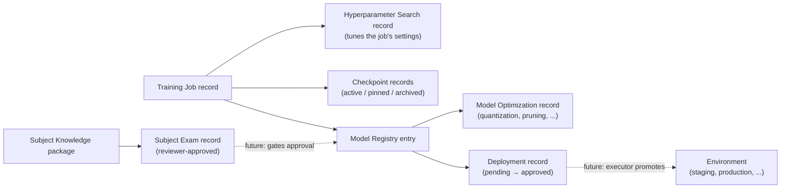

Three different lifecycles appear in this chain, and each was chosen to match what the record *is*:

- **Reviewer workflow** (`draft → in_review → approved / rejected → archived`) — Subject Exams, like Instruction Examples, because an exam is authored content a person reviews.
- **Job lifecycle** (`draft → queued → running → completed / failed / canceled → archived`, eleven states) — Hyperparameter Searches and Model Optimizations, because both execute like training jobs once a real executor exists.
- **Resource approval** (`pending → approved / rejected`) — Deployments, like Vector Stores and RAG configurations, because a deployment is infrastructure awaiting authorization.
- **Retention lifecycle** (`active → pinned → archived`) — Checkpoints only. Nobody "approves" a checkpoint; an administrator keeps it, protects it from retention deletion (`pinned`), or archives it.

### 10.6 Status is state, not evidence

A lifecycle status answers, “What state does the administrative record claim?” Evidence answers, “What verifiably happened?” They must agree, but they are not interchangeable.

For example, a legitimate completed training job should eventually be supported by:

- executor identity and version;
- start and finish times;
- exact input dataset and base-model digests;
- full configuration and seed;
- resource and metric logs;
- checkpoints and output hashes;
- cancellation/failure history;
- the user or service responsible;
- audit records.

Until an executor attaches that evidence, manually changing a status to `completed` proves only that the record was changed. The Phase 56 tabular executor is the first place this evidence loop closes: a job it ran carries a real loss curve, real held-out metrics, real checkpoint losses, and a real weight artifact — and its statuses were set by the executor, not by hand.

### 10.7 Hands-on lesson: train, evaluate, and use a real tabular model

This is the first fully executable machine-learning workflow inside MasterAI. It uses the classic supervised-learning loop from Section 2 on your own CSV data. Everything in this lesson computes for real.

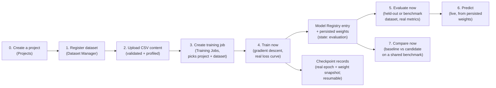

The Dashboard (`/app/ml`) leads with exactly this path — five clickable boxes, in order, labeled "Create a project," "Register a dataset," "Upload dataset content," "Create & run a training job," and "Evaluate the result" — so you can always get back to the start of this lesson from there. Steps 0-3 below are that same five-step path (registering and filling a dataset is two actions on one Dataset Manager page, which is why the Dashboard shows them as two boxes but this lesson as one step); Steps 4-7 are what to do once a trained model exists.

**Step 0 — Create a project.** Before anything else, open Projects (`/app/ml/projects`, box 1 on the Dashboard) and create one — a name and, optionally, a description/objective/subject domain is enough. A project is the container the rest of this lesson's records attach to: Step 3's training job requires picking one. One project can hold many datasets, training jobs, and evaluation runs, so create it once per real objective (e.g. "Support ticket triage"), not once per experiment.

**Step 1 — Prepare a CSV the engine can learn from.** This lesson's path is the *Tabular data* purpose (see Step 2). The first row is the header. A feature column may be numeric (measurements, counts, encoded flags) *or* text/category (e.g. a `record_type` column with values like `document`/`image`/`video`) — a text feature column is automatically one-hot encoded (turned into one `columnName=value` 0/1 column per distinct value actually seen) rather than rejected, so you do not need to pre-process categorical data by hand. The target column — what the model should learn to predict — may be numeric (regression: price, temperature, duration) or categorical text (classification: `spam`/`ham`, `low`/`medium`/`high`, species names). At least one feature column, one target column, and two data rows are required; up to 8 MiB and 64 distinct class labels are accepted for a classification target — if your CSV's real label column has more distinct labels than that, or the target you actually want is free text (an LLM's response to a prompt, not a fixed set of classes), that CSV is not a tabular classification dataset at all: register it with purpose "Instruction / fine-tuning text" instead (Step 2) and take it to the Fine-Tuning page, not Training Jobs.

**Step 2 — Register the dataset and upload its content.** Dataset Manager (`/app/ml/datasets`) shows a numbered "Step 2 → Step 3" banner at the top of the page, because this is really two separate actions: register the dataset, then use **Upload dataset content**. Registering asks "What kind of data is this?" — **Tabular data (classification / regression)**, this lesson's path, or **Instruction / fine-tuning text (LLM training)** for rows of prompt-and-response text meant for the Fine-Tuning page instead (Section 7.4/9.5) — pick this if your data has no single column to predict, e.g. a `instruction`/`prompt` column paired with a `response`/`output`/`completion` column. The two purposes are validated differently and that choice cannot be changed later, only re-registered. For a Tabular dataset, **Upload dataset content** takes the target column name (blank means the last column) and a CSV, JSON, JSONL, or Parquet file — the file's own extension picks the format; for an Instruction dataset, the target column field is ignored and the file just needs its instruction/prompt and response/output/completion columns present. The server parses everything before storing anything; a malformed row (wrong cell count) or a nested JSON field is rejected with the exact reason named — a non-numeric feature cell in a Tabular dataset is not an error, it is treated as a category (see Step 1). A successful upload reports the real profile: for Tabular, row count, feature columns (categorical ones already expanded into their one-hot names), and the detected task; for Instruction, row count and the detected instruction/response column names. Until content is uploaded, that dataset is marked **⚠ no content uploaded yet** everywhere it appears (the Registered Datasets table's Content column, and every dataset picker across the ML pages) — this is the single most common way a new user's first training attempt fails, so the UI now flags it before you ever click Train now rather than after.

**Optional — Augment the dataset.** The same page's **Augment dataset (optional)** form (2026-08-24) adds real synthetic rows on top of whatever you uploaded — your original rows are never changed or removed, only added to — and is worth reaching for when you have too little data or an imbalanced classification target. For text/category columns, four checkboxes run the classic "Easy Data Augmentation" word-level operations: synonym replacement and random insertion (both drawing from a small built-in synonym list — not a full thesaurus, so uncommon or domain-specific words are left as-is), random deletion, and random swap; the "Text change amount" field controls roughly what fraction of a cell's words each enabled operation touches. For numeric columns, "Add numeric noise" adds a jittered synthetic copy of every row, scaled to each column's own typical spread. "Balance rare classes" is classification-only: it duplicates rows from under-represented classes toward the "Target balance ratio" (0.5 = at least half as many rows as your largest class) — it is silently skipped for a regression dataset or one with too many distinct classes to treat as categories, not an error. The result reports real rows-before/rows-after/synthetic-rows-added counts. Re-running Step 3's training job afterward trains against the augmented content, since augmenting persists a new dataset version the same way uploading or cleaning content already does.

**Step 3 — Create a training job for that dataset.** In Training Jobs (`/app/ml/training-jobs`, step 4 of the banner), create a job whose Project is the one from Step 0 and whose Dataset is the one you just filled — its entry in the dropdown should read "N row(s) ready", not the warning above. The Model field may be left as "Create a new model" — the executor will register the trained model for you.

**Step 4 — Train.** Click **Train now**. This button is disabled (with a tooltip explaining why) if the job's dataset has no uploaded content yet — go back to Step 2 first. Once enabled, clicking it moves the job through `queued → preparing → running` for real, runs full-batch gradient descent (default: 200 epochs, learning rate 0.05, 20% held-out split, seed 42 — all overridable through `POST /api/v1/ml/training-jobs/{id}/run`), and reports the method it chose, the final loss, and the held-out metrics in the result panel. It also creates checkpoint records carrying the actually measured losses, persists the learned weights, and leaves the model registry entry in the `evaluation` state with the job at `awaiting_evaluation` — the honest place for an unreviewed model.

**Step 5 — Evaluate like a professional.** Held-out metrics from training are a good first signal, but Section 9 taught that evaluation should be an independent act. Register a second benchmark dataset with the same columns, upload its content, create an Evaluation Run naming the trained model and the benchmark dataset, and click **Evaluate now**. The harness computes real metrics — accuracy, macro precision/recall/F1, and a confusion matrix for classification; MSE, MAE, and R² for regression — and stores them permanently behind **View result**.

**Step 6 — Predict.** In Model Registry, use **Predict with a trained model**: enter the trained model's ID and the feature values as a JSON object keyed by column name (for example `{"sepal_length":5.1,"sepal_width":3.5}`). A column the model learned as a category (Step 1) still takes its plain natural value here too, e.g. `{"record_type":"document"}` — never the internal one-hot name — MasterAI expands it using the exact scheme fitted during training; a value never seen in training is rejected with a clear "not seen while training this model" error rather than a silent guess. Classification returns the winning label with every class probability; regression returns the predicted value. Because the weights are persisted, this works across server restarts.

**Step 7 — Compare two models like a scientist.** Section 9 also taught that a single score means little without a controlled comparison. Train a second model — a different feature set, different hyperparameters, or newer data — then open **Model Comparison**, create a comparison naming the current model as the baseline, the new model as the candidate, and one shared benchmark dataset (both models must have been trained, and the benchmark must have uploaded content matching both schemas), and click **Compare now**. The harness evaluates *both* trained artifacts against the *same* rows — the only fair test — and stores a verdict: each model's full metrics, the primary-metric delta (macro F1 for classification, MSE for regression), and the measured winner. A tie is reported as a tie. This is exactly the controlled experiment a professional would run before replacing a production model, and the stored result behind **View result** is the evidence for that decision.

**What to watch for, in classroom terms.** If the final loss barely moves, the learning rate may be too small or the features uninformative. If training diverges (the run fails with a non-finite loss), lower the learning rate. If held-out accuracy is far below training accuracy, you are overfitting — Section 6.5 applies here exactly as it does to large models. And a constant feature column contributes nothing: the engine standardizes it to zero and its weight never moves.

---

### 10.8 Hands-on lesson: ingest knowledge and test grounded retrieval

This workflow creates retrieval evidence. It does not train a language model and does not ask one to generate an answer.

1. Open **Machine Learning → Subject Knowledge Manager** and create a subject package with a narrow scope. Move it through review according to your governance process.
2. Open **Machine Learning → Embeddings and Vector Stores**. Create a vector store and choose one embedding method: `authored_hashing_vectorizer_v1`, or a verified Ready model listed from `models/embeddings-code-search/`. Choose `cosine` and approve the resource. A learned model must support pooled embeddings through llama.cpp; choosing a chat-only GGUF is intentionally prevented by the category boundary.
3. Return to **Subject Knowledge Manager**. Under **Ingest a knowledge file**, choose the subject and vector store from their named selectors. Use the file dialog to select a `.txt`, `.md`, `.csv`, `.json`, `.jsonl`, or `.parquet` source no larger than the administrator-configured size limit (`knowledge.maximumDocumentBytes`, default 25 MiB — see `docs/architecture/configuration.md`), then select **Ingest and index file**. Parquet files are converted to text by a configured, process-isolated DuckDB CLI helper (`knowledge.parquetHelperExecutable`); if none is configured, Parquet uploads are rejected with a message pointing to the other supported formats.
4. Verify the returned filename, SHA-256 digest, byte count, and chunk count. These are execution evidence. A lifecycle label by itself is not.
5. Return to **Embeddings and Vector Stores** and select **View index**. Confirm that document count, chunk count, indexed byte count, vector dimensions, and method match what you ingested.
6. Open **Machine Learning → Retrieval-Augmented Generation**. Create a RAG configuration using the populated store and one of the implemented strategies: `hybrid`, `vector`, or `keyword`. Approve the configuration before testing it.
7. In **Test retrieval**, select the approved configuration, enter a question whose answer exists in the source, choose 1–20 chunks, and run retrieval.
8. Inspect every returned citation, score, and source excerpt. Confirm the first results actually support the question. The assembled context is suitable input for a later generation step, but Phase 61 deliberately does not fabricate an answer or claim groundedness on a model's behalf.
9. Repeat with a question whose answer is absent. Zero results or low-quality evidence is an important negative test; do not treat any retrieved text as proof merely because it ranked first.
10. When a source becomes obsolete, delete the ingested knowledge document. MasterAI removes its persisted chunks and vectors with it, preventing that source from appearing in later retrieval.

The built-in hashing vectorizer is local, deterministic, restart-stable, and useful for lexical/term-overlap similarity. It is not equivalent to a learned transformer embedding model and should not be described as one. Phase 61's learned adapter can provide semantic embeddings from a suitable verified GGUF while retaining the same approval and citation boundaries. Treat its model id and dimensions as part of the index identity: changing the model requires a new/rebuilt store, and semantic quality must be measured with the exact model and workload you intend to deploy.

### 10.9 Hands-on lesson: importing a Scraper Project dataset

The separate **Scraper Project** (a Delphi 12 application, `f:\projects\delphi12\Scraper`, distinct from MasterAI itself) scrapes permitted public web content and exports it as instruction/conversation/document records, purpose-built to feed MasterAI. Knowing which MasterAI page a Scraper export belongs to — and why — is the point of this lesson.

**First, decide which pipeline the export is for.** The Scraper writes three record shapes (`instruction`/`input`/`output`; `conversation` `messages`; raw `document` `text`), each carrying a `metadata` object (`source_url`, `source_title`, `quality_score`, ...). Every one of these is **prose/instructional data for the knowledge-ingestion (RAG) pipeline in Section 10.8** — none of it is numeric feature columns, so it is not usable input for the tabular CSV training pipeline in Section 10.7. If you export a Scraper dataset as CSV, MasterAI's tabular trainer will reject it (or silently ignore it as a poor classifier target) because `instruction`/`output`/`text` are text columns, not numeric features. Use the JSON or JSONL export format for MasterAI, not CSV.

1. In the Scraper Project, run your crawl and export the resulting dataset as **JSONL** (File → Export Dataset → JSON Lines) — the format the Scraper's own documentation recommends for MasterAI. JSON (single array) also works; Parquet works if a DuckDB helper is configured (Section 10.8, step 3).
2. In MasterAI, open **Machine Learning → Subject Knowledge Manager** and open (or create) the subject package this content belongs under.
3. Under **Ingest a knowledge file**, choose the subject and an approved vector store, then select the exported `.jsonl` (or `.json`) file and ingest it.
4. MasterAI recognizes the Scraper's fixed record shapes and rewrites each record to clean text (e.g. `Instruction: ...` / `Output: ...` for instruction records, `role: content` lines for conversation records, the raw passage for document records, prefixed with the source title/URL when present) before splitting it into chunks — rather than chunking the raw JSON syntax verbatim. JSON that does not match any of the three shapes still ingests, chunked as plain text exactly as before.
5. Continue from Section 10.8, step 4 onward: verify the chunk count, inspect the populated index, and test retrieval. Confirm a returned chunk reads as clean sentence-like text (not `{"instruction":"...` fragments) — that confirms the shape recognition worked.

## 11. Sequential lesson: set up an existing model for MasterAI

This is the current, operational path: taking a model that someone else already trained (an "existing model") and making it usable inside MasterAI. You are not teaching the model anything new here — you are installing, verifying, and safely connecting it. Perform the steps in order; each step exists because skipping it lets an unverified, unsuitable, or unsafe model reach a real user.

### Step 1 — Define the intended use

**What this step is:** Before touching any software, write down, in plain language, what you actually need the model to do.

**Why this step is required:** If you do not know what "good" looks like before you start, you cannot tell afterward whether the model you installed is actually suitable — you will just be guessing based on a few lucky-looking replies. Skipping this step is the single most common reason projects end up with the wrong model, or a model that leaks the wrong kind of data to the wrong audience.

**What to write down:**

- task and users;
- data classification;
- required model capabilities;
- acceptable license;
- minimum quality;
- maximum memory and latency;
- whether citations or current knowledge are needed.

If the need is only current repository knowledge, begin with project context rather than training.

### Step 2 — Confirm the host and storage

**What this step is:** Checking that the physical (or virtual) computer that will run the model actually has enough memory, disk space, and processing capability.

**Why this step is required:** A model file that looks small on disk can still refuse to run, or run so slowly it is unusable, once MasterAI also has to hold conversation history, in-progress calculations, and multiple requests at once. Confirming capacity here — instead of after installation fails — avoids wasted downloads and confusing runtime errors later.

Confirm CPU features, available RAM, optional GPU support and VRAM, free model storage, runtime storage, and expected context length. Leave an operating-system safety reserve. Do not size only for the model file; allow for mapped weights, runtime buffers, the KV cache, prompt processing, and concurrent requests.

MasterAI's authoritative project-owned model root is `models/`. The configured `workspace.modelsRoot` determines the runtime location. Relative paths resolve against the directory containing `settings.json`, so confirm the resolved value with:

```powershell
.\build\Windows-x64\Release\masterai.exe models-root .\config\settings.json
```

#### Understand the memory budget

The model file size is only the beginning of the memory estimate. Plan for:

```text
total working memory ≈ resident model weights
                     + KV cache
                     + runtime work buffers
                     + prompt and output buffers
                     + concurrent-slot overhead
                     + MasterAI and operating-system reserve
```

Approximate unquantized weight storage begins with:

```text
parameter count × bytes per parameter
```

For example, three billion parameters at two bytes each is roughly six billion bytes before format overhead and runtime allocations. Quantization can reduce weight storage, but actual GGUF size and measured resident memory are the values to trust.

The KV cache generally grows with context length, model architecture, cache precision, and the number of simultaneously reserved slots. Doubling context can therefore add substantial memory even though the model file did not change. MasterAI's admission controls may correctly reject a model/context/slot combination that would leave too little RAM or VRAM for safe operation.

#### Understand the compute budget

Consider:

- prompt-evaluation speed, because large project context must be processed before output begins;
- generated tokens per second;
- model cold-load time;
- CPU instruction support and thread count;
- optional GPU backend compatibility and usable VRAM;
- storage read performance and page-fault behavior;
- expected concurrency;
- power and thermal limits for long jobs.

Training usually needs far more memory than inference because it stores gradients, optimizer state, activations, and checkpoints. The fact that a quantized model runs in MasterAI does not prove the same host can fine-tune the source model.

### Step 3 — Obtain an approved inference runner

**What this step is:** MasterAI itself does not contain the code that actually runs a language model's math. That job is done by a separate, external program called an "inference runner" — MasterAI currently supports one specific one, `llama-server.exe` (from the `llama.cpp` project). This step is about obtaining a trusted, known copy of that program.

**Why this step is required:** The inference runner executes on your machine with real permissions, and it is the piece of software actually interpreting the model file. An unverified or tampered copy could behave unpredictably or maliciously regardless of how carefully you vet the model itself. Pinning an exact, checked version means "the same input always produces the same behavior" — essential for trust and reproducibility later in this guide.

MasterAI does not vendor or build the inference backend. Obtain the approved, version-pinned `llama-server.exe` and record its exact absolute path. The current plan pins `llama.cpp` as the sole optional exception to the independently authored C++17 foundation.

Treat the executable as code:

- obtain it from an approved source;
- pin its revision;
- verify its digest;
- keep it outside source control;
- do not replace it silently after calibration or evaluation.

### Step 4 — Choose a compatible model artifact

**What this step is:** Picking the actual model file you want to use, in the one file format MasterAI currently understands: GGUF.

**Why this step is required:** Not every model file will work with the runner from Step 3. A model built for a different architecture, or one whose license forbids your intended use, will either fail to load or expose you to legal risk. Checking compatibility and licensing before you download and configure anything avoids discovering the problem only after significant setup work.

The current inference adapter requires GGUF and `llama-cpp`. Select a model whose architecture is supported by the pinned runner and whose license, task, context capacity, and hardware requirements fit the use case.

Approved initial categories are:

- `general-programming`;
- `code-completion`;
- `code-review`;
- `debugging`;
- `documentation`;
- `embeddings-code-search`.

Place one model in:

```text
models/<category>/<model-id>/
├── manifest.json
└── <model-file>.gguf
```

### Step 5 — Create the strict manifest

**What this step is:** Writing a small JSON "identity card" (called a manifest) that sits next to the model file and describes exactly what it is: its name, category, exact size, cryptographic fingerprint (hash), license, and hardware needs.

**Why this step is required:** MasterAI refuses to trust a model file just because it exists in the right folder. Without a manifest, MasterAI (and you) would have no reliable way to know whether a file has been corrupted, swapped, or tampered with since you approved it. The manifest is what later steps (verification, in Step 8) check the real file against.

Use [manifest.schema.json](../models/manifest.schema.json) as the authority. A simplified example is:

```json
{
  "schemaVersion": 1,
  "id": "my-cpp17-assistant-v1-q4km",
  "displayName": "My C++17 Assistant v1",
  "category": "general-programming",
  "model": {
    "format": "gguf",
    "architecture": "<actual-architecture>",
    "quantization": "Q4_K_M"
  },
  "requirements": {
    "minimumRamMiB": 4096,
    "recommendedRamMiB": 8192,
    "estimatedDiskMiB": 4096
  },
  "files": [
    {
      "path": "my-cpp17-assistant-v1-q4_k_m.gguf",
      "sizeBytes": 1234567890,
      "sha256": "<64-lowercase-hex-characters>"
    }
  ],
  "backends": ["llama-cpp"],
  "provenance": {
    "sourceUrl": "https://huggingface.co/<owner>/<repository>/resolve/<immutable-revision>/<file>",
    "revision": "<immutable-revision>"
  },
  "license": {
    "spdx": "Apache-2.0",
    "accepted": true
  },
  "hardware": {
    "cpuFeatures": [],
    "gpuBackend": ""
  }
}
```

Never copy placeholder values into a real manifest. Measure the exact file size, calculate the real SHA-256, use the real architecture, record an immutable source revision, and confirm that the SPDX value is accepted by the schema and valid for that model.

### Step 6 — Build MasterAI if necessary

**What this step is:** Compiling MasterAI's own source code into a runnable program (`masterai.exe`), if you have not already done so for the version you intend to run.

**Why this step is required:** MasterAI is C++17 source code; it must be turned into a binary before it can be started. Building it yourself (rather than trusting an unknown prebuilt copy) keeps the same "verify what you run" discipline used for the inference runner and model files.

From the repository root on Windows x64:

```powershell
.\scripts\build.ps1 -Platform Windows-x64 -BuildType Release
.\scripts\test.ps1 -Platform Windows-x64 -BuildType Release
```

This guide does not instruct you to run Linux or WSL validation as part of a normal Windows model setup. Follow the project rules and perform Linux work only when it is explicitly required and authorized.

### Step 7 — Configure MasterAI

**What this step is:** Running the interactive configuration wizard so MasterAI knows where things live: which network port to listen on, where to store its data, where the model folder is, and where to find the inference runner from Step 3.

**Why this step is required:** MasterAI has no built-in defaults it silently guesses at for these paths — it needs to be told explicitly, once, so every later step (verification, starting the service, chatting) points at the same real files instead of failing or picking up the wrong ones.

```powershell
.\scripts\configure.ps1 -BuildType Release
```

In the wizard, confirm:

1. MasterAI's loopback service port.
2. Runtime data directory.
3. Model directory.
4. Absolute path to the approved `llama-server.exe`.
5. Optional approved `curl` path if MasterAI will perform downloads.
6. Allowed local-password and operating-system identity methods.

Leaving the inference executable blank disables inference.

### Step 8 — Verify the model

**What this step is:** Asking MasterAI to actually check the model file and its manifest (from Step 5) against each other — confirming the file size, the cryptographic hash, the license, and hardware suitability all genuinely match what the manifest claims.

**Why this step is required:** Just placing a file in the right folder does not make it trustworthy — a file could be incomplete, corrupted during copying, or swapped for something else entirely. Verification is the one moment MasterAI proves, with evidence, that the file it will run is the exact file you approved. A model that fails verification is refused, on purpose — this is a safety gate, not a formality to skip.

MasterAI does not trust discovery alone. Refresh the verification cache after adding, replacing, or removing any model artifact:

```powershell
.\scripts\rehash.ps1 -BuildType Release
```

Or call the binary directly:

```powershell
.\build\Windows-x64\Release\masterai.exe verify-models .\models
```

Verification checks path containment, manifest fields, file type, exact size, SHA-256, backend compatibility, licensing/provenance policy, and hardware suitability. A present but unverified file is not Ready.

### Step 9 — Start the service and create the first administrator

**What this step is:** Actually launching the MasterAI program so it starts listening for requests, then using a one-time secret code it prints on its very first run to create the first admin account.

**Why this step is required:** Nothing in the previous steps ran MasterAI itself — they only prepared files and configuration on disk. This step brings the service to life. The one-time token exists so that only the person who physically has access to the machine's console output (not a random network visitor) can claim the first, most-privileged account.

```powershell
.\scripts\start.ps1 -BuildType Release -Foreground
```

On first start, securely retain the one-time administrator token from the log. Open:

```text
http://127.0.0.1:7070
```

Use the setup form to create the first administrator. The Machine Learning interface is administrator-only.

### Step 10 — Confirm service and model state

**What this step is:** Calling two simple health-check web addresses to confirm the MasterAI service itself is alive and ready to accept logins, then separately checking that your model shows as "Ready" in the model list.

**Why this step is required:** "The service is running" and "the model is safe to use for chat" are two different facts, and it is easy to mistake one for the other. A running service with an unverified or still-loading model will accept your login but fail or behave unexpectedly the moment you try to chat — checking both separately avoids that confusing surprise.

Check:

```text
GET /health/live
GET /health/ready
```

Remember that `/health/ready` means the service and authentication path are ready; it is not proof that a model is verified or loaded. Confirm the model is shown as Ready in the model inventory before chat testing.

### Step 11 — Run a reproducible benchmark

**What this step is:** Running a fixed, repeatable test suite against the model that measures how fast it responds and how much memory it actually uses on your hardware.

**Why this step is required:** A model's advertised specifications rarely match its real-world behavior on your specific machine. Without a measured baseline now, you have nothing to compare against later if performance degrades after a driver update, a hardware change, or swapping to a different model — "reproducible" means you can rerun the exact same test later and trust the comparison.

```powershell
.\build\Windows-x64\Release\masterai.exe benchmark-model `
  .\config\settings.json `
  my-cpp17-assistant-v1-q4km `
  quick
```

Then use `standard` and `extended` when warranted. Compare only results produced with compatible hardware identity, suite hash, and profile. Record quality, latency, token rate, peak runner memory, and failures.

### Step 12 — Test in chat with controlled context

**What this step is:** Actually talking to the model through MasterAI's chat interface, deliberately trying a range of question types rather than just one friendly test message.

**Why this step is required:** A benchmark (Step 11) measures speed and memory, not whether the model's *answers* are actually good, safe, and reliable for your intended use. One impressive-looking reply proves almost nothing — models can be confidently wrong (see Section 5.7 on hallucinations). Testing a deliberately varied set of cases, including edge cases and unsafe requests, is what actually reveals whether the model is fit for purpose.

Create an ordinary MasterAI project if repository context is required. Create a chat, select the verified model, and test:

- simple subject questions;
- representative tasks;
- edge and ambiguous cases;
- unsafe or prohibited requests;
- long-context behavior;
- cancellation and timeouts;
- answers with and without project evidence.

Do not promote a model because one demonstration looks convincing.

### Step 13 — Record approval and operating limits

**What this step is:** Writing down, in one place, everything that proves this specific model was checked, tested, and formally approved — its identity, its hash, its measured performance, and its known weaknesses.

**Why this step is required:** Memory fades and people change roles; a written record is what lets someone six months from now understand *why* this exact model was trusted, what its limits were, and what to roll back to if something goes wrong. Without this record, "we tested it and it seemed fine" is not something anyone can verify or audit later.

Record the approved model identity, hash, source, license, benchmark evidence, intended use, known limitations, context limit, reply limit, hardware profile, and rollback model. Only then permit controlled production use.

---

## 12. Sequential lesson: build and teach a specialized model

This is the recommended complete lifecycle: taking an existing base model and deliberately specializing it for a narrow task, all the way through to safe production use. Unlike Section 11 (installing something already finished), this section is about *creating* something new. At the present implementation boundary, MasterAI can organize much of the control-plane metadata and can run the final compatible GGUF, while the actual training, conversion, and some evaluation work must occur in a separately approved workflow until the planned executors exist.

Each step below carries an **exit condition** — a plain test for "am I actually done with this step, or am I fooling myself?" Do not move to the next step until the exit condition is genuinely true, not just technically true on paper.

### Step 1 — Create the capability contract

**What this step is:** Writing a precise, testable description of what the specialized model must be able to do, and — just as importantly — what it must refuse to do.

**Why this step is required:** "Make the model better" cannot be measured. If you do not define success in advance, you will not be able to tell later whether the finished model actually achieved anything, or whether you are just impressed by a demo. This contract becomes the yardstick every later evaluation (Sections 9 and 12, Step 12) is measured against.

Define exactly what the model must do, must not do, and how success will be measured. Name the target input, output, subject, users, security class, latency, memory, and quality limits.

**Exit condition:** The requirement is testable and approved.

### Step 2 — Establish a baseline

**What this step is:** Before changing anything, measure how well an existing, untouched model already performs on your target task.

**Why this step is required:** Without a "before" measurement, you cannot prove the specialization effort was worth it. Teams regularly discover — only after weeks of work — that a well-crafted prompt on an off-the-shelf model already met the requirement (see Section 7.5's decision tree), making all the subsequent training unnecessary. Measuring first can save you the entire rest of this lesson.

Choose one or more approved base models and run the evaluation set before teaching. Preserve prompts, runtime settings, model hashes, hardware identity, and results.

**Exit condition:** You know the current quality and cost.

### Step 3 — Create a Machine Learning project

**What this step is:** Creating one named record inside MasterAI's Machine Learning administration area that acts as the home for everything related to this specific specialization effort.

**Why this step is required:** A real specialization effort touches many separate records over time — datasets, training jobs, evaluations, deployments. Without one project tying them together from the start, it becomes very difficult later to answer "which dataset, which training run, and which evaluation actually belong to this model?" The project is the anchor everything else attaches to.

Sign in as an administrator and open:

```text
/app/ml/projects
```

Create a project with a clear name, objective, subject, task, owner, and initial `draft` status. The current record is a scoped organizational container; preserve additional requirements in approved project documentation until the full planned fields are implemented.

**Exit condition:** The development objective has one authoritative project identity.

### Step 4 — Choose the teaching method

**What this step is:** Deciding *how* you will actually change the model's behavior — by instructing it at request time (prompting), by handing it current documents (project context or RAG), or by permanently altering its learned weights (fine-tuning).

**Why this step is required:** These methods have very different costs, risks, and results, and picking the wrong one wastes enormous effort. Fine-tuning is expensive, slow, and can silently damage abilities the model already had (see Section 6.6, catastrophic forgetting); it should never be the default choice when a simpler method would work just as well.

Apply the decision tree in Section 7:

- prompt first for simple behavioral instruction;
- project context or RAG for changing knowledge and citations;
- fine-tuning for stable repeated behavior, terminology, format, or tool patterns;
- combine RAG and fine-tuning when both behavior and current facts matter;
- avoid foundation training unless a separately justified program proves it necessary.

If RAG is selected, the current administration foundation can register the intended configuration at:

```text
/app/ml/rag-configs
```

Record the implemented search strategy (`hybrid`, `vector`, or `keyword`) and its registered vector store. Phases 58–61 can ingest selected local text files, populate either the authored hashing-vector index or a verified GGUF learned-embedding index, rank source chunks, and assemble citation-bearing context as shown in Section 10.8. They do not rewrite queries, rerank with a separate model, generate an LLM answer, or judge that answer's groundedness; validate those later-stage behaviors separately.

**Exit condition:** The method is justified against simpler alternatives.

### Step 5 — Register the base model and its provenance

**What this step is:** Formally recording, inside MasterAI, exactly which starting model you are building from — its exact version, where it came from, and its license — before you begin changing it.

**Why this step is required:** Everything you build in the rest of this lesson is only meaningful if it is traceable back to a known, reproducible starting point. If you cannot later prove exactly which base model and version you started from, you cannot legally or technically reproduce, audit, or defend the result.

Use the Machine Learning Model Registry at:

```text
/app/ml/models
```

Record the model name, source, task, and lifecycle state supported by the current interface. Separately retain full provenance: exact version, architecture, tokenizer, template, license, hash, signature if available, hardware/runtime requirements, and base evaluation.

You do not have to do this by hand for a model you have already downloaded through Settings → Models. The "Base model" field on both the Fine-Tuning Job form (`/app/ml/fine-tuning-jobs`) and the Model Builder Config form (`/app/ml/model-builder-configs`) now lists your downloaded models directly, tagged "(downloaded)" alongside anything already in the registry, tagged "(ML registry)". Pick a downloaded model there and MasterAI registers it for you on submission, pointed at the real file already on disk. This does not replace retaining the fuller provenance record above (tokenizer, template, signature, hardware requirements, base evaluation) — it only removes the separate manual registry-entry step for the name/source/task fields.

**Exit condition:** The exact base model can be reproduced and legally used.

### Step 6 — Create the subject knowledge package

**What this step is:** Writing down exactly what subject the model is meant to know about — its scope, its terminology, and, crucially, what is explicitly *outside* that scope.

**Why this step is required:** "Teach it about C++" is not a boundary anyone can check against; "teach it about C++17 resource-ownership defects, excluding build-system and IDE questions" is. A written scope is what lets a reviewer later tell whether a wrong answer is a genuine defect or simply a question that was never in scope to begin with.

Open:

```text
/app/ml/subjects
```

Define the subject, scope, owner, and review lifecycle. In the accompanying controlled subject specification, include terminology, concepts, rules, procedures, examples, counterexamples, sources, prohibited conclusions, known limits, evaluation questions, and update schedule.

**Exit condition:** A reviewer can tell what is inside and outside the subject.

### Step 7 — Acquire and register approved data

**What this step is:** Collecting the source material (documents, code, examples) the model will eventually learn from, and formally recording where each piece came from and whether you are actually allowed to use it.

**Why this step is required:** Section 8 explains that a model is only as trustworthy as its data — "the data is the curriculum." Using data without a clear license, consent, or classification check can create real legal exposure, and a model that has already learned from bad data cannot simply have that knowledge deleted afterward (see Section 14.1). Checking permission *before* using data, not after, is the only point where a bad source can still be avoided at zero cost.

Open:

```text
/app/ml/datasets
```

Register the intended dataset and its source. Do not approve it yet. Build a provenance inventory for every source and reject data with unresolved license, consent, integrity, or classification issues.

**Exit condition:** Every source has an owner, permitted use, classification, revision, and checksum.

### Step 8 — Prepare and label the data

**What this step is:** Cleaning the raw source material (removing junk, secrets, and duplicates) and attaching the "correct answers" (labels) that the model will be trained to reproduce.

**Why this step is required:** A model trained on messy, duplicated, or unlabeled data does not magically produce clean, correct behavior — it faithfully reproduces whatever patterns (including mistakes, private information, or near-duplicate leakage across your test set) exist in the data you actually gave it. This is unglamorous, mechanical work, but skipping it is the most common cause of a model that looks fine in a demo and fails in reality.

Use the current administrative records at:

```text
/app/ml/prep-jobs
/app/ml/label-tasks
/app/ml/instruction-examples
/app/ml/synthetic-records
```

These pages currently track scoped jobs, tasks, and examples; they do not yet execute the full preparation or labeling pipeline. Perform the actual transformations in an approved, isolated, reproducible environment. Keep scripts, configuration, logs, input hashes, output hashes, and reviewer decisions.

**Continual Learning — collecting real examples from your own conversations (`/app/ml/instruction-examples`, 2026-08-24).** This is the one real exception to "tracks intent only" above, and it implements the first six steps of the plan's Continual Learning workflow (Section 38) for real. The page's **Collect from conversations** form scans every chat you own, pairs up each real user message with the real assistant reply that followed it, and for each pair: scrubs out anything that looks like an email address, a US Social Security number, a credit-card-shaped number, or a phone number (a small built-in pattern matcher, not a full PII/NER model — treat it as a safety net, not a guarantee); scores the pair's quality (an empty, very short, or refusal-shaped reply scores low and is skipped); and safety-scans both sides with the same real scanner Safety and Governance uses elsewhere (a secret-shaped token or prompt-injection phrasing gets the pair skipped too). A pair that clears both bars becomes an ordinary `draft` instruction example in the table above, already PII-scrubbed — never auto-approved, never used to train anything by itself. The rest of the workflow is exactly the review path you already know: open the new draft, read it, edit it if needed, and move it through the same `draft → in_review → approved` states as any manually authored example. From there, adding it to a dataset, fine-tuning, evaluating, comparing against production, and deploying with approval are the same already-real steps covered elsewhere in this document — this feature only automates the tedious front end of finding and pre-screening candidates, never the judgment calls after it.

Required order:

1. Verify and scan inputs.
2. Normalize encoding and schema.
3. Detect and remove secrets and personal information according to policy.
4. Remove duplicates before splitting.
5. Label against written guidelines.
6. Review machine-generated labels.
7. Mark synthetic examples clearly.
8. Split by leakage-safe groups.
9. Freeze immutable training, validation, and test versions.
10. Approve only after quality and isolation checks pass.

**Exit condition:** The immutable dataset version passes the checklist in Section 8.7.

### Step 9 — Design the experiment

**What this step is:** Writing down, before training starts, every setting that will control the training run — which layers change, what hyperparameters (Section 4.3) are used, what hardware runs it, and what would make the result acceptable or unacceptable.

**Why this step is required:** Training involves many knobs that interact in non-obvious ways. Deciding these values in advance — instead of adjusting them mid-run based on how results are looking — is what keeps an experiment scientifically honest and lets another trained person repeat exactly what you did and get the same result.

Open:

```text
/app/ml/experiments
/app/ml/model-builder-configs
/app/ml/hyperparameter-searches
```

If the experiment includes a settings search rather than one fixed configuration, register a Hyperparameter Search against the training job it tunes and choose a search strategy from the dropdown: **Grid** (evenly spaced values across the whole range), **Random** (independent random draws — often finds a good setting faster than grid on a small trial budget), or **Bayesian** (learns from each trial's result and picks the next one it expects to do best — usually the most sample-efficient, at the cost of a little extra time choosing each trial). All three are real executors. Optionally narrow the search with `searchSpaceJson` (an object like `{"learningRate":{"min":0.01,"max":0.1},"epochs":{"min":10,"max":100}}`) and a `maxTrials` budget (1-20; defaults to 10), then call `POST /api/v1/ml/hyperparameter-searches/{id}/run`. Every strategy genuinely retrains and re-evaluates the referenced job's dataset for each real trial, capped at the same hard budget of 20: Grid steps `floor(sqrt(maxTrials))` values per dimension; Random draws `maxTrials` independent samples (seeded from the search's own id, so re-running the same search reproduces the same trials); Bayesian fits a small Gaussian Process to every trial observed so far and picks each next trial by maximizing Expected Improvement, after an initial random warm-up. Every strategy records the best trial's real learning rate, epoch count, and held-out score on the search record. Learning rate and epoch count are always real tunable knobs; when the referenced training job has a real Model Builder MLP architecture (Step 9 below), batch size, dropout, and optimiser choice (sgd/sgd_momentum/adam) genuinely vary too, riding the trial's own position in the ranges rather than multiplying the trial budget — the winning trial's values for those three are visible in the run's `detail` text and in `trials_json`. These three MLP-only knobs are not modeled by the Bayesian search's own Gaussian Process (a mixed continuous/categorical kernel was judged out of scope); they still vary every trial, just not as a dimension Bayesian search actively reasons about. Weight decay is now a real tunable too — see Section 9's L1/L2 regularization fields below — but it is set on the design sheet directly rather than swept by a search. Warmup steps, sequence length, and adapter rank stay out of scope: the tabular/MLP trainer has no such concepts (adapter rank belongs to the separate GGUF LoRA fine-tuning path instead).

**Ensemble Methods (`/app/ml/ensembles`, 2026-08-24).** Once a training job exists, you can combine several models trained against it into one stronger prediction instead of relying on a single run. Create an ensemble against the job, pick a method, and press **Run now**: **Bagging** trains several models on different random resamples of the data and averages their predictions — a safe, general-purpose default that reduces variance. **Boosting** trains models one after another, each correcting the previous ones' mistakes — can reach higher accuracy but is more prone to overfitting a small dataset. **Stacking** trains several diverse models, then trains a small final model that learns how to best combine their predictions. All three genuinely retrain real models and combine their real predictions — nothing here is simulated. The result reports the real combined ensemble score *and* the real score of one plain model trained the same way on the identical held-out rows, so you can see directly whether ensembling actually helped on your dataset, not just a bare number with nothing to compare it against. This is a real train-and-evaluate action, like Hyperparameter Search above, not a long-running background job — it does not yet leave behind a model you can send live prediction requests to; training a real production model from the winning configuration (e.g. the method/member count that won) is a separate step using Training Jobs the normal way.

The Model Builder now records the complete design sheet from the plan's section 9, not just the source type. Create the configuration first (name, source type, optional project and base model), then press its **Configure** button in the list to open the **Configure build settings** form. The form has the two modes section 9 requires:

- **Basic mode** shows the five everyday decisions: model architecture, loss function, optimiser, batch size, and epoch count. Model architecture and loss function are free-text labels for your own reference — the trainer picks its real loss from the dataset automatically and does not read either field back.
- **Advanced mode** additionally reveals layer configuration, hidden dimensions, sequence length, attention configuration, vocabulary and tokenizer, activation functions, dropout, initialisation strategy, learning-rate scheduler, gradient accumulation, gradient clipping, L1 regularization, L2 regularization, mixed precision, checkpoint frequency, validation frequency, early stopping, random seed, reproducibility settings, and distributed-training settings. Layer configuration and hidden dimensions are the two that genuinely shape the trained network; sequence length, attention configuration, vocabulary/tokenizer, mixed precision, and validation frequency are recorded but not consumed by this tabular-MLP trainer (see "What's real now" below), which is why the web UI moved sequence length out of Basic mode rather than presenting it as an everyday decision.

Numeric fields treat `0` as "not set — use the executor's default", dropout must stay between 0.0 and 1.0, and gradient clipping, L1 regularization, and L2 regularization must not be negative; the server rejects out-of-range values instead of storing them. Saving in basic mode never discards advanced values — the form loads the stored settings and saves the whole sheet back.

**Submitting now does something real (2026-08-19).** Attach a dataset id to the configuration (`datasetId` at creation, or `POST .../{id}` via `set_dataset()`), then call `POST /api/v1/ml/model-builder-configs/{id}/run`. This re-checks the same basic/advanced-mode and dropout/gradient-clipping ranges `Configure build settings` already enforced, then creates a genuine `TrainingJob` against the attached dataset and records its id on the configuration (`resultingTrainingJobId`) before moving the configuration to `submitted`. Read that job's own record (`/app/ml/training-jobs`) and run it the normal way to actually train.

**What's real now (2026-08-23):** this codebase now has a real, from-scratch, configurable multi-layer perceptron (MLP) trainer alongside the original linear/logistic/softmax-regression trainer. Give the design sheet a concrete `layer_configuration` (a comma-separated list of hidden-layer sizes, e.g. `256,128,64`) or a non-zero `hidden_dimensions`, and running the resulting `TrainingJob` (`POST /api/v1/ml/training-jobs/{id}/run`) genuinely trains that architecture — activation function, dropout, optimiser (sgd/sgd_momentum/adam), batch size, gradient clipping/accumulation, learning-rate schedule (constant/step/cosine), early stopping, initialisation strategy, epoch count, random seed, and checkpoint frequency are all real inputs to the run, not just recorded text. Leave `layer_configuration`/`hidden_dimensions` empty (or zero) and the job trains the original plain linear/logistic/softmax model exactly as before. **The boundary that does not change:** attention configuration, vocabulary/tokenizer, sequence length, and mixed precision stay unconsumed by design — they describe transformer/sequence-model concepts that do not apply to a tabular-row MLP, and this codebase does not implement a from-scratch transformer trainer. Reproducibility/distributed-training settings remain descriptive free text. A `submitted` configuration with a concrete architecture proves the eventual run trains that real network; running the resulting job is still a separate, explicit step.

**L1/L2 regularization is also real now (2026-08-24).** Set "L1 regularization (lasso strength)" and/or "L2 regularization (ridge strength)" above zero in the Configure build settings form, in either the plain linear/logistic/softmax path or the MLP path, and the run genuinely applies them as weight decay on every weight in every layer (never on a bias term) — L1 pushes small, unimportant weights all the way to zero; L2 shrinks every weight smoothly toward zero. Reach for L2 first if a model's training accuracy is much higher than its held-out/validation accuracy (the classic overfitting signature — see Section 4.3 and the troubleshooting table in Section 14); reach for L1 instead when you suspect many input columns are irrelevant and want the model to effectively drop them. Both stack with dropout and early stopping rather than replacing them — this codebase now has all three of the standard regularization tools.

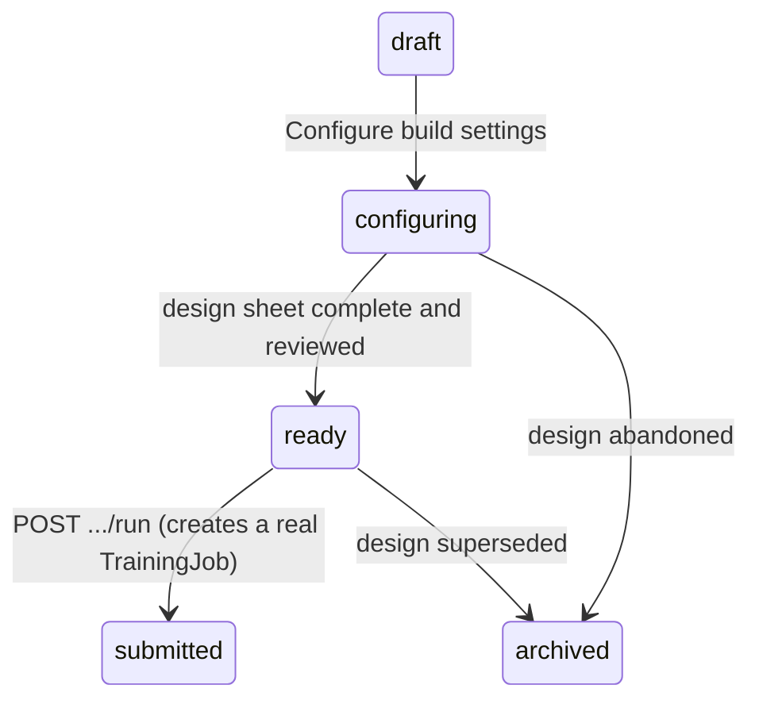

Record the project, model, dataset, and intended lifecycle. In the full experiment specification, pin:

- source-code revision;
- training runtime and dependency versions;
- base model and tokenizer digests;
- dataset version and checksum;
- method and trainable layers;
- hyperparameters and random seed;
- compute target and resource ceilings;
- checkpoint and cancellation policy;
- metrics and approval thresholds;
- output naming and storage;
- network and secret policy.

Change one meaningful variable at a time for early experiments when practical.

**Exit condition:** Another authorized trainer could repeat the experiment.

### Step 10 — Run a small pilot before a full job

**What this step is:** Running the entire training pipeline once on a small slice of data — not to produce a usable model, but to prove the *machinery* itself works: that data loads correctly, losses behave sensibly, checkpoints save and restore, and nothing crashes partway through.

**Why this step is required:** A full training job can take hours or days and consume significant compute. Discovering a broken data loader, a misconfigured checkpoint path, or a stalled cancellation switch only after committing the full budget wastes time, money, and possibly electricity for nothing. A cheap, fast pilot run catches these mechanical failures while they are still cheap to fix.

Use a small, representative training subset to confirm:

- the data loader works;
- losses are finite and move sensibly;
- checkpoints can be written and restored;
- validation is independent;
- memory, disk, and thermal behavior stay within limits;
- cancellation works;
- logs contain no secrets or raw restricted data.

Do not spend the full compute budget until the pipeline passes this pilot.

**Exit condition:** The pipeline is operational and bounded.

### Step 11 — Create and execute the real training or fine-tuning job

**What this step is:** Actually running the full training process against the complete prepared dataset — the step where the model's parameters are genuinely changed, using the training loop mechanics described in Section 6.

**Why this step is required:** This is the moment real learning happens; everything before it was preparation, and everything after it is verification. Watching the live metrics (loss, gradient norm, resource use) while it runs — rather than walking away and checking back at the end — is what lets you catch a diverging or unsafe run early instead of discovering the wasted compute after the fact.

Record the administrative job at one of:

```text
/app/ml/training-jobs
/app/ml/fine-tuning-jobs
```

The present MasterAI job record does not launch a training framework. Execute the approved job outside MasterAI's current runtime boundary, or wait for the planned isolated training executor. Never imitate execution by merely advancing the stored job status.

Monitor training and validation loss, learning rate, gradient norm, throughput, CPU, GPU, memory, disk, temperature, warnings, and checkpoint health. Stop on NaN/Inf loss, uncontrolled resource use, data-policy failure, worsening validation beyond policy, or loss of reproducibility evidence.

As the external workflow produces checkpoints, register the ones worth governing at:

```text
/app/ml/checkpoints
```

Each record names the training job that produced it and why it was captured (for example `epoch_end`, `best_metric`, or `manual`). Set a checkpoint to `pinned` to declare it exempt from retention deletion — the candidate you intend to evaluate and the last-known-good state are the usual candidates — and `archived` when it is retired. The record governs retention intent; the checkpoint file itself, its step/epoch metadata, and its hash remain in the external workflow's evidence bundle until the planned executor captures them directly.

**Exit condition:** A recoverable candidate checkpoint and complete evidence bundle exist.

### Step 12 — Evaluate the candidate

**What this step is:** Formally scoring the newly trained model — called the "candidate" because it has not yet earned production trust — against the frozen test set that was never used during training, and comparing it against the baseline from Step 2.

**Why this step is required:** Training loss decreasing tells you the model fit its training examples better; it does not tell you the model actually improved at the real task, or that it did not quietly get worse at something else (Section 6.5, Section 6.6). Evaluation against untouched test data, using the capability contract from Step 1 as the target, is the only honest way to know whether the training effort actually worked.

Create an evaluation record at:

```text
/app/ml/evaluation-runs
```

If the candidate must pass a subject-specific examination — the plan's Subject Examination System — register the exam against its subject knowledge package at:

```text
/app/ml/subject-exams
```

Record the exam's question format (for example `multiple_choice`, `short_answer`, or `code_task`) and move it through review to `approved` before administering it.

**Administering the exam is now real (2026-08-19).** Attach a real question bank with `POST /api/v1/ml/subject-exams/{id}/questions`: `{"questions":[{"questionText":"...","expectedAnswer":"..."},...],"passingThreshold":0.8}`. Then call `POST /api/v1/ml/subject-exams/{id}/run` with `{"modelId":"..."}` — this genuinely asks the target model each question (the same non-chat generation path Retrieval-Augmented Generation's `generate:true` mode uses), scores each answer, and reports the real question/pass count and score against the exam's `passingThreshold`. `GET /api/v1/ml/subject-exams/{id}/result` retrieves the latest run's full detail (one result per exam — running again overwrites it, the same way re-running an Experiment does).

**Grading is now a real LLM-as-judge (2026-08-23).** Each answer is judged by asking the target model itself a fixed, JSON-only judging prompt (`{"correct":true/false,"confidence":0.0-1.0,"rationale":"..."}`) — the same pattern the Safety and Governance classifier already uses, not a new kind of trust. `GET .../result` now reports each question's `gradedBy` ("llm_judge" or "heuristic_fallback"), `judgeConfidence`, and `judgeRationale`, so you can see exactly how each score was produced. The original plain, case-insensitive substring/whole-token-overlap check (`subject_exam_answer_matches()`) is not gone — it is the automatic fallback whenever the judge call itself fails or its reply is not parseable JSON, so a run degrades to an honest heuristic result instead of failing outright. A `heuristic_fallback` question should still be read the old way: short, specific expected answers ("443", "TCP") score reliably under it; open-ended ones may under-score a correct-but-differently-worded response. Running an exam never changes its review status — an `approved` exam can be run repeatedly against different models without losing its approval.

Run the frozen test set only after model and hyperparameter choices are settled. Compare against the base model and previous approved version. Include target capability, regressions, safety, adversarial cases, privacy leakage, memorization probes, latency, memory, and hardware compatibility.

**Exit condition:** All mandatory thresholds pass, or the candidate is rejected with recorded reasons.

### Step 13 — Review errors and iterate

**What this step is:** When evaluation reveals failures, digging into *why* each one happened — bad data, an ambiguous instruction, a labeling mistake, overfitting, and so on — rather than just re-running training with vague hope it improves.

**Why this step is required:** Re-training blindly on the same flawed data or plan usually reproduces the same failures, wasting another full training cycle. Diagnosing the actual root cause turns each failed attempt into useful information that makes the next attempt more likely to succeed, instead of repeating the same mistake with more compute.

Classify failures by topic and cause:

- missing or bad data;
- ambiguous instruction;
- incorrect label;
- retrieval failure;
- model capacity limit;
- overfitting;
- catastrophic forgetting;
- output-format failure;
- safety-policy failure;
- runtime or quantization regression.

Create a new dataset or experiment version. Never rewrite the evidence of the failed run.

**Exit condition:** The next iteration is based on diagnosed evidence, not guesswork.

### Step 14 — Convert and optimize for MasterAI inference

**What this step is:** Taking the approved trained checkpoint (which exists in a training-oriented format) and converting it into the GGUF format MasterAI's inference runner actually understands, optionally shrinking it through quantization (Section 4.6) to save memory.

**Why this step is required:** The format used during training is not the format used for serving chat responses — they serve different purposes, and MasterAI's current inference path only understands GGUF via `llama.cpp`. Quantization in particular is not free: reducing numeric precision can quietly reduce answer quality, so the converted file must be treated as a brand-new artifact to be re-checked, not an automatic step.

After approval of a source checkpoint, convert or merge it through an approved isolated process into a `llama.cpp`-compatible GGUF. Select quantization using measured quality and hardware results, not file size alone.

Register the intended operation against the registered model at:

```text
/app/ml/model-optimizations
```

Name the operation honestly (for example `quantization`, `pruning`, or `distillation`). For `operation: "pruning"`, optionally set `pruningThreshold` at creation (default `1e-3`), then request status `running` — this genuinely zeroes every weight below that magnitude and persists the pruned model, returning the real pruned/total weight counts in the response. Every other operation still only records intent and advances through the job lifecycle as an external workflow actually runs; the record creates the governed identity that a before/after quality comparison and the resulting artifact's hash will be attached to once a real executor exists for that operation too.

Treat each conversion or quantization as a new candidate artifact with a new hash and evaluation. A model that passed before conversion may fail afterward.

**Exit condition:** The GGUF is compatible, reproducible, licensed, hashed, and separately evaluated.

### Step 15 — Package the model in MasterAI

**What this step is:** Placing the converted GGUF file into MasterAI's model folder under a brand-new, unique model ID, writing its manifest (exactly as in Section 11, Step 5), and running verification again.

**Why this step is required:** This new, specialized GGUF is functionally a different artifact from anything MasterAI has seen before, even if it started from a familiar base model — it needs its own identity, its own hash, and its own verification pass. Overwriting the previous production model's directory instead of using a new ID would destroy your ability to roll back if the new model turns out to be worse.

Create:

```text
models/<approved-category>/<unique-model-id>/
├── manifest.json
└── <unique-model-file>.gguf
```

Never overwrite the previous production directory. Use a new model ID and version. Complete the manifest with exact metadata, then run `verify-models` or `rehash.ps1`.

**Exit condition:** MasterAI reports the model Ready without weakening a check.

### Step 16 — Benchmark on the target host

**What this step is:** Running MasterAI's own benchmark (as in Section 11, Step 11) on the newly packaged specialized model, and directly comparing the numbers against the base model and whatever model is currently running in production.

**Why this step is required:** Specialization and quantization can change a model's speed and memory footprint, not just its answer quality. A model that scores well on the subject test but is unacceptably slow, or that no longer fits in the memory budget from Section 11, Step 2, is not actually deployable — this step catches that before real users are affected.

Run the same MasterAI benchmark profile against the base, previous production, and candidate models on the same host. Also run the subject-specific evaluation externally until MasterAI's complete evaluation harness exists.

**Exit condition:** Quality, latency, memory, and stability meet the deployment contract.

### Step 17 — Deploy to staging

**What this step is:** Running the new model in a controlled, non-production copy of the real system — one that behaves like production but that ordinary users cannot reach — and exercising the full request path exactly as a real user would.

**Why this step is required:** Everything up to this point has tested the model in isolation. Staging is the first place the model is tested *inside the whole running system* — with real prompt assembly, real authorization checks, and real concurrent load — where integration bugs actually show up. Finding a problem in staging costs nothing to users; finding the same problem in production does not.

Load the candidate only in a controlled staging environment. Test real prompt assembly, project authorization, context limits, cancellation, concurrent requests, log redaction, and expected integrations.

**Exit condition:** Staging evidence matches offline evaluation and no policy boundary is bypassed.

### Step 18 — Approve production deployment

**What this step is:** Getting explicit, named sign-off from the people responsible for quality, safety, and operations before the model is allowed to serve real users, and writing down exactly who approved what.

**Why this step is required:** A model that passed every automated check can still be unsuitable for reasons a human reviewer catches — a subtle policy conflict, an unacceptable risk for this particular audience, a business concern no metric captures. Requiring a named, accountable approval (and dual approval for high-risk cases) ensures a real person is answerable for the decision, not just an automated pipeline.

Require the designated model evaluator, safety reviewer, and deployment authority. For high-risk use, require dual approval. Record the model card, dataset card, evaluations, known limits, monitoring thresholds, and rollback model.

Register the promotion itself at:

```text
/app/ml/deployments
```

Name the registered model, the target environment (for example `staging` or `production`), and the strategy (for example `direct`, `blue_green`, or `canary`). A new deployment starts `pending`; the deployment authority moves it to `approved` as the recorded act of authorization, or `rejected` with reasons. The record is the auditable approval — it does not load the model, route requests, or roll anything back. Serving still happens through the verified inference model tree (Section 10.3), and the runtime/target-node/health-status evidence will attach to this record once the planned deployment executor exists.

**Exit condition:** Approval is explicit, attributable, and auditable.

### Step 19 — Monitor production

**What this step is:** Continuing to watch the model's real-world behavior after it goes live — accuracy, safety, speed, and resource use — rather than treating deployment as the finish line.

**Why this step is required:** Approval in Step 18 was a snapshot judgment based on the evidence available at that moment; the real world keeps changing after that. Input patterns drift, edge cases appear that no test set anticipated, and a model that was safe on day one can start producing unsafe or low-quality output as conditions change. Monitoring is what lets you notice that before it becomes a serious incident.

Monitor:

- input and output drift;
- subject accuracy and user rejection;
- hallucination and citation failures;
- unsafe outputs;
- latency, timeouts, memory, and load time;
- retrieval and tool-use failures;
- changes in data or policy;
- integrity of runner and model files.

Feedback must enter a review queue. Do not train automatically from conversations.

**Exit condition:** The model stays within its approved quality, safety, and resource envelope.

### Step 20 — Version, roll back, or retire

**What this step is:** When monitoring (Step 19) reveals a real problem, switching production back to the last known-good model immediately, then treating the fix as a brand-new version that has to go through evaluation and approval again from scratch — not a quick patch to the live model.

**Why this step is required:** Because Step 13 (Package the model, Step 15) always assigns each candidate a unique, hashed identity with the previous approved model preserved untouched, a safe rollback target always exists — this is only true because earlier steps in this lesson were followed honestly. Preserving the failed artifact and its evidence, instead of deleting it, is what lets a future investigation understand exactly what went wrong.

Rollback when a safety, integrity, quality, or resource threshold is breached. Preserve the failed artifact and evidence according to policy; do not silently delete history. Create a new version for corrected behavior and repeat the gates.

**Exit condition:** Production always points to an approved, recoverable version.

---

## 13. Worked classroom example: a C++17 subject assistant

This example shows how the lessons join together.

### 13.1 Objective

Build an assistant that reviews C++17 code for resource ownership, path safety, error handling, and concurrency defects while respecting MasterAI's independent C++17 architecture.

### 13.2 First attempt: no training

1. Select a verified programming model.
2. Create a MasterAI project for the authorized repository.
3. Index the project.
4. Provide a focused system instruction and review rubric.
5. Ask representative questions with current file context.
6. Score correctness, compilability, evidence use, and false positives.

If this meets the threshold, stop. Training would add cost and risk without proven benefit.

### 13.3 Add retrieval when current rules matter

Keep project rules, architecture decisions, and current source separately managed. Retrieve the relevant passages for each review. This is better than attempting to encode frequently changing project facts into weights.

### 13.4 Fine-tune only for persistent review behavior

If the base model repeatedly ignores the required report format or misses stable C++17 patterns despite good context, create reviewed examples:

```json
{
  "instruction": "Review the function for ownership and path-safety defects.",
  "context": "<self-contained C++17 example>",
  "expectedResponse": "<evidence-linked finding or explicit no-finding result>",
  "subject": "C++17 secure code review",
  "difficulty": "medium",
  "reviewStatus": "approved"
}
```

Include clean examples so the model learns not to invent findings. Put variants from the same defect family into one data partition to prevent leakage.

### 13.5 Evaluation rubric

Measure:

- true defects found;
- false-positive rate;
- severity calibration;
- accurate source references;
- C++17 compliance;
- compilability of proposed changes;
- preservation of unrelated behavior;
- refusal to invent absent evidence;
- latency and memory;
- regression on general programming tasks.

### 13.6 Deployment decision

Approve only if the specialized model beats the base model on the frozen subject test without unacceptable regressions. Package the evaluated GGUF under a new model ID, verify its SHA-256, benchmark it in MasterAI, stage it, and preserve the previous approved model for rollback.

---

## 14. Security, privacy, and governance rules

### 14.1 Treat models and datasets as sensitive assets

Model weights may memorize or reveal training content. Dataset deletion does not automatically erase information learned into an already trained model. Data-removal obligations may require retraining or retiring derived models.

### 14.2 Least privilege

Training workloads must not automatically receive:

- administrator privileges;
- unrestricted filesystem access;
- unrestricted network access;
- production credentials;
- access to unrelated projects;
- database-administrator credentials.

### 14.3 Untrusted model code

Some model packages require custom executable code. Do not execute that code automatically. Inspect, approve, pin, and isolate it. MasterAI's current inference package deliberately permits only the strict GGUF and `llama.cpp` path.

### 14.4 Poisoning and prompt injection

Imported documents and feedback can contain malicious instructions. Treat source content as data, not authority. Preserve source boundaries, filter and classify content, apply access control before retrieval, and never let retrieved text override system policy.

### 14.5 Reproducibility and audit

Every result should be traceable to:

```text
user + project + source code + configuration + base model + tokenizer
+ dataset version + seed + runtime + hardware + checkpoints + evaluation
```

Record state transitions and their reasons. Do not convert a status field into evidence that an operation happened.

### 14.6 Production model card

Every production model should document:

- purpose and owner;
- intended and prohibited uses;
- base model and lineage;
- training and evaluation data references;
- license and provenance;
- evaluation and safety results;
- known limitations;
- input and output types;
- hardware and runtime requirements;
- model and tokenizer hashes;
- approval status and approvers;
- monitoring and rollback rules.

---

## 15. Troubleshooting guide

| Symptom | Likely cause | Correct response |
|---|---|---|
| Model file exists but is not Ready | Verification cache missing, manifest mismatch, unsupported backend, or unsuitable hardware | Run `verify-models`; correct the cause rather than bypassing verification |
| `inference_backend_not_configured` | `llamaServerExecutable` is blank or invalid | Re-run configuration with the approved absolute runner path |
| `model_not_ready` | Model has not passed all readiness checks | Inspect manifest, exact size, hash, license, backend, and hardware assessment |
| Model loads but replies are poor | Unsuitable base model, prompt/template mismatch, quantization loss, or weak evaluation assumptions | Compare baseline, inspect template and settings, and test another approved candidate |
| Training loss falls but test quality does not | Overfitting, leakage, or objective mismatch | Stop, inspect splits and labels, revise data or regularization |
| Fine-tuned model forgets general skills | Catastrophic forgetting | Reduce update scope/rate, use an adapter, improve mixed data, and enforce regression tests |
| RAG answers cite irrelevant material | Weak chunking, retrieval, filtering, threshold, or reranking | Evaluate retrieval separately before blaming generation |
| A Training Job says `completed` but no artifact exists | Current record status was advanced without a real executor | Treat it as invalid operational evidence; run a controlled external job or wait for the executor |
| Vector Store exists but searches return nothing | Current scoped record does not populate an index | Implement or use an approved embedding/index pipeline; do not infer readiness from registration |
| Deployment is `approved` but the model is not being served | The deployment record is authorization, not execution | Package and verify the GGUF in the inference model tree; the record governs the promotion, it does not perform it |
| Checkpoint record exists but "Resume training" 409s with `ml_checkpoint_has_no_snapshot` | The checkpoint was created manually (the free-form page form), not captured by a real training/fine-tuning run | Only checkpoints a training or fine-tuning run captured automatically (`hasSnapshot: true`) carry real weights to resume from |
| Hyperparameter Search shows `completed` with `trialsRun: 0` | Status was advanced via `POST .../status` (a plain status flip) instead of `POST .../run` (the real executor) | Call `POST .../run` to actually train/score trials; treat a status-only `completed` with no trial results as intent, not evidence |
| Larger context causes load rejection or severe slowdown | KV-cache and runtime memory exceed the safety ceiling | Reduce context/slots, choose a smaller model or quantization, and recalibrate |
| Quantized model is faster but less accurate | Precision reduction changed behavior | Evaluate each quantization and reject unacceptable quality loss |

---

## 16. Glossary of essential terms

| Term | Classroom definition |
|---|---|
| Activation function | A nonlinear transformation applied inside a neural network so it can represent more than linear relationships. |
| Adapter | A small trainable module attached to a base model to specialize it without updating every base weight. |
| Architecture | The design of the model's computation: layers, connections, dimensions, and operations. |
| Artifact | A produced file or record such as a model, adapter, checkpoint, dataset, log, or evaluation report. |
| Attention | A transformer operation that combines information from relevant token positions using learned query, key, and value projections. |
| Backpropagation | The algorithm that calculates gradients from the loss backward through a differentiable computation graph. |
| Base model | The existing model from which prompting, retrieval, or fine-tuning begins. |
| Batch | A group of examples processed together before an optimizer update. |
| Benchmark | A fixed, reproducible set of tasks and scoring rules used to compare systems. |
| Checkpoint | A saved training state that permits evaluation, recovery, or continued training. |
| Chunk | A bounded section of a document used for indexing, retrieval, or dataset construction. |
| Classification | Selecting a category or label for an input. |
| Context window | The maximum bounded token sequence a language model can consider for one inference sequence. |
| Data leakage | Information improperly crossing into training, validation, or test data and making results misleading. |
| Deployment strategy | The controlled method used to promote a model into an environment, such as direct replacement, blue-green switchover, or a canary rollout to a small share of traffic first. |
| Dataset | A governed collection of records used for training, validation, testing, evaluation, or retrieval. |
| Distillation | Training a smaller student model to reproduce selected behavior of a larger teacher model. |
| Embedding | A numeric vector representation used internally by models or for similarity search. |
| Epoch | One pass through the selected training dataset. |
| Evaluation | Measurement of a fixed model against defined quality, safety, and resource criteria. |
| Feature | Information supplied to a model as input. |
| Fine-tuning | Continuing training from an existing model to adapt behavior or task ability. |
| Foundation model | A broadly pre-trained model intended to support many downstream tasks. |
| Generalization | Useful performance on new examples not used to fit the model. |
| GGUF | An inference-oriented model file format used by MasterAI's current `llama.cpp` adapter. |
| Gradient | The estimated direction and sensitivity of loss with respect to a trainable parameter. |
| Hallucination | A plausible-looking model output that is unsupported, incorrect, or fabricated. |
| Hyperparameter | A trainer-selected setting such as learning rate, batch size, or epoch count. |
| Hyperparameter optimization | A systematic search (grid, random, Bayesian, and similar strategies) over training settings to find a configuration that performs best on validation data within resource limits. |
| Inference | Running a fixed trained model to obtain a prediction or generated output. |
| Instruction tuning | Fine-tuning on instruction-and-response examples to shape response behavior. |
| KV cache | Stored attention keys and values that avoid recomputing eligible earlier token positions. |
| Label | The desired target, category, score, span, response, or preference attached to a supervised example. |
| Learning rate | The scale of optimizer parameter updates. |
| Logit | A raw model score converted into a probability distribution for selection or loss calculation. |
| LoRA | Low-rank adaptation, a parameter-efficient method that learns compact updates to selected weights. |
| Loss | A numeric training objective measuring disagreement between prediction and target. |
| Model card | A governed description of model purpose, lineage, data, evaluation, limits, safety, and approval. |
| Model optimization | Post-training transformation of a finished model — quantization, pruning, distillation, merging, and similar operations — to reduce resource cost, always re-evaluated because quality can change. |
| Optimizer | The algorithm that converts gradients into parameter updates. |
| Overfitting | Learning training examples too specifically, causing weaker performance on unseen data. |
| Parameter or weight | A numeric value learned during training and used during inference. |
| Perplexity | A language-model metric related to how much probability the model assigns to observed tokens; lower is better only within a compatible comparison. |
| Prompt | Instructions and content supplied to a generative model for the current request. |
| Provenance | The traceable origin, revision, ownership, license, and transformation history of an asset. |
| Quantization | Representing weights or caches with reduced numeric precision to reduce resource use. |
| RAG | Retrieval-augmented generation: retrieving authorized external knowledge and adding it to the inference context. |
| Regression | Either predicting a numeric value or, in testing language, an unwanted loss of previously working behavior. |
| Reranker | A model or algorithm that reorders retrieved candidates by estimated relevance. |
| Seed | A value used to initialize controlled pseudorandom behavior for improved repeatability. |
| Step | Commonly one optimizer update during training. |
| Subject examination | A governed set of questions and scoring rules used to test whether a model has actually learned an approved subject to its required standard. |
| Synthetic data | Machine-generated examples kept distinguishable from human-created or real-world records. |
| Temperature | A generation setting that adjusts how concentrated or varied token selection is. |
| Token | A vocabulary unit produced by a tokenizer, such as a word fragment, symbol, or whitespace pattern. |
| Tokenizer | The exact algorithm and vocabulary that convert text into token identifiers and back. |
| Training | Optimizing trainable parameters against an objective using examples. |
| Validation set | Held-out development data used for model and hyperparameter decisions. |
| Vector store | A controlled index of embeddings and metadata used for similarity retrieval. |

---

## 17. Classroom review questions

Use these questions before beginning a real model project:

1. What is the difference between a parameter and a hyperparameter?
2. Why does adding context not permanently teach model weights?
3. When is RAG preferable to fine-tuning?
4. Why must duplicate families be separated before creating dataset splits?
5. Why is a falling training loss insufficient for approval?
6. What changes when a model is quantized?
7. Why must the tokenizer and chat template be part of model identity?
8. What does a MasterAI Training Job record prove today, and what does it not prove?
9. Why are the ML Model Registry and the inference `models/` tree different?
10. Which evidence must exist before a specialized model enters production?
11. Why does a Checkpoint record use a retention lifecycle instead of an approval workflow?
12. What does an `approved` Deployment record authorize, and what does it not do?

Expected answers:

1. Parameters are learned; hyperparameters control learning or execution.
2. Context affects only the current bounded inference input and cache.
3. Use RAG for current, private, separately managed, or citable knowledge.
4. Otherwise near-identical answers can leak into validation or test data.
5. It says only that the optimization objective improved on training data.
6. Numeric weight precision and runtime characteristics change; teaching does not occur.
7. They determine how text becomes tokens and how roles/content are presented.
8. It proves a persisted administrative record and status, not real framework execution.
9. One tracks development governance; the other is the verified deployable GGUF runtime tree.
10. Identity, provenance, license, dataset lineage, evaluation, safety, resource, approval, staging, monitoring, and rollback evidence.
11. A checkpoint is not judged good or bad on creation — it is kept, protected from retention deletion (`pinned`), or archived, so its states describe retention, not approval.
12. It records that the deployment authority authorized promoting that model to that environment with that strategy; it does not load, serve, monitor, or roll back the model.

---

## 18. Final sequential checklist

Use this as the authoritative order for a model-development exercise:

- [ ] Define the task, users, boundaries, risks, and measurable success criteria.
- [ ] Establish a base-model and prompt/context baseline.
- [ ] Create the MasterAI Machine Learning project.
- [ ] Choose prompting, project context, RAG, fine-tuning, or a justified combination.
- [ ] Register the exact base model and provenance.
- [ ] Define and approve the subject knowledge package.
- [ ] Acquire only approved, licensed, classified sources.
- [ ] Verify, clean, redact, deduplicate, label, and review data.
- [ ] Split immutable training, validation, and test sets without leakage.
- [ ] Pin code, configuration, runtime, hardware, seeds, metrics, and ceilings.
- [ ] Run a bounded pilot and prove cancellation/checkpoint recovery.
- [ ] Execute the approved training workflow; do not simulate it with status changes.
- [ ] Register governed checkpoints and pin the ones retention must never delete.
- [ ] Evaluate against the base model, regressions, safety tests, and resource limits.
- [ ] Diagnose failures and create new immutable versions for each iteration.
- [ ] Convert and quantize the approved checkpoint for `llama.cpp` only when required.
- [ ] Re-evaluate the final GGUF artifact.
- [ ] Create the strict MasterAI manifest and unique model directory.
- [ ] Verify the model hash and Ready state.
- [ ] Benchmark on the target host.
- [ ] Deploy to staging and validate the real MasterAI request path.
- [ ] Obtain explicit production approval and record it as an approved Deployment.
- [ ] Monitor drift, safety, quality, integrity, and resources.
- [ ] Preserve a tested rollback path and retire obsolete versions safely.

---

## 19. Closing lesson

Machine learning is controlled experimental engineering. A model learns statistical behavior from data and objectives; it does not automatically acquire truth, policy, or judgment. The safest and most efficient path is to begin with the smallest intervention that can satisfy the requirement: a clear prompt, then authorized context or retrieval, then fine-tuning only when persistent behavior must change.

MasterAI should be used as the governed boundary around that lifecycle. Its current strengths are verified local inference, process isolation, authorization, project context, model integrity, resource control, benchmarking, and increasingly detailed Machine Learning administration records. Its planned training system should extend those same principles into execution without weakening them.

The professional standard is therefore simple:

> Never call a model learned, approved, or production-ready because a file exists, a loss decreased, a status changed, or one answer looked good. Call it ready only when its identity, data lineage, measured behavior, safety, resource use, approvals, and recovery path are all proven.

## Related project documentation

- [Authoritative implementation plan](PLAN.md)
- [MasterAI model category taxonomy](architecture/model-taxonomy.md)
- [Model manifest schema](../models/manifest.schema.json)
- [Configuration field reference](architecture/configuration.md)
- [Phase 4–7 inference, download, and benchmark operations](operations/phase-4-7-operations.md)
- [Security threat model](security/threat-model.md)
- [Project objectives](objectives.md)
