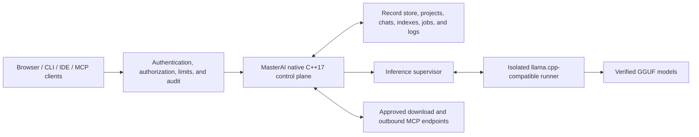

# Overview and architecture

> Part of the [MasterAI README](../README.md).

MasterAI coordinates local language models, authenticated users, programming
projects, chats, source context, verified downloads, benchmarks, IDE clients,
and Model Context Protocol (MCP) integrations from one security-focused native
service.

The project is designed for developers who want local ownership of models and
project data without making an inference engine, a container platform, or a
third-party application framework the foundation of the system.

## Why MasterAI?

MasterAI is intended to provide a dependable local AI programming environment
with explicit security and resource boundaries:

- **Local ownership** — models, projects, chats, indexes, benchmarks, and
  operational state remain on systems you control.
- **Native C++17 control plane** — no Docker runtime and no inherited web or
  application framework.
- **Programming-first workflows** — chat, code completion, review, debugging,
  documentation, project search, IDE integration, and reproducible model
  comparison.
- **Process-isolated inference** — model runners execute outside the main
  control-plane process, so model memory and runner failures remain isolated.
- **Deny-by-default security** — listeners, routes, files, model sources, MCP
  tools, and administrative operations require explicit authority.
- **Verified model lifecycle** — manifests bind model identity, provenance,
  license, size, digest, backend, and hardware suitability.
- **Bounded resource use** — queues, memory reservations, contexts, background
  work, downloads, and indexes are designed around enforced ceilings.
- **Replaceable adapters** — inference, hardware, storage, embedding, speech,
  secret, and MCP integrations do not dictate the internal architecture.
- **Evidence-driven optimization** — performance work must be measured without
  bypassing correctness, security, cancellation, or auditing.

## Project aims

MasterAI aims to become a native, modular programming AI host that can:

1. Run securely on developer workstations and approved local servers.
2. Discover and validate categorized local programming models.
3. Assess whether a model can run safely on the current hardware.
4. Supervise local inference backends without loading model weights into the
   control process.
5. Provide authenticated browser, API, CLI, IDE, and MCP workflows.
6. Preserve durable projects, chats, attachments, indexes, jobs, and audit
   records with recovery support.
7. Download model artifacts only from approved immutable sources, resume
   interrupted transfers, and verify them before promotion.
8. Compare models with reproducible performance and programming-quality
   evidence.
9. Operate safely on lower-memory systems through deterministic admission,
   pressure handling, and degradation.
10. Add retrieval, caching, prompt reuse, and advanced throughput only after
    their security, memory, and quality boundaries are proven.

## Architecture

MasterAI separates the security-sensitive control plane from replaceable model
runner processes:

The control plane owns configuration, authentication, authorization, users,
projects, chats, model metadata, downloads, benchmarks, MCP policy, process
supervision, health, metrics, and graceful lifecycle operations. It does not
map large model weights into its own address space.

Initial inference uses an optional, version-pinned `llama.cpp` server behind a
validated process adapter. `llama.cpp` is not the architectural foundation and
can be replaced without changing MasterAI's external contract.

### Core design principles

- Strict ISO C++17 for application source; optional Assembly only when profiling
  proves a benefit and a C++17 boundary is retained.
- Native Windows, Linux, and macOS (Apple Silicon) operation without a
  container runtime.
- Loopback-only network binding by default.
- Authentication and authorization even in local-only mode.
- Canonical, authorized filesystem paths with symlink traversal denied by
  default.
- OS-backed cryptography and secret protection; no custom cryptographic
  primitives.
- Strict configuration schemas, bounded inputs, atomic persistence, and
  recoverable state.
- Process isolation, cancellation, timeouts, backpressure, and graceful
  shutdown.
- Explicit model provenance, licensing, size, and SHA-256 verification.
- Current authorization checks remain authoritative; caches never become an
  access-control source.

Further design detail is available in
[ADR-0001](architecture/ADR-0001-cpp17-native-architecture.md), the
[release 1 baseline](architecture/ADR-0003-release-1-product-baseline.md),
and the [security threat model](security/threat-model.md).
