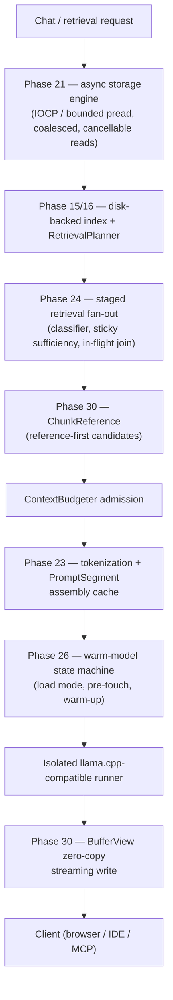

# Performance and bounded-memory direction

> Part of the [MasterAI README](../README.md). See
> [docs/PLAN.md](PLAN.md) for the itemized status and evidence boundaries.

MasterAI measures before optimizing. The system distinguishes time to first
token, prompt throughput, generation throughput, retrieval quality and latency,
peak memory, and output correctness.

The completed bounded-memory foundation provides:

- One system-wide memory admission authority
- A mandatory operating-system safety reserve
- Hard limits for request and background-work categories
- Minimal, balanced, and performance profiles
- Deterministic pressure handling
- Bounded prioritized work
- Inference admission and actionable rejection
- Resource and request telemetry

Deadline-bound hybrid retrieval, a security-partitioned cache hierarchy,
compatible prompt/KV reuse, and host-specific calibration are now
implemented on top of that foundation (Phases 16–19 in the
[Project status](project-status.md) table). Phase 18's real-model
repeated-turn reuse check is complete; Phases 16, 17, and 19 retain the
evaluation or comparative evidence listed in the status table. Phase 20 now
provides durable evidence review, explicit admission, independent disable,
implementation-availability checks, audit, and safe-profile fallback through
`GET`/`POST /api/v1/performance/advanced-optimizations`. The optional
candidates remain disabled until their individual measurements satisfy that
gate. The POST contract accepts `record-evidence`, `admit`, or `disable`;
evidence recording requires the baseline/change, host/model/backend SHA-256
identities, TTFT, prompt and generation throughput, peak resident memory,
quality and power/thermal notes, regression decision, and fallback result.
Admission is a separate action and cannot succeed without a wired native
implementation.

The performance layer adds asynchronous/coalesced storage, a hierarchical
resident/streaming cache, exact token/prefix reuse, staged retrieval fan-out,
weighted-fair scheduling and calibrated continuous batching, selective model
pre-touch and warm-state management, bounded KV-cache lifecycle,
topology-aware placement, model-tier routing, and immutable shared-buffer/
arena data flow. Phases 21–26 are implementation-complete and wired into the
live paths described below; backend-specific optimization activation remains
default-off until the Phase 20 evidence gate admits it. None may bypass
authorization, integrity, auditing, cancellation, quality checks, or memory
ceilings.

How a chat request moves through the performance layer:

The diagram shows where each mechanism sits in the request path. The Phase 24
authored Release evaluation measured 213 us total/145 us high case versus 736
us/401 us for the Phase 16 bounded-fan-out baseline. Continuous batching is
implemented but remains disabled until host/model/backend-specific evidence
passes the existing admission gate. Scheduling, KV governance, topology, and
model routing are supporting layers omitted from this simplified view. See
[docs/PLAN.md](PLAN.md) for the itemized status and evidence boundaries.
